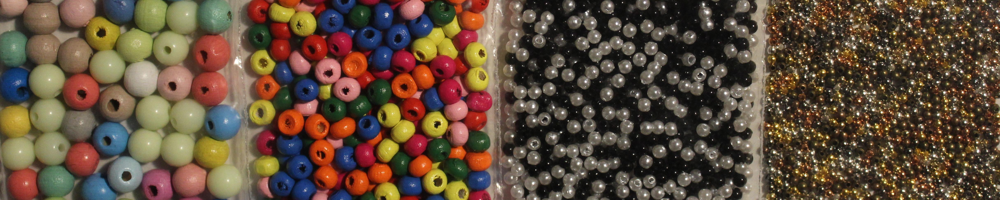
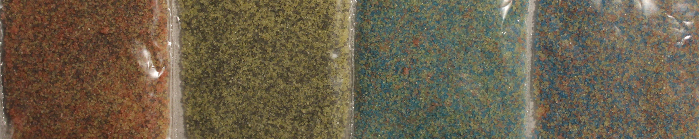
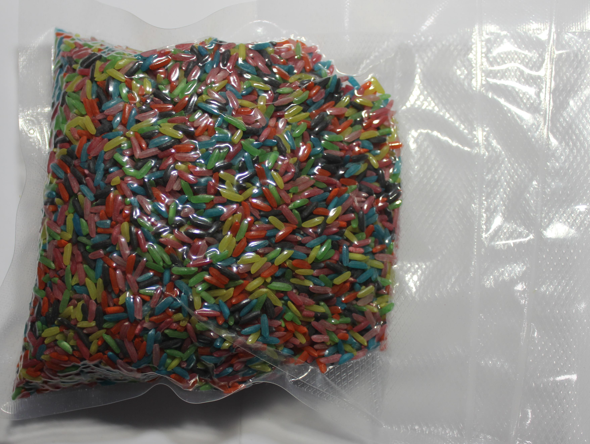

# Tamper-evident Protection

Die Geschichte der Menschheit ist auch eine Geschichte von Geheimnissen, Angriffen und der Verteidigung des Vertraulichen. Steganografie, Kryptografie und technische Hilfsmittel unterstützen uns bei der Wahrung des Privaten. Die Gegenspieler der Vertraulichkeit arbeiten – je nach Akteur – außerhalb oder innerhalb rechtlicher Rahmenbedingungen und passen sich diese oft mit Scheinargumenten an. So ist beispielsweise ein Verbot von Verfahren zum Schutz des Vertraulichen immer ein Schritt in die (aus unserer Sicht) falsche Richtung und schwächt nicht die Notwendigkeit des individuellen Schutzbedürfnisses, sondern sanktioniert diese. Daher ist in diesem Katz-und-Maus-Spiel die praktische Nutzung des Möglichen wichtiger als die rechtlichen Rahmenbedingungen.

Wenn wir Gegenstände bzw. Geräte außerhalb unser Sicht haben, können wir im Zweifel nicht ausschließen, dass es unerwünschte/unautorisierte Zugriffe darauf gab und womöglich die Vertraulichkeit und Integrität nicht mehr besteht. Wir wollen hier nachfolgend eine kurze Zusammenfassung zu ein paar bekannten Gegenmaßnahmen geben und eine neue Methode vorstellen.

Wenn es einen unautorisierten Zugriff(sversuch) gab, ist es im Interesse der Betroffenen (Eigentümer/Besitzer/Sender/Empfänger), von diesem zu erfahren, um sich nicht in falscher Sicherheit zu wähnen und etwaige Folgemaßnahmen einzuleiten.

Seit Jahrtausenden werden Siegel in diversen Formen mit dem Ziel verwendet, die Vertraulichkeit und Integrität etwa von Briefen zu bescheinigen. Ähnlich alt sind die Angriffe auf diese Schutzmaßnahmen. Dies setzt sich bis heute fort, doch erfolgen diese Angriffe inzwischen auf einem ganz anderen Niveau. Vor allem durch die digitale Kommunikation und die weitreichende Präsenz technischer Geräte, die Akkumulation und automatisierte Auswertung von Daten hat sich seitdem viel geändert. Die Hilfsmittel dieser Kommunikation greifen sehr tief in unsere Leben ein, daher sollte auch ihre Vertraulichkeit und Integrität einen sehr hohen Stellenwert einnehmen. Nachfolgend wollen wir ein paar Beispiele für diese Angriffe benennen.

## Ein- und Angriffe

### Manipulation auf dem Versandweg (supply-chain interdiction)

[Während die US-Regierung seit Jahren behauptet, dass Firmen aus China Überwachungstechnologien in Geräten verbauen, die in die USA exportiert werden (etwa in Netzwerktechnik)](https://www.techradar.com/news/networking/routers-storage/photos-reveal-nsa-tampered-with-cisco-router-prior-to-export-1249191), wurde 2014 im Buch ["Die globale Überwachung" von Glenn Greenwald](https://www.droemer-knaur.de/buch/glenn-greenwald-die-globale-ueberwachung-9783426786918) enthüllt, dass die NSA-Einheit "TAO" (Tailored Access Operations) mindestens seit 2010 technische Geräte auf dem Versandweg abfängt und manipuliert. [The Intercept hat 2019 einen guten Artikel](https://theintercept.com/2019/01/24/computer-supply-chain-attacks/) zu Lieferkettenangriffen veröffentlicht und Microsoft hat eine eigene Artikelreihe: [Teil 1](http://microsoft.com/security/blog/2019/10/16/guarding-against-supply-chain-attacks-part-1-big-picture/), [Teil 2](https://web.archive.org/web/20210226030901/https://www.microsoft.com/security/blog/2020/02/03/guarding-against-supply-chain-attacks-part-2-hardware-risks/) und [Teil 3](https://web.archive.org/web/20210303150737/https://www.microsoft.com/security/blog/2020/03/11/guarding-against-supply-chain-attacks-part-3-how-software-becomes-compromised/).

> Laut diesen sei es üblich, unter anderem Server, Router und andere Netzwerktechnik vor der Ausfuhr in Drittstaaten mit
> Abhörtechnik zu präparieren. Danach werden die Geräte neu verpackt und wie geplant versendet.

[netzpolitik.org](https://netzpolitik.org/2014/nsa-hat-eine-spezialeinheit-um-paeckchen-zu-oeffnen-und-wanzen-zu-implantieren/)

Es ist anzunehmen, dass derartige Angriffe auch in anderen Staaten stattfinden – sei es gegen Einzelpersonen oder großflächiger.

### Evil-Maid-Attacken

Falls Hardwarezugriff besteht, lässt sich eine [Evil-Maid-Attacke](https://www.whonix.org/wiki/AEM) im eigentlichen Sinne [innerhalb weniger Minuten](https://www.youtube.com/watch?v=loBX_vEXxVA) durchführen. Wer Zugriff auf die Hardware hat, kann nicht nur Firmware und ggf. Software manipulieren, sondern auch Hardware austauschen oder manipulieren und Abbilder von Speichermedien erstellen.

In dem verlinkten Artikel werden auch Maßnahmen vorgestellt, die eine derartige Manipulation zumindest erkennen lassen sollen. Denn nicht alle Zugriffe sind so offensichtlich wie hier:

> I just write quicker sometimes with pen and paper. I put it in the safe in my hotel room, and that night I had gone out by myself. I came home and the door to my hotel room was open, the safe was open, there was still the cash I had taken out from the Cueva sitting on a table, so no one had stolen anything. When I first saw the door open I thought oh, maybe they’re doing late turndown service or something, but the door to the safe was open with my laptop in it and my laptop was in a different position. I don’t know what happened, you know? Someone clearly opened the safe, they moved it around, they didn’t take any money, but they also left my door open. So, I never knew whether they actually did something or put something on the laptop or looked at the laptop and saw that there was nothing there, or whether they just left it open to scare me or send a message.

[Nicole Perlroth (cyber-security and digital espionage reporter at The New York Times) at 16:45 in EP 98: Zero Day Brokers from darknet diaries.](https://darknetdiaries.com/episode/98/)

## Schutzverfahren

Es gibt spezielle Schrauben, Siegel, "fälschungssichere" Labels und Klebeband, "manipulationssichere" Taschen und [vieles mehr](https://www.hhi.fraunhofer.de/abteilungen/fs/projekte/archiv/optical-tamper-protection-otp-fuer-prs-security-module.html), um unautorisierte Zugriffe bei Gegenständen/Produkten und Inhalten von Sendungen feststellen zu können. Wir gehen davon aus, dass die meisten davon manipuliert werden können und für talentierte und ressourcenstarke Angreifer kein Problem darstellen. Wer einen Einblick bekommen mag, kann sich Vorträge wie beispielsweise von der [DEFCON 19: Introduction to Tamper Evident Devices](https://www.youtube.com/watch?v=W07ZpEv9Sog) ansehen. Mehr dazu erfährt man auch in den Arbeiten von Sergei Skorobogatov (Physical Attacks and Tamper Resistance. Introduction to Hardware Security and Trust, 143–173. doi:10.1007/978-1-4419-8080-9_7) und [Elena Dubrova](https://people.kth.se/~msmith/is2500_pdf/Anti-Tamper%20Techniques_elena.pdf). Es gibt auch Wettbewerbe, in denen es darum geht, möglichst viele dieser Schutzmaßnahmen zu umgehen, so geben uns Mos & Boo Einblicke von der [OzSecCon 2018 Tamper Evident Challenge](https://mosandboo.com/ozseccon-2018-tamper-evident-challenge-walkthrough/). Wir wollen nachfolgend zunächst nur auf ein Verfahren zum versiegeln von Schrauben und ungenutzen Ports näher eingehen.

### Glitzer-Nagellack

Eine realtiv weit verbreitete Methode, um beispielsweise Schrauben an Geräten zu versiegeln, damit ein unautorisierter Zugriff mit höherer Wahrscheinlichkeit festgestellt werden kann, ist die Verwendung von Nagellack mit verschieden farbigen/großen Elementen. Dieses Verfahren wurde unseres Wissen nach erstmalig auf dem [30C3](https://media.ccc.de/v/30C3_-_5600_-_en_-_saal_1_-_201312301245_-_thwarting_evil_maid_attacks_-_eric_michaud_-_ryan_lackey) von [Eric Michaud](https://twitter.com/ericmichaud) und [Ryan Lackey](https://twitter.com/octal) vorgestellt und wird von mehreren Unternehmen, Privatpersonen und z. B. [Journalisten bei der Auswertung der Panama Papers](https://www.mz.de/deutschland-und-welt/politik/panama-papers-journalisten-sicherten-laptops-mit-glitzernagellack-1138070) empfohlen und genutzt.

Wir haben selbst ein paar Versuche unternommen, um die Wirksamkeit dieses Verfahrens zu prüfen.

#### Glitzer-Nagellack mit Aufklebern

Bei dem von [Mullvad VPN beschriebenen Verfahren](https://mullvad.net/en/help/how-tamper-protect-laptop/) schützt ein Aufkleber, dessen Rand mit Glitzer-Nagellack versiegelt wird, die Schrauben (oder ungenutzte Ports), um so einerseits Zugriffsversuche feststellen zu können und anderseits bei Bedarf möglichst einfach wieder Zugang dazu zu haben. Bei diesem Verfahren ist es jedoch ohne große Übung relativ einfach möglich, z. B. mit einer Nadel oder einem Skalpell unter den Aufkleber zu fahren und diesen zum Teil nach oben zu schieben, um an die Schrauben zu kommen. Etwaige Bruchstellen des Lacks könnten mit Klarlack wieder verschlossen werden, wobei dies uns bei unseren Versuchen meist nicht erforderlich war. Wir haben bei unserem Test bisher zwei verschiedene Aufkleber verwendet, wobei der von Mullvad am besten hielt.

Wir haben nachfolgend zwei Bilder eines unserer ersten Versuche, in denen bis auf 3-4 Glitzer-Elemente am Rand (links oben) des Aufkleber alle weiteren nach wie vor an der gleichen Stelle sind. Bei weiteren Versuchen konnte dies reduziert werden, sodass wir dieses Verfahren als ungeeignet einstufen.

Im linken Foto sieht man eine mit dem Nagellack von Mullvad VPN versiegelte Schraube. Im rechten Foto sieht man diese Versiegellung nachdem sie einmal wie oben beschrieben geöffnet wurde. Im linken oberen Teil des rechten Foto kann man erkennen das die Anordnung der Elemente an der Kante des Aufkleber nicht mehr ganz die gleiche ist. Die beiden größeren Elemente (linker Rand mittig und unten) wurden ebenfalls gebrochen, jedoch danach wieder auf ihre Position gebracht. In weiteren Versuchen haben wir ähnliche Ergebnisse erzielt. Ausschlaggebend ist bei diesem Verfahren die Menge der Elemente an und um die Kante des Aufkleber. Wir vermuten das mit Aufklebern die für Siegel verwendet werden, jene die beim abziehen kaputt gehen, in Verbindung mit Nagellack besser sind.

#### Glitzer-Nagellack direkt

Dieses Verfahren wird beispielsweise von [Nitrokey](https://docs.nitrokey.com/de/nitropad/qubes/sealed-hardware.html) und [Purism](https://puri.sm/posts/anti-interdiction-update-six-month-retrospective/) verwendet und ist im Vergleich zum vorherigen Verfahren aus unserer Sicht sicherer. Dabei werden die Schrauben direkt mit Glitzer-Nagellack versiegelt. Hierbei sind die Schächte der Schrauben besonders relevant. Ist dieser Schacht/Kanal zu tief, ist es schwer, unter normalen Bedingungen ein brauchbares Foto der Versiegelung zu machen. Ist der Schacht/Kanal flach oder wird der Kanal insgesamt mit Nagellack ausgefüllt, besteht die Gefahr das bei der Verwendung von viel Lack die obere Schicht abgeschnitten wird und nach der Manipulation mit Klarlack wieder angebracht wird. Wenn jedoch zu wenig Elemente verwendet werden, könnten diese nach der Manipulation ggf. manuell wieder an der Ausgangsstelle angeordnet werden. Wie [HoodiePony](https://twitter.com/hoodiePony) bei der OzSecCon 2018 Tamper Evident Challenge vorgegangen ist um 3 von 4 Siegeln erfolgreich zu brechen und wieder anzubringen ist uns leider aktuell nicht bekannt.

Einschätzung nach unseren Selbstversuchen: Es ist mitunter bei diesen beiden Verfahren sehr schwierig oder nicht möglich Manipulationen erkennen zu können. Wir haben bei weiteren Versuchen die Kombination von Nagellack mit verschiedenen Klebern (Uhu Alleskleber, Sekundenkleber von herlitz, Doratex Double Power und Yachtcare Super Epoxy) ausprobiert. Unser Favorit dabei ist die Versiegelung des Schacht mit Epoxidharz und GLitzer-Nagellack darin oder darüber. Angriffe mit Mitteln speziell für Epoxidharz haben wir nicht untersucht. Dieses Verfahren macht es jedoch auch etwas schwieriger bei Bedarf wieder alle Schrauben zu lösen.

## random mosaic $ rm -r ice

Wir haben uns Gedanken gemacht eine Methode zu finden, die mit weit verbreiteten und möglichst günstigen Mitteln ein schwer reproduzierbares Muster ergibt. Dieses Muster sollte manuell oder mit technischen Mitteln möglichst einfach überprüft werden können. Wir haben uns dafür im wesentlichen zwei Optionen ausgedacht: Eine für eine kurzzeitige Lagerung und eine weitere für eine längerfristige Lagerung und/oder den Versand.

Damit könnten beispielsweise Schriftstücke, Datenträger, Kommunikationstechnik, Hardware-Wallets und andere sensible Objekte so geschützt werden, dass ein unautorisierter Zugriff mit größerer Wahrscheinlichkeit festgestellt werden kann.

### Auf der Suche nach geeigneten Gegenständen/Substanzen

Um geeignete Gegenstände/Substanzen zu finden haben wir nachfolgende Anforderungen formuliert, mehrere Stoffe und Mischungen ausprobiert und folgende Einschätzung dazu:

Die gesuchte Mischung sollte:

- Nicht zu klein sein, damit das Muster/einzelne Elemente möglicht gut erkennbar ist/sind.
- Nicht zu groß sein, damit es möglichst schwer ist, das Muster zu reproduzieren.
- Aus verschiedenfarbigen und/oder verschieden großen Elementen bestehen, welches ein möglichst kontrastreichen Muster ergeben kann.
- Die Elemente sollten möglichst rund und trocken sein und nicht zu Klumpenbildung bzw. zum Verkanten oder Verkleben neigen.
- Im Falle einer Beschädigung (z. B. eines Risses) unserer Schutzmaßnahmen sollte der geschütze Inhalt nicht zusätzlich beschädigt werden. Daher sollten nur Festkörper verwenden werden und der Inhalt ggf. gesondert geschützt werden, um ein Eindringen der Elemente (z. B. bei einem Riss) in den Gegenstand/das Objekt zu verhindern/erschweren.
- Keine scharfkantigen oder spitzen Teile verwenden, die ggf. unsere Schutzmaßnahmen beschädigen könnten.
- Nicht zu schwer sein, z. B. um Versandkosten zu sparen.

Um das Mischverhalten zu testen waren für uns besonders die ersten 3 Punkte von Relevanz, durch eine Vorauswahl wurden nur Gegenstände/Substanzen ausgesucht, die die letzten 3 Punkte unserer Anforderungen erfüllten.

Unser bisheriger Favoriten sind: Rote Linsen & Belugalinsen, Gelbe und Grüne Erbsen und Weiße Bohnen, sowie gefärbter Reis.

#### Mittel für unser Mosaik

Rote Linsen & Belugalinsen:

* Die Linsen haben eine gute Größe (weder zu klein, noch zu groß), ein gutes Mischverhalten und bilden ein kontrastreiches Muster.

Gelbe Erbsen & Weiße Bohnen:

* Sowohl die Gelben Erbsen, als auch die Weißen Bohnen haben eine gute Größe (weder zu klein, noch zu groß), ein gutes Mischverhalten und bilden ein kontrastreiches Muster.

gefärbter Reis:

* Der Reis ist etwas kleiner als die beiden zuvor genannten Substanzen, hat jedoch den Vorteil das man sich die gewünschten Farben nach Bedarf selbst mit Lebensmittelfarbe (mehr dazu weiter unten) zusammenstellen kann.

Goldhirse:

* Hirse haben wir auf Grund seiner geringen Größe nur in Kombination mit anderen Substanzen getestet.

Vogelfutter:

* Vogelfutter hat den Vorteil, dass es beispielsweise in kleineren Beuteln relativ normal aussieht und sein Geheimnis möglicherweise dadurch noch vor Angreifern verbergen kann. Je nach Inhalt der Mischung kann es jedoch sein, dass dieser leicht verkleben kann.

Kugeln aus verschiedenen Farben, Größen und Materialien:

* Die Kugeln haben im Vergleich zu den anderen Artikeln wahrscheinlich die beste Beständigkeit, sind jedoch leider auch relativ kostenintensiv und schwerer zu bekommen als die meisten anderen Mittel.

gefärbtes Salz:

* Das Salz haben wir mit Lebensmittelfarbe gefärbt (mehr dazu weiter unten). Zucker und Salz verhalten sich ähnlich, wobei es beim Zucker gelegentlich zu leichter Klumpenbildung kommt. Aufgrund der Größe ist ein Vergleich des Muster teilweise auch nur schwer möglich.

gefärbter Zucker:

* Den Zucker haben wir mit Lebensmittelfarbe gefärbt (mehr dazu weiter unten). Zucker und Salz verhalten sich ähnlich, wobei es beim Zucker gelegentlich zu leichter Klumpenbildung kommt. Aufgrund der Größe ist ein Vergleich des Muster teilweise auch nur schwer möglich.

gefärbte Maisstärke (DIY Holi-Pulver):

* Die Maisstärke haben wir mit Lebensmittelfarbe gefärbt (mehr dazu weiter unten). Die Maisstärke ergibt ein Pulvergemisch, bei welchem die einzelnen Farben teilweise nur noch schwer zu erkennen sind.

kinetischer Sand:

* Der kinetischer Sand scheint uns ungeeignet, da dieser ebenfalls realtiv kostenintensiv ist, in einer einzelnen Farbe ungeeignet ist und wenn mehrere Farben verwendet werden, nach mehrmaligen durchmischen alles scheinbar gleich aussieht. Des Weiteren gehen wir davon aus, dass es bei einer solchen Konsistenz mehrere Angriffe geben wird, bei der wir nicht mehr feststellen können, ob es einen Zugriffsversuch gab oder nicht.

#### Färben

Wir haben den Reis und die anderen Substanzen mit Lebensmittelfarbe gefärbt und 2 verschiedene Lebensmittelfarben getestet. Die Lebensmittelfarben von V2 Foods finden wir auf Grund der Farbintensität besser als die von Limino. Dabei war das Vorgehen immer ähnlich:

1) je 125 g Substanz circa 15 Tropfen Lebensmittelfarbe
2) 0,5 Teelöffel Wasser dazu geben (nicht bei Salz und Zucker)
3) In einem geschlossenen Beutel oder einer Box gut durchmischen.
4) Sollte die gewünschte Farbintensität noch nicht erreicht sein, noch ein paar Tropfen Lebensmittelfarbe hinzugeben. Doch nicht zuviel, da die Substanz sonst ggf. zu sehr verklebt/klummt.
5) Die gefärbte Substanz etwas ausgebreitet in einem Teller, auf Backpapier oder in einer Box an der Luft trocknen lassen.

Einer anderen Anleitung folgend haben wir zunächst Essigessenz statt Wasser verwendet. Der damit gefärbte Reis war jedoch sehr geruchsintensiv, weshalb wir uns im Anschluss nur noch für Wasser entschieden haben. Das Ergebnis war bei beiden Mittel ähnlich. Das zum Färben verwendete Gefäß im Anschluss gut säubern, damit durch Farbrückstände nicht die Farbintensität verfälscht wird, falls das Gefäß erneut zum Färben verwendet wird.

Wir können bisher nicht bewerten wie die Beständigkeit über einen längeren Zeitraum ist. Es kann sein das durch UV-Strahlung und andere Einflüsse die Farbintensität nachlässt. Mit anderen Farben haben wir noch keine Versuche unternommen.

Neben der normalen Lebensmittelfarbe könnten auch mehrere Elemente mit fluoreszierenden Schwarzlicht-Farben eingefärbt werden, somit wäre neben dem normalen und offensichtlichen Bild ein weiteres Muster möglich, welches nur mit Schwarzlicht sichtbar ist. Wir haben dies bisher noch nicht getestet.

### Kurzzeitige Lagerung

Der Entstehungsgeschichte folgend beginnen wir mit der ersten Option, der kurzzeitigen Lagerung. Wenn wir einen Ort verlassen und Gegenstände bzw. Geräte zurücklassen müssen, können wir diese in eine oder mehrere Folien/Beutel einpacken und diese am besten in einer von allen Seiten durchsichtigen Box einlagern. Danach füllen wir die Box etwas mit unserer bunten Mischung, mindestens soweit, dass eine ausreichend dicke Schicht über unseren Geräten ist. Auf der Box können wir zuvor ein Raster einzeichnen, um einen Vergleich auf einzelne (dem Angreifer unbekannte) Flächen in diesem Raster zu beschränken oder einen Gesamtvergleich vornehmen. Die Box sollte so gelagert werden, dass z. B. Erschütterungen oder andere Faktoren möglichst nicht das Ausgangsmuster verändern. Dabei kann die Box z. B. auf einem Handtuch oder Kleidungsstück so auf einem Gegenstand positioniert werden, dass dieses kleinere Erschütterungen der Umgebung abschwächt, die Box jedoch von diesem nicht herunter rutschen kann. Um gute Aufnahmen des Ausgangsmusters zu machen, sollte die Box von allen sichtbaren Seiten fotografiert werden. Diese Aufnahme kann auf einem möglichst sicheren Gerät gespeichert werden, an eine von uns vertraute Person über einen verschlüsselten und verifizierten Weg übermittelt werden oder an ein anderes eigenes Gerät gesendet werden. Um in Anschluss zu überprüfen, ob das Ausgangsmuster immer noch das aktuelle Muster aufweist, kann ein neues Foto angefertigt werden und/oder der vorgefundene Zustand mit dem Foto des Ausgangsmusters verglichen werden.

Gab es eine Veränderung von mehreren Elementen innerhalb des Musters, sollte ggf. von einem unautorisierten Zugriff bzw. einer Kompromitierung ausgegangen werden. Wobei diese Einschätzung je nach Faktoren und Schutzbedürfnis zu treffen ist. Vielleicht war auch nur das eigene Haustier oder ein Familienmitglied etwas neugierig, was es mit der bunten Mischung auf sich hat.

Wir empfehlen an dieser Stelle eine Kombination mit [Haven](https://guardianproject.github.io/haven/). Sollte das Gerät ausfallen oder es Probleme bei den Sensoren oder der Übertragung geben, besteht dennoch mindestens eine weitere Schicht unserer Schutzmaßnahmen.

### Längerfristige Lagerung oder Versand

Insbesondere für den Versand scheint es uns eine sehr gut geeignete Methode zu sein, um von den Betroffenen unautorisierte Zugriffe auf deren schützenswerte Inhalte feststellen zu können. Bei nahezu jeder Versandmethode mit Dritten sind mehrere uns unbekannte Personen und Orte eingebunden.

Da die Elemente wie oben vorgeschlagen ihre Position beim Transport nicht halten würden, bedarf es eines anderen Verfahrens. Das Gerät bzw. der Gegenstand werden mit Frischhaltefolie, einem Beutel oder anderweitig eingepackt. Damit soll ein Schaden am Gerät/Gegenstand verhindert werden, der z. B. durch Abfärben oder Eindringen von Elementen (z. B. in Anschlüsse am Handy/Laptop) entstehen könnte. Diese Schutzschicht sollte möglichst wenig zusätzlichen Platz in Anspruch nehmen. Der so verpackte Gegenstand bzw. das Gerät kommen jetzt in eine leere oder zum Teil gefüllten Beutel. Dieser Beutel wird mit weiteren Elementen gefüllt, sodass der Gegenstand bzw. das Gerät möglichst von allen Seiten ausreichend mit Elementen versehen ist und das Objekt selbst nicht mehr von außen eingesehen werden kann.

Dieser mit bunten Elementen gefüllte Beutel wird im Anschluss vakuumiert. Dadurch werden diese an der jeweiligen Position gehalten. Sobald die Hülle beschädigt wird und ein Druckausgleich stattfindet, spätestens aber wenn ein Zugriff auf das umschlossene Objekt erfolgt, ändern die Elemente ihre Position.

#### Vakuumieren mit dem Staubsauger

Da viele Personen Staubsauger (es gibt sogar öffentliche an einigen Tankstellen) haben, steht dieses Verfahren für uns an erster Stelle. Für Staubsauger gibt es spezielle, wiederverwendbare Beutel, um z. B. Kleidung oder Decken platzsparend und zum Schutz vor Schäden (z. B. durch Motten) lagern zu können. Dabei kann die Luft innerhalb des Beutels durch ein Ventil und mit dem Staubsauger entfernt werden. Durch den dabei entstehenden Unterdruck verringert sich z. B. das Volumen von Decken in diesen Beuteln erheblich. Leider konnten wir nur größere Beutel finden, die sich z. B. gut für Laptops eignen, jedoch weniger für kleine Gegenstände.

#### Vakuumieren mit einem Vakuumiergerät

Es gibt viele verschiedene Vakuumiergeräte, diese unterscheiden sich in Qualität und Größe. Vakuumiergeräte werden beispielsweise verwendet, um Lebensmittel länger frisch zu halten. Die passenden Beutel dafür gibt es in alle gewünschten Größen, wobei diese nicht so einfach bzw. nur mit Materialverlust wiederverwendet werden können.

Bei beiden Verfahren kann man die Beuteln mit den Elementen auch kaskadieren. Dafür wird der Vorgang wie oben beschrieben einmal durchgeführt: Gegenstand/Gerät in dem Beutel mit den Elemente vakuumieren. Das Ergebnis des ersten Vorgangs wird nach der Speicherung der Bilder erneut in einen Beutel mit weiteren Elementen gegeben und vakuumiert.

Manche Unternehmen verzichten bewusst auf bestimmte Verfahren zur Manipulationssicherung. [So verweist Ledger](https://support.ledger.com/hc/en-us/articles/4404389367057-Is-my-Ledger-device-genuine-?#h_d3e66427-a745-46c6-b1bf-3b7f52ba8ed4), die Herstellerfirma des gleichnamigen Hardware-Wallets für Kryptowährungen, auf die Fälschbarkeit von Siegeln und beschränkt sich auf [hardwareseitige Schutzmaßnahmen](https://support.ledger.com/hc/en-us/articles/4404382029329-Check-hardware-integrity):

> **Anti-tamper seals**
> Ledger deliberately chooses not to use anti-tamper seals on its packaging. These seals are easy to counterfeit and can,
> therefore, be misleading. Rather, genuine Ledger devices contain a secure chip that prevents physical tampering: this
> provides stronger security than any sticker possibly could.

Nachdem im Jahr 2020 eine Datenbank mit Kundendaten in fremde Hände gefallen war, erhielten mehrere Ledger-Kunden im Frühjahr 2021 [gefälschte angebliche Ersatzgeräte](https://www.nasdaq.com/articles/inside-the-scam%3A-victims-of-ledger-hack-are-receiving-fake-hardware-wallets-2021-06-17) per Post.

Andere Unternehmen suchen nach Verbesserungsmöglichkeiten. So haben wir nach unseren Tests bei Recherchen für diesen Text die Arbeit von [shiftcrypto](https://shiftpages.github.io/tamper-evident-packaging/#how-it-works) gefunden und uns gefreut das diese teilweise ähnliche Ansätze verfolg(t)en. Mehr zu ihren Erfahrungen während der Testphase kann man [hier](https://medium.com/shiftcrypto/bitboxtep-alpha-program-what-we-have-learned-cd2e1a1bbd6c) nachlesen.

## Danksagung und Partizipation

Wir möchten uns an dieser Stelle bei allen bedanken die uns hierbei unterstützt haben. Dieser Dank gilt insbesondere jenen die uns Vakuumiergeräte zur Verfügung gestellt haben, Mullvad VPN für den Glitzer-Nagellack, sowie Nitrokey und Purism für den Austausch zum versiegeln mit Nagellack.

Solltest du weitere Ideen, Hinweise oder Verbessrungsvorschläge haben [schreib uns gerne](https://proxysto.re/kontakt.html) oder arbeite mit uns auf [github](https://github.com/dys2p/website-dys2p/blob/master/2021-12-tamper-evident-protection) an diesem Projekt.
