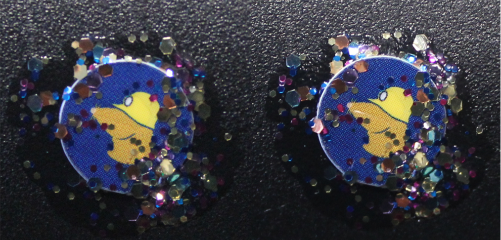
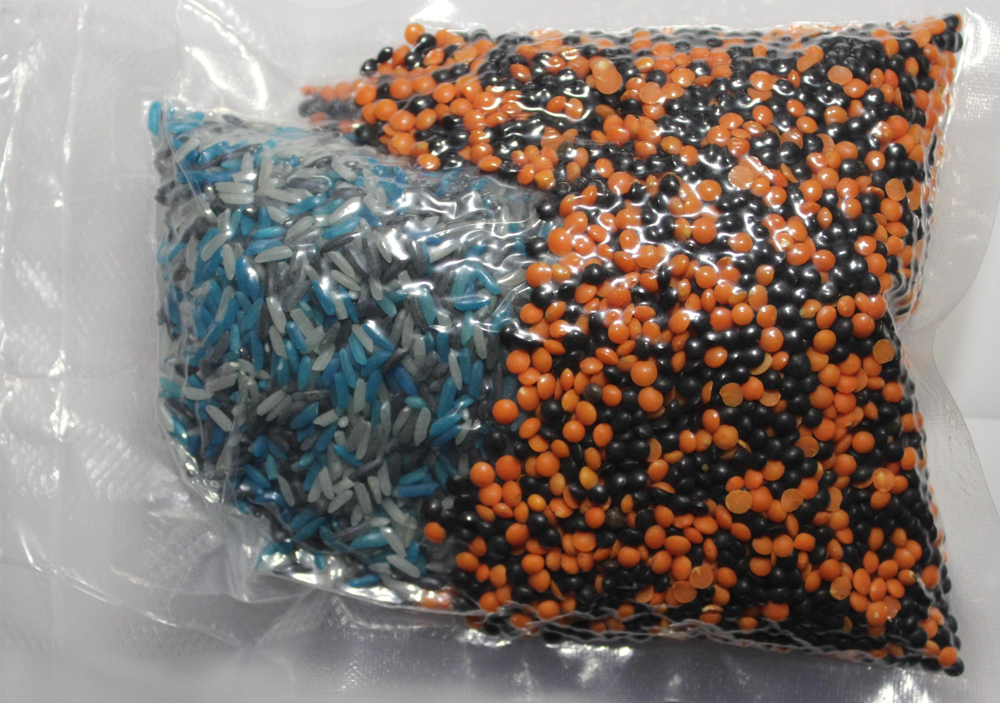

# Random Mosaic – Erkennung unautorisierter physischer Zugriffe mit Bohnen, Linsen und buntem Reis

Die Geschichte der Menschheit ist auch eine Geschichte von Geheimnissen, Angriffen und der Verteidigung des Vertraulichen. Steganografie, Kryptografie und technische Hilfsmittel unterstützen uns bei der Wahrung des Privaten. Die Gegenspieler der Vertraulichkeit arbeiten – je nach Akteur – außerhalb oder innerhalb rechtlicher Rahmenbedingungen und passen sich diese oft mit Scheinargumenten an.

Wenn wir Gegenstände bzw. Geräte außerhalb unser Sicht haben, können wir nicht ausschließen, dass es unerwünschte/unautorisierte Zugriffe darauf gab und womöglich die Vertraulichkeit und Integrität nicht mehr besteht. Wenn es einen unautorisierten Zugriff(sversuch) gab, ist es im Interesse der Betroffenen (Eigentümer/Besitzer/Sender/Empfänger), von diesem zu erfahren, um etwaige Folgemaßnahmen einzuleiten und sich nicht in falscher Sicherheit zu wähnen.

Seit Jahrtausenden werden Siegel in diversen Formen mit dem Ziel verwendet, die Vertraulichkeit und Integrität etwa von Briefen zu bescheinigen. Ähnlich alt sind die Angriffe auf diese Schutzmaßnahmen. Dies setzt sich bis heute fort, doch erfolgen diese Angriffe inzwischen auf einem ganz anderen Niveau. Vor allem durch die digitale Kommunikation und die weitreichende Präsenz technischer Geräte sowie die Akkumulation und automatisierte Auswertung von Daten hat sich seitdem viel geändert. Moderne Kommunikationsmittel greifen sehr tief in unsere Leben ein, daher sollte auch ihre Vertraulichkeit und Integrität einen sehr hohen Stellenwert einnehmen.

Nachfolgend zeigen wir ein paar Beispiele für diese Angriffe, fassen bekannte Gegenmaßnahmen zusammen und stellen eine neue Methode vor.

## Ein- und Angriffe

### Manipulation auf dem Versandweg (Supply Chain Interdiction)

Während die US-Regierung seit Jahren behauptet, dass chinesische Firmen Überwachungstechnik in Geräten verbauen, die in die USA exportiert werden (etwa in Netzwerktechnik), wurde 2014 im Buch ["Die globale Überwachung" von Glenn Greenwald](https://www.droemer-knaur.de/buch/glenn-greenwald-die-globale-ueberwachung-9783426786918) enthüllt, dass die NSA-Einheit "TAO" (Tailored Access Operations) mindestens seit 2010 technische Geräte auf dem Versandweg abfängt und manipuliert. [Netzpolitik.org](https://netzpolitik.org/2014/nsa-hat-eine-spezialeinheit-um-paeckchen-zu-oeffnen-und-wanzen-zu-implantieren/) fasst zusammen:

> Laut diesen sei es üblich, unter anderem Server, Router und andere Netzwerktechnik vor der Ausfuhr in Drittstaaten mit
> Abhörtechnik zu präparieren. Danach werden die Geräte neu verpackt und wie geplant versendet.

Es ist anzunehmen, dass derartige Angriffe auch in anderen Staaten stattfinden – sei es gegen Einzelpersonen oder großflächiger. [The Intercept veröffentlichte 2019 einen guten Artikel](https://theintercept.com/2019/01/24/computer-supply-chain-attacks/) zu Lieferkettenangriffen, Microsoft begann im selben Jahr eine eigene Artikelreihe: [Teil 1](http://microsoft.com/security/blog/2019/10/16/guarding-against-supply-chain-attacks-part-1-big-picture/), [Teil 2](https://web.archive.org/web/20210226030901/https://www.microsoft.com/security/blog/2020/02/03/guarding-against-supply-chain-attacks-part-2-hardware-risks/) und [Teil 3](https://web.archive.org/web/20210303150737/https://www.microsoft.com/security/blog/2020/03/11/guarding-against-supply-chain-attacks-part-3-how-software-becomes-compromised/).

### Evil-Maid-Attacken

Falls Hardwarezugriff besteht, lässt sich eine [Evil-Maid-Attacke](https://www.whonix.org/wiki/AEM) im eigentlichen Sinne [innerhalb weniger Minuten](https://www.youtube.com/watch?v=loBX_vEXxVA) durchführen. Wer Zugriff auf die Hardware hat, kann nicht nur Firmware und ggf. Software manipulieren, sondern auch Hardware austauschen oder manipulieren und Abbilder von Speichermedien erstellen.

In dem verlinkten Artikel werden auch Maßnahmen vorgestellt, die eine derartige Manipulation zumindest erkennen lassen sollen. Denn nicht alle Zugriffe sind so offensichtlich wie hier:

> I just write quicker sometimes with pen and paper. I put it in the safe in my hotel room, and that night I had gone out by myself. I came home and the door to my hotel room was open, the safe was open, there was still the cash I had taken out from the Cueva sitting on a table, so no one had stolen anything. When I first saw the door open I thought oh, maybe they’re doing late turndown service or something, but the door to the safe was open with my laptop in it and my laptop was in a different position. I don’t know what happened, you know? Someone clearly opened the safe, they moved it around, they didn’t take any money, but they also left my door open. So, I never knew whether they actually did something or put something on the laptop or looked at the laptop and saw that there was nothing there, or whether they just left it open to scare me or send a message.
>
> – [Nicole Perlroth (cyber-security and digital espionage reporter at The New York Times) at 16:45 in EP 98: Zero Day Brokers from darknet diaries.](https://darknetdiaries.com/transcript/98/)

## Schutzverfahren

Es gibt spezielle Schrauben, Siegel, "fälschungssichere" Labels und Klebeband, "manipulationssichere" Taschen und [vieles mehr](https://www.hhi.fraunhofer.de/abteilungen/fs/projekte/archiv/optical-tamper-protection-otp-fuer-prs-security-module.html), um unautorisierte Zugriffe etwa auf Gegenstände oder auf Inhalte von Sendungen feststellen zu können. Wir gehen davon aus, dass die meisten Verfahren überlistet werden können und für talentierte und ressourcenstarke Angreifer kein Problem darstellen. Wer einen Einblick bekommen mag, kann sich Vorträge wie beispielsweise von der [DEFCON 19: Introduction to Tamper Evident Devices](https://www.youtube.com/watch?v=W07ZpEv9Sog) ansehen. Mehr dazu erfährt man auch in den Arbeiten von Sergei Skorobogatov (Physical Attacks and Tamper Resistance. Introduction to Hardware Security and Trust, 143-173, `doi:10.1007/978-1-4419-8080-9_7`) und [Elena Dubrova](https://people.kth.se/~msmith/is2500_pdf/Anti-Tamper%20Techniques_elena.pdf). Es gibt auch Wettbewerbe, in denen es darum geht, möglichst viele dieser Schutzmaßnahmen zu umgehen. So geben uns Mos & Boo Einblicke von der [OzSecCon 2018 Tamper Evident Challenge](https://mosandboo.com/ozseccon-2018-tamper-evident-challenge-walkthrough/).

Manche Unternehmen verzichten bewusst auf bestimmte Verfahren zur Manipulationssicherung. [So verweist Ledger](https://support.ledger.com/hc/en-us/articles/4404389367057-Is-my-Ledger-device-genuine-?#h_d3e66427-a745-46c6-b1bf-3b7f52ba8ed4), die Herstellerfirma des gleichnamigen Hardware-Wallets für Kryptowährungen, auf die Fälschbarkeit von Siegeln und beschränkt sich auf [hardwareseitige Schutzmaßnahmen](https://support.ledger.com/hc/en-us/articles/4404382029329-Check-hardware-integrity):

> **Anti-tamper seals**
>
> Ledger deliberately chooses not to use anti-tamper seals on its packaging. These seals are easy to counterfeit and can,
> therefore, be misleading. Rather, genuine Ledger devices contain a secure chip that prevents physical tampering: this
> provides stronger security than any sticker possibly could.

Nachdem im Jahr 2020 ein Akteur Kundendaten verbreitet hat, erhielten mehrere Ledger-Kunden im Frühjahr 2021 [manipulierte angebliche Ersatzgeräte](https://www.nasdaq.com/articles/inside-the-scam%3A-victims-of-ledger-hack-are-receiving-fake-hardware-wallets-2021-06-17) per Post.

Andere Unternehmen suchen nach Verbesserungsmöglichkeiten. So haben wir nach unseren Experimenten [die Arbeiten von shiftcrypto](https://shiftpages.github.io/tamper-evident-packaging/#how-it-works) gefunden und uns gefreut, dass diese teilweise ähnliche Ansätze verfolgen. Mehr zu ihren Erfahrungen während der Testphase kann man [in diesem Rückblick](https://medium.com/shiftcrypto/bitboxtep-alpha-program-what-we-have-learned-cd2e1a1bbd6c) nachlesen.

### Glitzer-Nagellack

Eine realtiv weit verbreitete Methode, um beispielsweise Schrauben an Geräten zu versiegeln, damit ein unautorisierter Zugriff mit höherer Wahrscheinlichkeit festgestellt werden kann, ist die Verwendung von Nagellack mit verschiedenfarbigen und verschieden großen Elementen. Dieses Verfahren wurde unseres Wissen nach erstmalig auf dem [30C3](https://media.ccc.de/v/30C3_-_5600_-_en_-_saal_1_-_201312301245_-_thwarting_evil_maid_attacks_-_eric_michaud_-_ryan_lackey) von [Eric Michaud](https://twitter.com/ericmichaud) und [Ryan Lackey](https://twitter.com/octal) vorgestellt und wird von mehreren Unternehmen und Privatpersonen empfohlen und genutzt, so auch von [Journalisten bei der Auswertung der Panama Papers](https://www.mz.de/deutschland-und-welt/politik/panama-papers-journalisten-sicherten-laptops-mit-glitzernagellack-1138070).

Wir haben selbst ein paar Versuche unternommen, um die Wirksamkeit dieses Verfahrens zu prüfen.

#### Glitzer-Nagellack mit Aufklebern

Bei dem von [Mullvad VPN beschriebenen Verfahren](https://mullvad.net/en/help/how-tamper-protect-laptop/) schützt ein Aufkleber, dessen Rand mit [Glitzer-Nagellack](https://shop.proxysto.re/conf/501) versiegelt wird, die Schrauben (oder ungenutzte Ports), um so einerseits Zugriffsversuche feststellen zu können und anderseits bei Bedarf einfach wieder Zugang dazu zu erhalten. Bei diesem Verfahren ist es jedoch ohne große Übung relativ einfach möglich, z. B. mit einer Nadel oder einem Skalpell unter den Aufkleber zu fahren und diesen zum Teil nach oben zu schieben, um an die Schrauben zu kommen. Die Bruchstellen im Lack könnten mit Klarlack repariert werden, wobei dies uns bei unseren Versuchen meist nicht erforderlich war. Wir haben bei unseren Versuchen bisher zwei verschiedene Aufkleber verwendet, wobei der von Mullvad am besten hielt.

Das nachfolgende Bild ist eine Vorher-Nachher-Aufnahme eines unserer ersten Versuche. Bis auf 3-4 Glitzer-Elemente am linken oberen Rand des Aufklebers sind alle weiteren nach wie vor an der gleichen Stelle. In folgenden Versuchen konnte dies weiter reduziert werden, sodass wir dieses Verfahren nur als bedingt geeignet einstufen.

Die linke Aufnahme zeigt eine mit dem Nagellack von Mullvad VPN versiegelte Schraube. Die rechte Aufnahme entstand, nachdem diese Versiegelung einmal wie oben beschrieben geöffnet wurde. Im linken oberen Teil der rechten Aufnahme ist zu erkennen, dass die Anordnung der Elemente an der Kante des Aufklebers etwas verändert ist. Die beiden größeren Elemente (linker Rand mittig und unten) wurden ebenfalls gebrochen, jedoch danach wieder auf ihre alte Position gebracht. In weiteren Versuchen haben wir ähnliche Ergebnisse erzielt. Ausschlaggebend ist bei diesem Verfahren die Menge der Elemente auf der Kante des Aufklebers. Zudem gibt es spezielle Siegel-Aufkleber, die beim Abziehen kaputt gehen und für dieses Verfahren vermutlich besser geeignet sind.

#### Glitzer-Nagellack direkt

Diese Methode wird u. a. von [Nitrokey](https://docs.nitrokey.com/de/nitropad/qubes/sealed-hardware.html) und [Purism](https://puri.sm/posts/anti-interdiction-update-six-month-retrospective/) verwendet und ist im Vergleich zum vorherigen Verfahren aus unserer Sicht sicherer. Dabei werden die Schrauben direkt mit Glitzer-Nagellack versiegelt. Hierbei sind die Schächte der Schrauben besonders relevant. Ist ein Schacht zu tief, ist es schwer, unter normalen Bedingungen ein brauchbares Foto der Versiegelung zu machen. Ist der Schacht flach oder wird er vollständig mit Nagellack gefüllt, besteht die Gefahr, dass bei der Verwendung von viel Lack die obere Schicht abgeschnitten und nach der Manipulation mit Klarlack wieder angebracht werden kann. Falls der Nagellack zu wenige Elemente enthält, könnten diese nach der Manipulation ggf. manuell wieder an der Ausgangsstelle angeordnet werden. Wie [HoodiePony](https://twitter.com/hoodiePony) bei der _OzSecCon 2018 Tamper Evident Challenge_ vorgegangen ist, um drei von vier Siegeln erfolgreich zu brechen und wieder anzubringen, ist uns leider aktuell nicht bekannt.

#### Glitzer-Nagellack mit Klebstoff

Wir haben in weiteren Versuchen die Kombination von Glitzer-Nagellack mit verschiedenen Klebstoffen (UHU Alleskleber, Herlitz Sekundenkleber, Doratex Double Power, Yachtcare Super Epoxy) ausprobiert. Diese Verfahren machen es schwerer, Schrauben bei Bedarf wieder zu lösen. Unser bisheriger Favorit ist die Versiegelung von Schrauben mit Epoxidharz und Glitzer-Nagellack, wobei sich der Lack in oder über dem Harz befinden kann.

#### Fazit

Mit den ersten beiden Verfahren ist es mitunter sehr schwierig oder gar unmöglich, Manipulationen zu erkennen. Durch eine sorgfältige Herangehensweise lassen sich die Chancen jedoch erhöhen. Angriffe auf Klebstoffe, etwa mit Lösungsmitteln oder Wärme, müssen noch eingehender untersucht werden.

## random mosaic $ rm -r ice

Eine Alternative zum Versiegeln ist das Einbetten des ganzen Gegenstands in einer Substanz, deren Oberfläche ein Mosaik bildet, das schwer reproduzierbar ist und sich bei Manipulationen ändert. Das Mosaik soll manuell oder mit technischen Mitteln möglichst einfach überprüft werden können. Das Ziel ist, Schriftstücke, Datenträger, Kommunikationstechnik, Hardware-Wallets und andere sensible Objekte so zu schützen, dass ein unautorisierter Zugriff mit größerer Wahrscheinlichkeit festgestellt werden kann. Wir unterscheiden zwischen zwei Anwendungsfällen: kurzzeitiger Lagerung und längerfristiger Lagerung bzw. Versand.

### Auf der Suche nach geeigneten Substanzen

Die gesuchte Mischung sollte:

- nicht zu feinkörnig sein, damit die einzelnen Elemente gut erkennbar sind
- nicht zu grob sein, damit es möglichst schwer ist, das Mosaik zu reproduzieren
- aus verschiedenfarbigen und/oder verschieden großen Elementen bestehen, um ein möglichst kontrastreichen Mosaik zu ergeben
- aus möglichst runden Elementen bestehen, um nicht zu verkanten
- möglichst trocken sein und nicht zu Klumpenbildung bzw. zum Verkleben neigen
- einfach und preisgünstig zu beschaffen sein
- fest sein, um im Fall eines Austretens keinen Schaden anzurichten
- keine scharfen Kanten oder spitzen Ecken haben, die Schäden verursachen können
- nicht zu schwer sein, z. B. um Versandkosten zu sparen

Um das Mischverhalten zu testen, waren für uns insbesondere die ersten drei Punkte relevant. Wir haben mehrere Substanzen untersucht und uns dabei auf solche beschränkt, die die letzten drei Punkte unserer Anforderungen erfüllten. Unser bisheriger Favoriten sind: Rote Linsen & Belugalinsen, gelbe und grüne Erbsen und weiße Bohnen, sowie gefärbter Reis.

#### Rote Linsen & Belugalinsen

Die Linsen haben eine gute Größe, ein gutes Mischverhalten und bilden ein kontrastreiches Mosaik.

#### Gelbe Erbsen & weiße Bohnen

Sowohl die gelben Erbsen als auch die weißen Bohnen haben eine gute Größe, ein gutes Mischverhalten und bilden ein kontrastreiches Mosaik.

#### Gefärbter Reis

Der Reis ist etwas feinkörniger als die beiden zuvor genannten Substanzen. Er hat jedoch den Vorteil, dass man sich die gewünschten Farben selbst mit Lebensmittelfarbe (mehr dazu weiter unten) zusammenstellen kann.

#### Goldhirse

Hirse haben wir auf Grund seiner geringen Größe nur in Kombination mit anderen Substanzen getestet.

#### Vogelfutter

Vogelfutter hat den Vorteil, dass es in kleineren Beuteln relativ normal aussieht und sein Geheimnis dadurch möglicherweise vor Angreifern verbergen kann. Je nach Zusammensetzung kann es jedoch verkleben.

#### Kugeln aus verschiedenen Farben, Größen und Materialien

Die Kugeln haben im Vergleich zu den anderen Artikeln wahrscheinlich die beste Beständigkeit, sind jedoch teurer und schwerer erhältlich als die meisten anderen Subtanzen.

#### Gefärbtes Salz

Das Salz haben wir mit Lebensmittelfarben gefärbt (mehr dazu weiter unten). Aufgrund der Körnergröße ist ein Vergleich des Mosaiks schwerer.

#### Gefärbter Zucker

Den Zucker haben wir mit Lebensmittelfarben gefärbt (mehr dazu weiter unten). Zucker verhält sich ähnlich wie Salz, es kommt jedoch gelegentlich zu leichter Klumpenbildung. Aufgrund der Körnergröße ist ein Vergleich des Mosaiks schwerer.

#### Gefärbte Maisstärke (DIY-Holi-Pulver)

Die Maisstärke haben wir mit Lebensmittelfarben gefärbt (mehr dazu weiter unten). Sie ergibt ein Pulvergemisch, bei dem die einzelnen Farben teilweise nur noch schwer zu erkennen sind.

#### Kinetischer Sand

Kinetischen Sand (auch als Modelliersand bezeichnet) erachten wir als unzweckmäßig. Er ist relativ kostenintensiv, in einer einzelnen Farbe ungeeignet, und nach mehrmaligem Durchmischen mehrerer Farben sieht alles gleich aus, sodass sich nicht mehr feststellen lässt, ob es einen Zugriffsversuch gab oder nicht.

### Färben mit Lebensmittelfarbe

Wir haben zwei verschiedene Lebensmittelfarben getestet. Die Farben von _V2 Foods_ finden wir aufgrund der höheren Farbintensität besser als die von _Limino_. Dabei war das Vorgehen immer ähnlich:

1. Circa 15 Tropfen Lebensmittelfarbe zu 125 g Substanz geben.
2. einen halben Teelöffel Wasser dazugeben (außer bei Salz und Zucker).
3. In einem geschlossenen Beutel oder einer Box gut durchmischen.
4. Sollte die gewünschte Farbintensität noch nicht erreicht sein, noch ein paar Tropfen Lebensmittelfarbe hinzugeben. Nicht zu viel, da die Substanz sonst verkleben oder verklumpen kann.
5. Die gefärbte Substanz auf einem Teller, auf Backpapier oder in einer Box ausbreiten und an der Luft trocknen lassen.

Einer anderen Anleitung folgend haben wir zunächst Essigessenz statt Wasser verwendet. Der damit gefärbte Reis war jedoch sehr geruchsintensiv, weshalb wir uns im Anschluss nur noch für Wasser entschieden haben. Das Ergebnis war in beiden Fällen ähnlich. Bevor das Gefäß zum Färben mit einer anderen Farbe verwendet wird, sollte es gut gesäubert werden, damit Farbrückstände nicht das Ergebnis beeinträchtigen.

Die Beständigkeit der Farbe über einen längeren Zeitraum können wir bislang nicht einschätzen. Es ist möglich, dass durch UV-Strahlung und andere Einflüsse die Farbintensität nachlässt.

Neben normaler Lebensmittelfarbe könnten Teile der Substanz auch mit fluoreszierenden Schwarzlicht-Farben eingefärbt werden. Somit wäre neben dem normalen und offensichtlichen Bild ein weiteres Mosaik vorhanden, welches nur mit Schwarzlicht sichtbar ist. Wir haben dies noch nicht getestet.

### Kurzzeitige Lagerung

Der Entstehungsgeschichte folgend, beginnen wir mit dem ersten Anwendungsfall, der kurzzeitigen Lagerung. Wenn wir einen Ort verlassen und Gegenstände bzw. Geräte zurücklassen müssen, können wir diese in einer von allen Seiten durchsichtigen Box einlagern. Danach füllen wir die Box mit unserer bunten Mischung, sodass unsere Geräten bedeckt sind. Die Box sollte so gelagert werden, dass Erschütterungen oder andere Faktoren möglichst nicht das Ausgangsmosaik verändern. Dabei kann die Box z. B. auf einem Handtuch oder Kleidungsstück so auf einem Gegenstand positioniert werden, dass dieses kleinere Erschütterungen der Umgebung abschwächt, die Box jedoch von diesem nicht herunter rutschen kann.

Für einen Gesamtvergleich können wir die Box von allen sichtbaren Seiten fotografieren. Diese Aufnahmen können auf einem möglichst sicheren Gerät gespeichert werden, an eine von uns vertraute Person über einen verschlüsselten und verifizierten Weg übermittelt werden oder an ein anderes eigenes Gerät gesendet werden. Im Anschluss gilt es, das vorgefundene Mosaik mit dem Ausgangsmosaik zu vergleichen. Auf den Wänden der Box können wir zuvor ein Raster einzeichnen, um den Vergleich auf einzelne (einem Angreifer unbekannte) Flächen zu beschränken.

Um einen Gegenstand vor Schäden, z. B. durch Abfärben oder durch das Eindringen der Substanz etwa in die Anschlüsse eines Laptops, zu schützen, kann er in Frischhaltefolie, einen Beutel oder anderweitig eingepackt werden.

Eine Kombination mit [Haven](https://guardianproject.github.io/haven/) als zusätzliche Sicherheitsschicht kann an dieser Stelle empfehlenswert sein.

### Längerfristige Lagerung oder Versand

Insbesondere beim Versand sensibler Gegenstände sehen wir den Bedarf, unautorisierte Zugriffe feststellen zu können. Bei nahezu jeder Versandmethode sind uns unbekannte Personen und Orte eingebunden.

Da die farbigen Elemente im obigen Vorschlag ihre Position beim Transport nicht halten würden, ändern wir das Verfahren. Der Gegenstand kommt jetzt in eine luftundurchlässige Hülle. Diese wird mit unserer bunten Substanz gefüllt, sodass der Gegenstand möglichst von allen Seiten verdeckt ist, und im Anschluss vakuumiert. Dadurch werden die farbigen Elemente an ihrer Position gehalten. Falls die Hülle beschädigt wird und ein Druckausgleich stattfindet, spätestens aber wenn ein Zugriff auf das umschlossene Objekt erfolgt, ändern die Elemente ihre Position.

#### Vakuumieren mit dem Staubsauger

Da viele Personen Staubsauger besitzen und es auch öffentliche Staubsauger an Tankstellen gibt, steht dieses Verfahren für uns an erster Stelle. Es gibt spezielle, wiederverwendbare Vakuumbeutel, um z. B. Kleidung und Decken platzsparend und geschützt zu lagern. Die Luft aus dem Beutel wird dabei mit dem Staubsauger oder einer Handpumpe durch ein Ventil entfernt. Im Handel sind nur größere Beutel erhältlich, die sich z. B. gut für Laptops eignen, jedoch weniger für kleine Gegenstände.

#### Vakuumieren mit einem Vakuumiergerät

Es gibt viele verschiedene Vakuumiergeräte, die sich in Qualität und Größe unterscheiden. Vakuumiergeräte werden beispielsweise verwendet, um Lebensmittel länger frisch zu halten. Passenden Beutel gibt es in vielen Größen, sie können aber nicht so einfach bzw. nur mit Materialverlust wiederverwendet werden.

#### Kaskadierung

Bei beiden Verfahren lassen sich die Beuteln mit den Elementen auch kaskadieren. Dafür wird das Ergebnis des ersten Vorgangs nach dem Fotografieren erneut in einen Beutel mit weiteren Elementen gegeben und vakuumiert.

### Auswertung

Gab es eine Veränderung von einem oder mehreren Elementen innerhalb des Mosaiks, sollte ggf. von einem unautorisierten Zugriff bzw. einer Kompromittierung ausgegangen werden. Die Beurteilung ist in Abhängigkeit der Situation und des individuellen Schutzbedürfnisses zu treffen. Vielleicht war auch nur das eigene Haustier oder ein Familienmitglied etwas neugierig, was es mit der bunten Mischung auf sich hat, oder ein Beutel war undicht.

## Danksagung und Partizipation

Wir möchten uns an dieser Stelle bei allen bedanken die uns hierbei unterstützt haben. Dieser Dank gilt insbesondere jenen, die uns Vakuumiergeräte zur Verfügung gestellt haben, Mullvad VPN für den Glitzer-Nagellack sowie Nitrokey und Purism für den Austausch zum Versiegeln mit Nagellack.

Solltest du weitere Ideen, Hinweise oder Verbessrungsvorschläge haben, dann [schreib uns gerne](https://proxysto.re/kontakt.html) oder arbeite mit uns auf [github](https://github.com/dys2p/website-dys2p/blob/master/2021-12-tamper-evident-protection) an diesem Projekt.
