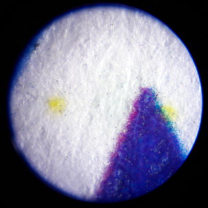
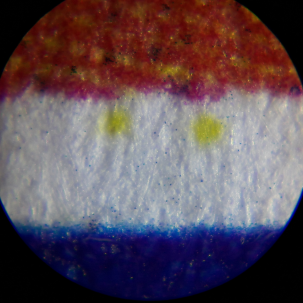
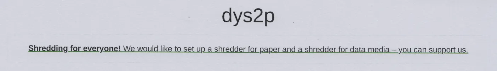
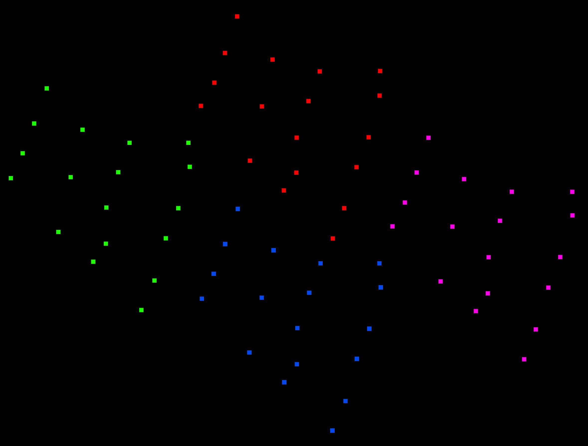
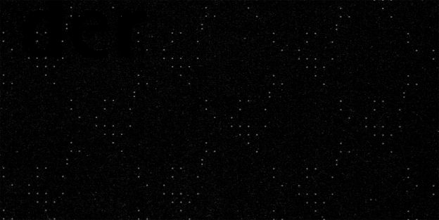
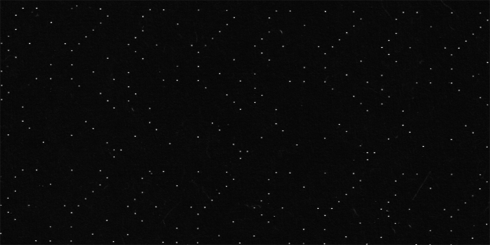
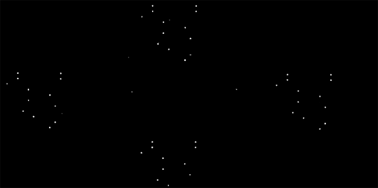
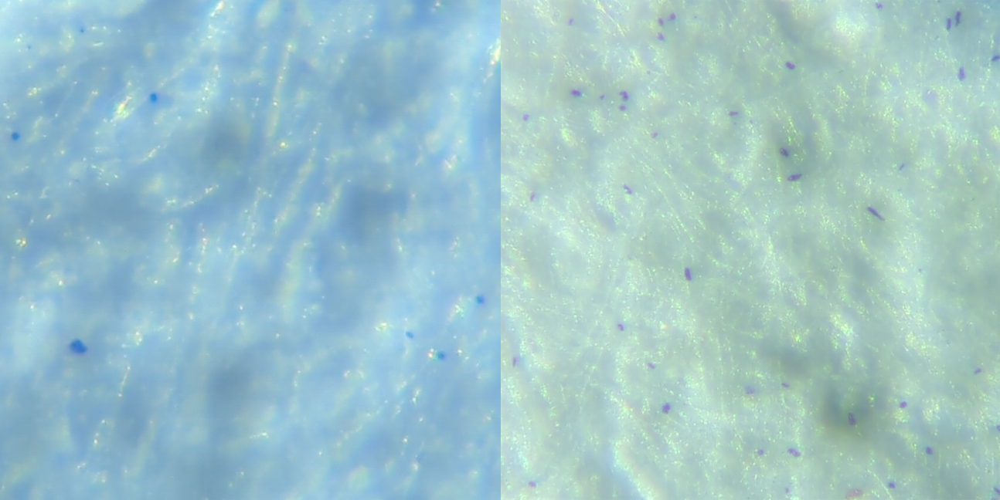

<style>
q { font-family: monospace; }
.footnotes p { margin-bottom: 0; }
</style>

# Verräterische Spuren in Ausdrucken und Scans

_September 2022_

In unserem [Ladengeschäft](https://proxysto.re/index.html) in Leipzig (Deutschland) ermöglichen wir es Personen, wie in unserem [Konzept](https://dys2p.com/konzept.html) beschrieben, ein Multifunktionsgerät (Drucker, Kopierer und Scanner) zu nutzen. Damit dies möglichst datenschutzfreundlich erfolgen kann, haben wir uns mit den Datenschutzaspekten auseinandergesetzt und treffen eine Reihe von Maßnahmen. Im Gegensatz zu vielen anderen Copyshops haben wir keine Kameras angebracht, weder vor noch in unserem Geschäft.

Auf andere Faktoren haben wir keinen oder nur bedingten Einfluss. So werden bei jedem Druck, jeder Kopie und jedem Scan Spuren oder Informationen hinterlassen, die sich nachteilig auf die Benutzerin auswirken kann. Etwa wenn es sich um vertrauliche oder private Dokumente handelt, die damit ungewollt in fremde Hände fallen könnten, oder wenn die Spuren und Informationen dazu geeignet sind, die Person zu identifizieren.

## Inhaltsverzeichnis

<nav>
  <ul>
    <li>
      <a href="#datenspeicherung-und-verarbeitung">Datenspeicherung und Verarbeitung</a>
      <ul>
        <li>
          <a href="#externe-datentraeger">Externe Datenträger</a>
          <ul>
		    <li>
			  <a href="#malware">Malware</a>
		    </li>
		    <li>
			  <a href="#identifikation">Identifikation</a>
		    </li>
          </ul>
        </li>
        <li>
          <a href="#interner-datenspeicher">Interner Datenspeicher</a>
          <ul>
            <li>
              <a href="#festplatte">Festplatte</a>
            </li>
            <li>
              <a href="#arbeisspeicher">Arbeitsspeicher</a>
            </li>
          </ul>
        </li>
      </ul>
    </li>
    <li>
      <a href="#fehldrucke-und-vergessene-dokumente">Fehldrucke und vergessene Dokumente</a>
    </li>
    <li>
      <a href="#verraeterische-spuren-auf-ausdrucken-und-in-gescannten-dokumenten">Verräterische Spuren auf Ausdrucken und in gescannten Dokumenten</a>
      <ul>
        <li>
          <a href="#machine-identification-codes">Machine Identification Codes</a>
        </li>
        <li>
          <a href="#counterfeit-deterrence-systems">Counterfeit Deterrence Systems</a>
          <ul>
            <li>
              <a href="#eurion-konstellation">EURion-Konstellation</a>
            </li>
            <li>
              <a href="#digimarc">Digitale Wasserzeichen von Digimarc</a>
            </li>
          </ul>
        </li>
        <li>
          <a href="#patente">Patente</a>
        </li>
      </ul>
    </li>
    <li>
      <a href="#mics-eigene-untersuchungen">MICs: Eigene Untersuchungen</a>
      <ul>
        <li>
          <a href="#untersuchung-mit-dem-mikroskop">Untersuchung mit dem Mikroskop</a>
        </li>
        <li>
          <a href="#untersuchung-mit-schwarzlicht">Untersuchung mit Schwarzlicht</a>
        </li>
        <li>
          <a href="#untersuchung-am-computer">Untersuchung am Computer</a>
          <ul>
            <li>
              <a href="#gimp">Bearbeitung mit GIMP</a>
            </li>
          </ul>
        </li>
        <li>
          <a href="#mics-in-freier-wildbahn">MICs in freier Wildbahn</a>
        </li>
        <li>
          <a href="#deda-toolkit">Deda Toolkit</a>
          <ul>
            <li>
              <a href="#deda_gui">deda_gui</a>
            </li>
            <li>
              <a href="#deda_extract_yd">deda_extract_yd</a>
            </li>
          </ul>
        </li>
      </ul>
    </li>
    <li>
      <a href="#metadaten-in-gescannten-dateien">Metadaten in gescannten Dateien</a>
      <ul>
        <li>
          <a href="#fallstricke-der-dateisysteme">Fallstricke der Dateisysteme</a>
        </li>
      </ul>
    </li>
    <li>
      <a href="#unerklaerliche-blaue-punkte-auf-dem-papier">Unerklärliche blaue Punkte auf dem Papier</a>
    </li>
    <li>
      <a href="#farben-typografie-und-weitere-faktoren">Farben, Typografie und weitere Faktoren</a>
    </li>
    <li>
      <a href="#fazit">Fazit</a>
    </li>
    <li>
      <a href="#danksagung-und-partizipation">Danksagung und Partizipation</a>
    </li>
    <li>
      <a href="#weiterfuehrende-literatur">Weiterführende Literatur</a>
    </li>
    <li>
      <a href="#presse">Presse</a>
    </li>
    <li>
      <a href="#guides">Guides</a>
    </li>
    <li>
      <a href="#references">Erwähnungen</a>
    </li>
    <li>
      <a href="#fussnoten">Fußnoten</a>
    </li>
  </ul>
</nav>

<h2 id="datenspeicherung-und-verarbeitung">Datenspeicherung und Verarbeitung</h2>

<h3 id="externe-datentraeger">Externe Datenträger</h3>

Sofern nicht nur eine Kopie von einem mitgebrachten Dokument erstellt werden soll, wird sehr wahrscheinlich ein wiederbeschreibbarer Datenträger (USB-Stick, SD-Karte, ...) verwendet, um darauf gescannte Dokumente zu speichern oder gespeicherte Dokumete zu drucken. In einigen Selbstbedienungs-Copyshops müssen mitgebrachte Datenträger an einen Computer angeschlossen werden, um gespeicherte Dokumente ausdrucken zu können.

<h4 id="malware">Malware</h4>

Diese Computer und Geräte können mit Schadsoftware infiziert sein. Dabei besteht etwa die Möglichkeit, dass die Schadsoftware sich auf dem verwendeten wiederbeschreibbaren Datenträger einnistet und bei einer weiteren Nutzung ausbreitet und vielfältigen Schaden anrichtet. Denkbar ist auch, dass die Schadsoftware gespeicherte Dateien ausliest und weiterleitet. Nicht zuletzt können Spuren der Dateien auf dem Gerät verbleiben und dort später in fremde Hände geraten.

[Golem.de und Kaspersky haben dies im Jahr 2015](https://web.archive.org/web/20150515004008/https://www.golem.de/news/golem-de-test-mit-kaspersky-so-sicher-sind-fototerminals-und-copyshops-1505-113981.html) mit 70 USB-Sticks an Fototerminals und in Copyshops in mehreren Städten getestet. Dabei wurde ein USB-Stick mit der Schadsoftware [Sality](https://en.wikipedia.org/wiki/Sality) infiziert.

Um die genannten Risiken zu verringern, können Personen bei uns von unserem Tails-Terminal drucken und gescannte Dokumente speichern. (Dabei handelt es sich um einen Computer ohne Festplatte. Auf ihm startet das Betriebssystem [Tails](https://tails.boum.org/index.de.html) von einer DVD. Damit kannst du dich anonym im Internet bewegen und Dokumente bearbeiten, ohne Spuren auf dem Computer zu hinterlassen. Eine Kabine schützt dich dabei vor neugierigen Blicken.) Es besteht zusätzlich die Möglichkeit, zu druckende Dateien auf CD/DVD mitzubringen und gescannte Dokumente auf CD/DVD zu brennen.

Die Verwendung von einmalig beschreibbaren CDs und DVDs ist hier sicherer als Flash-Speichermedien wie USB-Sticks und SD-Karten, auch wenn letztere einen Schreibschutz anbieten: "Bei Speichermedien mit eingebautem Hardware-Schreibschutz gibt es immer die Unsicherheit, in wie weit eine proprietäre Firmware die Blockade der Schreibkommandos und anderer Kommandos (Firmwareupdate) garantiert und nur die zum Lesen des Datenträgers erforderlichen Kommandos durchlässt."<sup><a href="#fn1" id="fnref1">1</a></sup> Wer mehr zu [Schreibtschutz](https://vkldata.com/Write-Blocker-Adapter) lesen möchte, oder selbst einen [Schreibschutz nachrüsten](https://vkldata.com/Schreibschutzschalter-am-USB-Stick-nachruesten) möchte, dem sei die Seite [vkldata.com](https://vkldata.com) empfohlen.

Hardware-Schreibblocker (z. B. für forensische Arbeiten [DE](https://web.archive.org/web/20210512013406/https://it-forensik.fiw.hs-wismar.de/index.php/Write_Blocker)[EN](https://en.wikipedia.org/wiki/Forensic_disk_controller)) erscheinen uns für diesen Einsatz aktuell zu kostspielig und unpraktikabel. Eine [Open-Source-DIY-Lösung](https://www.instructables.com/Cheap-and-Effective-USB-Write-Blocker/), wie auf der [Black Hat Europe 2012](https://docs.huihoo.com/blackhat/europe-2012/bh-eu-12-Polstra-Preventing_Oh_Shit-WP.pdf) erstmals veröffentlicht, hat leider eine sehr geringe Lesegeschwindigkeit.

<h4 id="identifikation">Identifikation</h4>

Externe Datenträger wie beispielsweise USB-Sticks oder Mobiltelefone werden vom Betriebssystem des Geräts erkannt. Die dabei entstehenden Logdateien (Protokolle) können bei einer Auswertung, z. B. nach einer Beschlagnahmung oder Infizierung, eine Vielzahl von Informationen zu an dem Gerät verwendeten externen Datenträgern preisgeben. Sie können u. a. Hardware-Seriennummern, Produktbezeichnungen und Produkt-IDs, Hersteller-IDs, Zeitpunkte des Einbindens und Auswerfens, UUID/GUID von Dateisystemen und mehr aus den letzten Wochen, Monaten oder Jahren umfassen. <sup><a href="#fn2" id="fnref2">2</a></sup> <sup><a href="#fn3" id="fnref3">3</a></sup> <sup><a href="#fn4" id="fnref4">4</a></sup> Sofern es mehr als ein Gerät bzw. eine Person betrifft, könnten darüber auch Verbindungen zwischen mehreren Geräten und Personen hergestellt werden. Für sensible Arbeiten empfiehlt es sich daher ein Betriebssystem wie Tails zu nutzen, welches beim Herunterfahren alle Logdateien "vergisst" und den Arbeitsspeicher [zusätzlich überschreibt](https://tails.boum.org/contribute/design/memory_erasure/). Bei besonders sensiblen Arbeiten sollte der externe Datenträger im Anschluss zusätzlich gelöscht und physisch zerstört werden.

Welche Informationen über externe Datenträger unser Multifunktionsgerät protokolliert, konnten wir leider nicht herausfinden.

<h3 id="interner-datenspeicher">Interner Datenspeicher</h3>

Multifunktionsgeräte nutzen ihre interne Arbeitsspeicher und Festplatte(n), um wie vorgesehen zu funktionieren. Der Arbeitsspeicher wird primär zur Verarbeitung der Druckaufträge genutzt. Auf der Festplatte werden neben der Firmware und den Einstellungen auch Daten für Druck, Kopie und Scan gespeichert.

Unser Multifunktionsgerät ist ein Canon imageRUNNER ADVANCE c5235i. Canon schreibt über die Verarbeitung der Daten:

> Das imageRUNNER ADVANCE-System untergliedert Daten vor dem Speichern in Verwaltungsinformationen und eigentliche
> Daten auf. Verwaltungsinformationen werden nach Abschluss des Kopier-, Sende-/Empfangs- oder Druckvorgangs gelöscht.
> Die eigentlichen Daten bleiben jedoch auf der Festplatte erhalten. Wenn die Funktion Festplatten-Datenlöschfunktion
> aktiviert ist, werden die eigentlichen Daten (Bild-, Verwaltungs- und Spooldaten für die Funktionen Kopieren,
> Mailbox, Drucken und Senden/Empfangen) zusammen mit den Verwaltungsinformationen gelöscht werden.

<h4 id="festplatte">Festplatte</h4>

Unser Multifunktionsgerät hat eine 160 GB große Festplatte. Auf Festplatten gespeicherte Daten lassen sich, in Abhängigkeit des verwendeten Geräts, mit oder ohne spezielle Software anteilig oder vollständig wiederherstellen, wenn diese nicht richtig vernichtet wurden. Insbesondere bei gebrauchten Geräten und Festplatten, die weiterverkauft werden, führen derartige Versäumnisse immer wieder zu Berichten wie:

- [cbsnews: Digital Photocopiers Loaded With Secrets (2010)](https://web.archive.org/web/20210702104607/https://www.cbsnews.com/news/digital-photocopiers-loaded-with-secrets/)
- [DHZ: Gefährlicher Datenspeicher: Sicherheitslücke am Kopierer (2015)](https://web.archive.org/web/20210712195315/https://www.deutsche-handwerks-zeitung.de/buerodrucker-richtig-entsorgen-148837/)
- [heise/c't: Wirklich alles gelöscht? (2016)](https://web.archive.org/web/20210630084612/https://www.heise.de/select/ct/2016/13/1466680725734830)
- [DiePresse: Das unschlagbare Langzeitgedächtnis von Druckern (2019)](https://web.archive.org/web/20210218171718/https://www.diepresse.com/5663245/das-unschlagbare-langzeitgedachtnis-von-druckern)
- [DasErste: Datenleck: Ungelöschte Festplatten auf ebay Kleinanzeigen (2021)](https://web.archive.org/web/20211022043523/https://www.daserste.de/information/wirtschaft-boerse/plusminus/sendung/daten-festplatten-ebay-kleinanzeigen-100.html)

Canon [schreibt dazu](https://web.archive.org/web/20220811185828/https://oip.manual.canon/USRMA-0072-zz-CS-deDE/contents/CS5255_security1243_specifyingmanagementsettingsfortheharddisk.html):

> Die Verwaltungsinformationen werden automatisch gelöscht, wenn der Auftrag abgeschlossen wurde, aber die tatsächlichen Daten werden auf der Festplatte gespeichert.

Wir haben unser Gerät so konfiguriert, dass während eines Auftrags die verarbeiteten und gespeicherten Daten mit dem DoD-Standard überschrieben werden. (["Die Daten werden dreimal überschrieben. Das erste Mal mit einem festen Wert, das zweite Mal mit einem Komplement des festen Wertes und das dritte Mal mit Zufallsdaten."](https://web.archive.org/web/20220811190034/https://oip.manual.canon/USRMA-0072-zz-CS-deDE/contents/CS5255_security1244_completelyerasingunnecessarydatafromthehardd.html?search=DoD)). Dies umfasst:

> - Beim Scannen temporär erstellte Bilder
> - Nach dem Löschen der Dateien in der Mailbox bzw. im Erweiterten Platz verbliebene Daten
> - Nach dem Löschen der Dateien in der Fax/I-Fax Eingangsbox (Vertrauliche Faxeingangsbox/Box Speicherempfang) verbliebene Daten
> - Gesendete und empfangene Fax/I-Faxdaten
> - [Spooldaten](https://de.wikipedia.org/wiki/Spooling)
> - Temporär gespeicherte Druckdaten

Zusätzlich dazu setzen wir das Gerät circa alle 30 Tage auf die Werkseinstellungen zurück und überschreiben mit der geräteinternen Funktion erneut alle Daten nach DoD-Standard. Wir wollten die Wirksamkeit dieser Methode mit einer forensischen Untersuchung testen, doch scheiterten [wie andere zuvor](https://web.archive.org/web/20220808210713/https://www.copytechnet.com/forums/archive/index.php/t-157793.html) beim Versuch, die Festplatte auszulesen, am ATA-Passwort. Wir hoffen, dies zu einem späteren Zeitpunkt nachholen zu können, und freuen uns über [Hinweise](https://proxysto.re/kontakt.html).

Nicht mehr benötigte Datenträger wie Festplatten, USB-Sticks und SD-Karten mit Zufallsdaten zu überschreiben ist eine gute Sache. Diese im Anschluss physisch zu zerstören, eine noch bessere. Um anderen Menschen und auch uns niederschwellig zu ermöglichen, Datenträger sicher außer Betrieb zu nehmen, wollen wir einen Festplattenshredder beschaffen und in unserem Ladengeschäft kostenfrei zugänglich machen und [sammeln dafür gerade finanzielle Mittel](https://dys2p.com/de/support.html).

<h4 id="arbeisspeicher">Arbeitsspeicher</h4>

Das Multifunktionsgerät in unserem Ladengeschäft hat 2,5 GB Arbeitsspeicher. Wie im vorherigen Abschnitt geschrieben, haben wir das Gerät so eingestellt, dass bereits während der Verarbeitung nicht mehr benötigte Informationen gelöscht und überschrieben werden sollen. Wer der Einstellung nicht vertraut, kann das Gerät nach der Benutzung ausschalten, um den Zwischenspeicher "vergessen" zu lassen.

<h2 id="fehldrucke-und-vergessene-dokumente">Fehldrucke und vergessene Dokumente</h2>

Fehldrucke können in unserem Ladengeschäft mit dem nebenstehenden Aktenvernichter, einem Dahle 706air mit den Sicherheitsstufen P-7/F-3/T-6, direkt in millimeterkleine Schnipsel zerkleinert werden. Falls das nicht ausreicht, können die Überreste mitgenommen werden.

Sollten Personen gedruckte, kopierte oder gescannte Dokumente vergessen haben, werden wir diese ansehen und mutmaßlich wichtige Originale für eine begrenzte Zeit aufbewahren. Offensichtliche Kopien und Ausdrucke werden wir am Ende des Tages schreddern.

<h2 id="verraeterische-spuren-auf-ausdrucken-und-in-gescannten-dokumenten">Verräterische Spuren auf Ausdrucken und in gescannten Dokumenten</h2>

Es gibt mannigfaltige Möglichkeiten, aus Ausdrucken Informationen zu gewinnen, die dazu führen können, den Hersteller, das Gerät und die Person, die für diesen Druck bzw. diese Kopie verantwortlich ist, zu identifizieren. Nachfolgend gehen wir auf die meisten uns bekannten Möglichkeiten ein.

<h3 id="machine-identification-codes">Machine Identification Codes</h3>

Obwohl es [seit 2004 bekannt ist](https://web.archive.org/web/20210502113634/https://www.pcworld.idg.com.au/article/8305/dutch_track_counterfeits_via_printer_serial_numbers/), handelt es sich doch um etwas, das nur wenige Personen im Kopf haben, wenn sie etwas drucken. Ein Machine Identification Code (MIC) wird auch als _yellow dots_, _tracking dots_, _secret dots_, Farbdruckermarkierung, _colour tracking dots_ oder _printer steganography_ bezeichnet und meint ein Verfahren, das winzige, für das bloße Auge nicht sichtbare, gelbe Punkte auf Ausdrucken hinzufügt. Diese gelben Punkte bilden ein Muster (davon gibt es verschiedene Formen) <sup><a href="#fn5" id="fnref5">5</a></sup>, in denen Informationen wie z. B. die Seriennummer des Gerät und ein Zeitstempel (Druckdatum und -uhrzeit) codiert gespeichert sind. Dieses Muster ist über die gesamte Seite verteilt. Für die Umsetzung ist die Firmware der Geräte verantwortlich. Im Jahr 2004 erhielt die Canon Deutschland GmbH dafür den BigBrotherAward in der Kategorie Technik.<sup><a href="#fn6" id="fnref6">6</a></sup>

Die codierten Informationen werden mitunter verwendet, um Personen zu identifizieren, die für Ausdrucke verantwortlich sind. Das führte u. a. bereits zu Identifizierung einer Whistleblowerin der NSA ([DE](https://web.archive.org/web/20220930221428/https://www.heise.de/newsticker/meldung/Vom-Drucker-verraten-NSA-Dokument-enttarnt-Whistleblowerin-3734692.html)[EN](https://web.archive.org/web/20220314225850/https://blog.erratasec.com/2017/06/how-intercept-outed-reality-winner.html)) und von [Mitarbeiter(n) des Berliner Staatsschutzes](https://web.archive.org/web/20201124104210/https://de.indymedia.org/node/29284), die Drohbriefe mit polizeiinternen Informationen [an 42 Personen versendet haben](https://web.archive.org/web/20210917182258/https://de.indymedia.org/node/16467).

Die [Electronic Frontier Foundation (EFF)](https://www.eff.org/), welche sich umfangreich mit [Druckern und deren Trackingmethoden](https://www.eff.org/de/issues/printers) befasst hat, traf im Jahr 2017 [folgende Einschätzung](https://www.eff.org/pages/list-printers-which-do-or-do-not-display-tracking-dots) [frei übersetzt]:

> Zur Erinnerung: Es scheint wahrscheinlich, dass alle neueren handelsüblichen Farblaserdrucker irgendeine Art von
> forensischen Tracking-Codes drucken, wobei nicht unbedingt gelbe Punkte verwendet werden. Dies gilt unabhängig
> davon ob diese Codes mit bloßen Auge sichtbar sind oder nicht und ob die Druckermodelle hier aufgeführt sind oder nicht.
> Dies gilt auch für die Drucker, die hier als nicht mit yellow dots arbeitend aufgeführt sind.

Wozu diese Verfahren dienen, ist offensichtlich – der Identifizierung von Geräten und Personen –, doch womit wird all das begründet? Dazu ein Exkurs in die Welt der Banknoten.

<h3 id="counterfeit-deterrence-systems">Counterfeit Deterrence Systems</h3>

Die Central Bank Counterfeit Deterrence Group (CBCDG), eine Arbeitsgruppe von inzwischen 32 Zentralbanken, [schrieb bereits im März 2004 auf ihrer Homepage](https://web.archive.org/web/20201025215726/https://rulesforuse.org/de/press-releases/zentralbanken-und-it-industrie-wollen-die-f%C3%A4lschung-von-banknoten-gemeinsam-bek%C3%A4mpfen):

> Die CBCDG hat das so genannte Counterfeit Deterrence System (CDS) entwickelt, um zu verhindern, dass PCs und Geräte
> bzw. Software zur digitalen Bildbearbeitung zur Fälschung von Banknoten verwendet werden. Das System wurde von
> Hardware- und Softwareherstellern freiwillig implementiert und verhindert, dass mittels PCs oder Geräten zur
> digitalen Bildbearbeitung das Bild einer geschützten Banknote erfasst oder reproduziert wird. Diese Technologie
> ist jedoch nicht in der Lage, den Nutzer eines PCs oder von Geräten zur digitalen Bildbearbeitung ausfindig zu machen.

Das [Unabhängige Landeszentrum für Datenschutz Schleswig-Holstein (ULD)](https://www.datenschutzzentrum.de/) hat im Jahr 2019 den Hersteller Canon angefragt ([Vorsicht: Yellow Dots! Versteckte Informationen in Farbkopien](https://www.datenschutzzentrum.de/uploads/it/2019_ULD_Report-Yellow-Dots.pdf)) und fasst die Antwort zusammen:

> [Canon] beruft sich auf die globale Zusammenarbeit zur Bekämpfung von Falschgeld zwischen den Strafverfolgungsbehörden
> und der Drucker-Industrie, die auf Veranlassung von Europol und
> Interpol entstanden ist (vgl. [8]) sowie auf die freiwillige Verpflichtung der Drucker-Industrie,
> das System zur Fälschungsprävention zu implementieren. Nähere Informationen konnte der
> Hersteller aufgrund einer Verschwiegenheitserklärung nicht geben.

<h4 id="eurion-konstellation">EURion-Konstellation</h4>

Bei Experimenten hat Markus Kuhn die [EURion-Konstellation](https://de.wikipedia.org/wiki/EURion-Konstellation) auf Euro-Banknoten entdeckt und [im Jahr 2002 veröffentlicht](https://www.cl.cam.ac.uk/%7Emgk25/eurion.pdf). Das Muster findet sich auch auf [den Banknoten anderer Länder](https://people.duke.edu/~ng46/collections/steg-eurion-constellation.htm). Es soll im Zusammenspiel mit unterstützender Soft- und Firmware von Hard- und Softwareherstellern das Scannen, Bearbeiten und Drucken von Banknoten verhindern. Weitere Untersuchungen von Steven J. Murdoch und Ben Laurie zeigen, dass die EURion-Konstellation nicht das einzige Merkmal ist, an dem Geldscheine erkannt werden.<sup><a href="#fn7" id="fnref7">7</a></sup> <sup><a href="#fn8" id="fnref8">8</a></sup> <sup><a href="#fn9" id="fnref9">9</a></sup>


Sowohl unsere eigenen Untersuchungen als auch die des Unabhängigen Landeszentrums für Datenschutz Schleswig-Holstein bestätigen dies. Wird ein Teil der EURion-Konstellation, welcher sich bei neuen Euro-Scheinen zwischen den Ziffern befindet, vom Gerät identifiziert, lässt es beim Drucken entweder Bereiche aus oder verändert das Gesamtbild etwa durch Schwärzungen oder Streifen. Wir haben dies mit der Vorderseite von Euro-Banknoten von 5 bis 50 Euro ausprobiert und dabei festgestellt, dass beim Abdecken eines Teils der EURion-Konstellation die Identifizierung fehlschlägt und keine weiteren Stellen verändert werden.

<h4 id="digimarc">Digitale Wasserzeichen von Digimarc</h4>

Neben der EURion-Konstellation benennt ein Artikel in der [Datenschleuder Nr. 86](https://dasalte.ccc.de/colorcopy/) aus dem Jahr 2005 das digitale Wasserzeichen von _Digimarc_, welches schon kurz zuvor auf dem 21C3 von Steven J. Murdoch und Ben Laurie in ihrem Vortrag [The Convergence of Anti-Counterfeiting and Computer Security](https://murdoch.is/talks/ccc04_counterfeiting.pdf) erwähnt wurde. Das Patent [WO1999053428A1](https://web.archive.org/web/20221012145732/https://patents.google.com/patent/WO1999053428A1/) der Digimarc Corporation beschreibt Grundlagen davon.

Wer mehr über Euro-Banknoten im Allgemeinen erfahren möchte, wird bei [Wikipedia](https://de.wikipedia.org/wiki/Eurobanknoten) fündig.

<h3 id="patente">Patente</h3>

Die Grundlagen dieser bereits bekannten Verfahren sind Patentanträge wie beispielsweise [US Patent 5515451](https://patents.justia.com/patent/5515451), welches am 7. Oktober 1993 von Xerox beantragt und 1996 erteilt wurde, und [US Patent 5845008](https://patents.justia.com/patent/5845008), welches am 20. Januar 1995 von der Omron Corporation beantragt und 1998 erteilt wurde. Da diese Anträge lange vor der Implementierung und den späteren "Entdeckungen in freier Wildbahn" gestellt wurden, könnte sich eine Recherche zu weiteren Patentanmeldungen der Hersteller lohnen, um Aufklärung über zusätzliche, womöglich bisher unentdeckte datenschutzfeindliche Methoden zu erlangen.

* [Brother Industries, Ltd.](https://patents.justia.com/assignee/brother-industries-ltd)
* [Brother Industries, Limited](https://patents.justia.com/assignee/brother-industries-limited)
* [Brother International Corporation ](https://patents.justia.com/assignee/brother-international-corporation)
* [Brother Kogyo Kabushiki Kaisha](https://patents.justia.com/assignee/brother-kogyo-kabushiki-kaisha)
* [Canon](https://patents.justia.com/company/canon)
* [Canon Kabushiki Kaisha](https://patents.justia.com/assignee/canon-kabushiki-kaisha)
* [Canon Production Printing Holding B.V.](https://patents.justia.com/assignee/canon-production-printing-holding-b-v)
* [Fuji Pigment Co., Ltd.](https://patents.justia.com/assignee/fuji-pigment-co-ltd)
* [Fuji Xerox Co ltd.](https://patents.justia.com/assignee/fuji-xerox-co-ltd)
* [Hewlett-Packard](https://patents.justia.com/company/hewlett-packard)
* [Hewlett-Packard Development Company, L.P.](https://patents.justia.com/search?q=Hewlett-Packard+Development+Company%2C+L.P.)
* [HP INDIGO B.V.](https://patents.justia.com/assignee/hp-indigo-b-v)
* [Hewlett-Packard Indigo B.V.](https://patents.justia.com/assignee/hewlett-packard-indigo-b-v)
* [Hewlett-Packard Industrial Printing Ltd.](https://patents.justia.com/assignee/hewlett-packard-industrial-printing-ltd)
* [Konica Minolta, Inc.](https://patents.justia.com/assignee/konica-minolta-inc)
* [Kyocera Document Solutions Inc.](https://patents.justia.com/assignee/kyocera-document-solutions-inc)
* [Lexmark International, Inc.](https://patents.justia.com/assignee/lexmark-international-inc)
* [Oki Electric Industry Co., Ltd.](https://patents.justia.com/assignee/oki-electric-industry-co-ltd)
* [Ricoh Company ltd.](https://patents.justia.com/assignee/ricoh-company-ltd)
* [Samsung](https://patents.justia.com/company/samsung)
* [Seiko Epson Corp.](https://patents.justia.com/assignee/seiko-epson-corp)
* [Seiko Epson Corporation](https://patents.justia.com/assignee/seiko-epson-corporation)
* [Xerox Corporation](https://patents.justia.com/assignee/xerox-corporation)

<h2 id="mics-eigene-untersuchungen">MICs: Eigene Untersuchungen</h2>

Zurück zum Machine Identification Code. Um zu überprüfen, ob ein Farblaserdrucker Machine Identification Codes auf Ausdrucken hinterlässt, gibt es verschiedene Verfahren. Wir haben uns bei unseren Untersuchungen am Vorgehen des Unabhängigen Landeszentrums für Datenschutz Schleswig-Holstein (ULD) in der zweiten Version ihrer Ausarbeitung [Vorsicht: Yellow Dots!](https://www.datenschutzzentrum.de/uploads/it/2019_ULD_Report-Yellow-Dots.pdf) orientiert.

Zu den Faktoren, die das Ergebnis verfälschen könnten, gehört ein zu geringer Füllstand der gelben Tonerkartusche. Hier sei angemerkt, dass bei manchen Geräten auch ein Druck in Schwarzweiß nicht mehr möglich ist, sobald eine Farbe leer ist. Falls der Ausdruck eingescannt wird, kann auch eine zu geringe Auflösung des Scans das Untersuchungsergebnis beeinträchtigen.

Für sämtliche nachfolgenden Untersuchungen haben wir, sofern nicht anders benannt, Ausdrucke unseres Canon imageRUNNER ADVANCE c5235i in DIN A4 mit den Farbprofilen <q>Farbe</q> und <q>Schwarz</q> verwendet. Für einen aussagekräftigen Vergleich haben wir ein Blatt Papier vor und nach dem Druck auf die gleiche Weise untersucht. Zuvor haben wir eine Seite des Blattes markiert, um sicherzustellen, dass wir vor und nach dem Druck die gleiche Seite betrachten.

<h3 id="untersuchung-mit-dem-mikroskop">Untersuchung mit dem Mikroskop</h3>

Wir haben zunächst unbedruckte Blätter genommen, eine Stelle markiert und diese vor und nach dem Druck mit einem Taschenmikroskop (Vergrößerung 60 bis 120) untersucht. Damit konnten wir die Ergebnisse des ULD bei uns bestätigen. Auf Ausdrucken, die mit dem Profil <q>Farbe</q> gedruckt wurden, haben wir mehrere winzige gelbe Punkte festgestellt. Bei Ausdrucken, die mit dem Farbprofil <q>Schwarz</q> erstellt wurden, waren diese nicht vorhanden.

 

<h3 id="untersuchung-mit-schwarzlicht">Untersuchung mit Schwarzlicht</h3>

Im Gegensatz zu dem Ergebnis des ULD konnten wir unter Schwarzlicht mit bloßem Auge keine gelben Punkte sichtbar machen. Zu besseren Veranschaulichung nachfolgend ein Foto der vergrößerten und mit Schwarzlicht angestrahlten Aufnahme der Untersuchung des ULD.

](../assets/images/print-scan-traces/uv-uld.jpg)

<h3 id="untersuchung-am-computer">Untersuchung am Computer</h3>

Um die Ausdrucke am Computer untersuchen zu können, empfiehlt sich die Arbeit mit gescannten Dokumenten. Dabei ist zu beachten, das dies am besten in einer hohen Auflösung (z. B. 1200x1200 dpi) und in einem verlustfreien Format geschieht.

Wir haben ein zuvor unbedrucktes weißes DIN-A4-Blatt vor und nach dem Bedrucken mit einem _Canon CanoScan LiDE 210_ mit 300, 600, 1200 und 2400 dpi eingescannt und als PNG-Datei gespeichert. Als Software diente uns dabei [GNOME simple-scan](https://gitlab.gnome.org/GNOME/simple-scan).

<h4 id="gimp">Bearbeitung mit GIMP</h4>

Wir haben mit [GIMP (GNU Image Manipulation Program)](https://www.gimp.org) diese Schritte ausgeführt:

1. gescannte Datei auswählen und in GIMP öffnen
2. Fenster > Andockbare Dialoge > Farben: die Farben Rot und Grün abwählen
3. Farben > Invertieren
4. Farben > Sättigung: erhöhen (mehrfach möglich)
5. ggf. weitere Anpassungen z. B. über die Farbkurven
6. Farben > Komponenten > Mono Mixer: Blaukanal hervorheben, z. B. mit den Werten 0, 0, 1



Ein vereinfachter Workflow, der hier jedoch nicht zur Anwendung kam, kann wie folgt aussehen:

1. Farben > Sättigung: zwei Mal ausführen mit dem Wert 10
2. Farben > Komponenten > Mono Mixer: Blaukanal hervorheben, z. B. mit den Werten 0, 0, 1
3. Farben > Invertieren

Je höher die Auflösung (300, 600, 1200, 2400 dpi), desto besser lässt sich das Muster erkennen und untersuchen:


Wir haben Ausdrucke vom Computer und vom USB-Stick sowie Kopien mit einer Auflösung von 600x600 dpi gescannt und in GIMP bearbeitet, um sie auf Machine Identification Codes zu untersuchen. In den Druckmodi <q>Einzelfarbe</q> und <q>Zwei Farben</q> haben wir nur einen Teil der verfügbaren Farben untersucht.

<table class="table">
  <thead>
    <tr>
      <th>Kategorie</th>
      <th>Modus</th>
      <th>Modus-Einstellung</th>
      <th>MIC</th>
    </tr>
  </thead>
  <tbody>
    <tr>
      <td>Druck von PC</td>
      <td>Schwarzweiß</td>
      <td>-</td>
      <td>kein MIC festgestellt</td>
    </tr>
    <tr>
      <td>Druck von PC</td>
      <td>Farbe</td>
      <td>-</td>
      <td><strong>MIC festgestellt</strong></td>
    </tr>
    <tr>
      <td>Druck von USB</td>
      <td>Auto (Farbe/Schwarz)</td>
      <td>-</td>
      <td><strong>MIC festgestellt</strong></td>
    </tr>
    <tr>
      <td>Druck von USB</td>
      <td>Schwarz</td>
      <td>-</td>
      <td>kein MIC festgestellt</td>
    </tr>
    <tr>
      <td>Kopie</td>
      <td>Auto (Farbe/Schwarz)</td>
      <td>-</td>
      <td><strong>MIC festgestellt</strong></td>
    </tr>
    <tr>
      <td>Kopie</td>
      <td>Einzelfarbe</td>
      <td>gelb</td>
      <td><strong>MIC festgestellt</strong></td>
    </tr>
    <tr>
      <td>Kopie</td>
      <td>Einzelfarbe</td>
      <td>grün</td>
      <td><strong>MIC festgestellt</strong></td>
    </tr>
    <tr>
      <td>Kopie</td>
      <td>Einzelfarbe</td>
      <td>rot</td>
      <td><strong>MIC festgestellt</strong></td>
    </tr>
    <tr>
      <td>Kopie</td>
      <td>Schwarz</td>
      <td>-</td>
      <td>kein MIC festgestellt</td>
    </tr>
    <tr>
      <td>Kopie</td>
      <td>Vollfarbe</td>
      <td>-</td>
      <td><strong>MIC festgestellt</strong></td>
    </tr>
    <tr>
      <td>Kopie</td>
      <td>Zwei Farben</td>
      <td>schwarz & rot</td>
      <td><strong>MIC festgestellt</strong></td>
    </tr>
  </tbody>
</table>

Ausdrucke und Kopien, die ohne Farben, sondern nur mit Schwarz erfolgen, erhalten in unseren Untersuchungen an unserem Gerät somit keinen sichtbaren Machine Identification Code.

Alle festgestellten Muster sind sogenannte <dfn>skewed small patterns</dfn>, welches Peter Buck in seiner Arbeit "[Reverse Engineering the Machine Identification Code](https://www.researchgate.net/publication/325976319_Reverse_Engineering_the_Machine_Identification_Code)" beschrieben hat und das ebenfalls an der [Duke University untersucht wurde](https://people.duke.edu/~ng46/collections/steg-color-copier-dot-code.htm).

Wir können die Ergebnisse dieser Arbeiten bestätigen: Wir finden ein Muster aus 18 Punkten vor, die unserer Einschätzung nach in einem Raster von 16x32 angeordnet sind, wahrscheinlich die Seriennummer unseres Gerätes (JWF11162) repräsentieren und sich über die gesamte Seite wiederholen. Das Muster ändert sich nicht mit der Zeit, dem Datum oder dem Inhalt des gedruckten Dokuments. Es hat die Form eines um etwa 30 Grad geneigten Parallelogramms. Die Ausrichtung, Start und Ende könnten jedoch auch anders als hier abgebildet sein. Das folgende Bild zeigt vier Wiederholungen des Musters, die wir unterschiedlich eingefärbt haben.



<h3 id="mics-in-freier-wildbahn">MICs in freier Wildbahn</h3>

Um festzustellen, wie häufig MICs "in der freien Wildbahn" anzutreffen sind, haben wir 100 Dokumente von 100 verschiedenen Unternehmen, Vereinen und Behörden untersucht, die wir unabhängig von dieser Untersuchung erhalten hatten. Das älteste Dokument kommt aus dem Jahr 2013, die meisten sind aus dem Zeitraum 2020-2022. Wir haben die Dokumente zufällig ausgewählt und jeweils meist das erste Blatt mittels Scan und Bearbeitung mit GIMP, wie oben beschrieben, und mit dem Mikroskop bei 120 facher Vergrößerung untersucht.

<table class="table">
  <thead>
    <tr>
      <th>Nummer</th>
      <th>Druck in Farbe / Schwarzweiß</th>
      <th>MIC</th>
      <th>Pattern</th>
      <th></th>
    </tr>
  </thead>
  <tbody>
    <tr>
      <td>001</td>
      <td>SW</td>
      <td>kein MIC festgestellt</td>
      <td></td>
      <td></td>
    </tr>
    <tr>
      <td>002</td>
      <td>Farbe</td>
      <td><strong>MIC festgestellt</strong></td>
      <td></td>
      <td></td>
    </tr>
    <tr>
      <td>003</td>
      <td>SW</td>
      <td>kein MIC festgestellt</td>
      <td></td>
      <td></td>
    </tr>
    <tr>
      <td>004</td>
      <td>SW</td>
      <td>kein MIC festgestellt</td>
      <td></td>
      <td></td>
    </tr>
    <tr>
      <td>005</td>
      <td>SW</td>
      <td>kein MIC festgestellt</td>
      <td></td>
      <td></td>
    </tr>
    <tr>
      <td>006</td>
      <td>SW</td>
      <td>kein MIC festgestellt</td>
      <td></td>
      <td></td>
    </tr>
    <tr>
      <td>007</td>
      <td>SW</td>
      <td>kein MIC festgestellt</td>
      <td></td>
      <td></td>
    </tr>
    <tr>
      <td>008</td>
      <td>Farbe</td>
      <td><strong>MIC festgestellt</strong></td>
      <td></td>
      <td></td>
    </tr>
    <tr>
      <td>009</td>
      <td>SW</td>
      <td>kein MIC festgestellt</td>
      <td></td>
      <td></td>
    </tr>
    <tr>
      <td>010</td>
      <td>SW</td>
      <td>kein MIC festgestellt</td>
      <td></td>
      <td></td>
    </tr>
    <tr>
      <td>011</td>
      <td>SW</td>
      <td>kein MIC festgestellt</td>
      <td></td>
      <td></td>
    </tr>
    <tr>
      <td>012</td>
      <td>SW</td>
      <td>kein MIC festgestellt</td>
      <td></td>
      <td></td>
    </tr>
    <tr>
      <td>013</td>
      <td>SW</td>
      <td>kein MIC festgestellt</td>
      <td></td>
      <td></td>
    </tr>
    <tr>
      <td>014</td>
      <td>SW</td>
      <td>kein MIC festgestellt</td>
      <td></td>
      <td></td>
    </tr>
    <tr>
      <td>015</td>
      <td>SW</td>
      <td>kein MIC festgestellt</td>
      <td></td>
      <td></td>
    </tr>
    <tr>
      <td>016</td>
      <td>SW</td>
      <td>kein MIC festgestellt</td>
      <td></td>
      <td></td>
    </tr>
    <tr>
      <td>017</td>
      <td>SW</td>
      <td>kein MIC festgestellt</td>
      <td></td>
      <td></td>
    </tr>
    <tr>
      <td>018</td>
      <td>SW</td>
      <td>kein MIC festgestellt</td>
      <td></td>
      <td></td>
    </tr>
    <tr>
      <td>019</td>
      <td>SW</td>
      <td>kein MIC festgestellt</td>
      <td></td>
      <td></td>
    </tr>
    <tr>
      <td>020</td>
      <td>Farbe</td>
      <td>unsicher (CMYK-Dots)</td>
      <td></td>
      <td></td>
    </tr>
    <tr>
      <td>021</td>
      <td>Farbe</td>
      <td><strong>MIC festgestellt</strong></td>
      <td></td>
      <td></td>
    </tr>
    <tr>
      <td>022</td>
      <td>SW</td>
      <td>kein MIC festgestellt</td>
      <td></td>
      <td></td>
    </tr>
    <tr>
      <td>023</td>
      <td>SW</td>
      <td>kein MIC festgestellt</td>
      <td></td>
      <td></td>
    </tr>
    <tr>
      <td>024</td>
      <td>SW</td>
      <td>kein MIC festgestellt</td>
      <td></td>
      <td></td>
    </tr>
    <tr>
      <td>025</td>
      <td>SW</td>
      <td>kein MIC festgestellt</td>
      <td></td>
      <td></td>
    </tr>
    <tr>
      <td>026</td>
      <td>SW</td>
      <td>kein MIC festgestellt</td>
      <td></td>
      <td></td>
    </tr>
    <tr>
      <td>027</td>
      <td>SW</td>
      <td>unsicher (CMYK-Dots)</td>
      <td></td>
      <td></td>
    </tr>
    <tr>
      <td>028</td>
      <td>SW</td>
      <td>kein MIC festgestellt</td>
      <td></td>
      <td></td>
    </tr>
    <tr>
      <td>029</td>
      <td>SW</td>
      <td>kein MIC festgestellt</td>
      <td></td>
      <td></td>
    </tr>
    <tr>
      <td>030</td>
      <td>SW</td>
      <td>kein MIC festgestellt</td>
      <td></td>
      <td></td>
    </tr>
    <tr>
      <td>031</td>
      <td>SW</td>
      <td>kein MIC festgestellt</td>
      <td></td>
      <td></td>
    </tr>
    <tr>
      <td>032</td>
      <td>SW</td>
      <td>kein MIC festgestellt</td>
      <td></td>
      <td></td>
    </tr>
    <tr>
      <td>033</td>
      <td>Farbe</td>
      <td><strong>MIC festgestellt</strong></td>
      <td></td>
      <td></td>
    </tr>
    <tr>
      <td>034</td>
      <td>SW</td>
      <td>kein MIC festgestellt</td>
      <td></td>
      <td></td>
    </tr>
    <tr>
      <td>035</td>
      <td>SW</td>
      <td>unsicher (CMYK-Dots)</td>
      <td></td>
      <td></td>
    </tr>
    <tr>
      <td>036</td>
      <td>SW</td>
      <td>kein MIC festgestellt</td>
      <td></td>
      <td></td>
    </tr>
    <tr>
      <td>037</td>
      <td>Farbe</td>
      <td><strong>MIC festgestellt</strong></td>
      <td></td>
      <td></td>
    </tr>
    <tr>
      <td>038</td>
      <td>SW</td>
      <td>kein MIC festgestellt</td>
      <td></td>
      <td></td>
    </tr>
    <tr>
      <td>039</td>
      <td>Farbe</td>
      <td><strong>MIC festgestellt</strong></td>
      <td></td>
      <td></td>
    </tr>
    <tr>
      <td>040</td>
      <td>SW</td>
      <td>kein MIC festgestellt</td>
      <td></td>
      <td></td>
    </tr>
    <tr>
      <td>041</td>
      <td>SW</td>
      <td>kein MIC festgestellt</td>
      <td></td>
      <td></td>
    </tr>
    <tr>
      <td>042</td>
      <td>SW</td>
      <td><strong>MIC festgestellt</strong></td>
      <td></td>
      <td></td>
    </tr>
    <tr>
      <td>043</td>
      <td>Farbe</td>
      <td><strong>MIC festgestellt</strong></td>
      <td></td>
      <td></td>
    </tr>
    <tr>
      <td>044</td>
      <td>Farbe</td>
      <td><strong>MIC festgestellt</strong></td>
      <td></td>
      <td></td>
    </tr>
    <tr>
      <td>045</td>
      <td>SW</td>
      <td>kein MIC festgestellt</td>
      <td></td>
      <td></td>
    </tr>
    <tr>
      <td>046</td>
      <td>SW</td>
      <td>kein MIC festgestellt</td>
      <td></td>
      <td></td>
    </tr>
    <tr>
      <td>047</td>
      <td>SW</td>
      <td>kein MIC festgestellt</td>
      <td></td>
      <td></td>
    </tr>
    <tr>
      <td>048</td>
      <td>SW</td>
      <td>kein MIC festgestellt</td>
      <td></td>
      <td></td>
    </tr>
    <tr>
      <td>049</td>
      <td>SW</td>
      <td>kein MIC festgestellt</td>
      <td></td>
      <td></td>
    </tr>
    <tr>
      <td>050</td>
      <td>SW</td>
      <td>kein MIC festgestellt</td>
      <td></td>
      <td></td>
    </tr>
    <tr>
      <td>051</td>
      <td>SW</td>
      <td>kein MIC festgestellt</td>
      <td></td>
      <td></td>
    </tr>
    <tr>
      <td>052</td>
      <td>SW</td>
      <td>kein MIC festgestellt</td>
      <td></td>
      <td></td>
    </tr>
    <tr>
      <td>053</td>
      <td>SW</td>
      <td>kein MIC festgestellt</td>
      <td></td>
      <td></td>
    </tr>
    <tr>
      <td>054</td>
      <td>SW</td>
      <td>kein MIC festgestellt</td>
      <td></td>
      <td></td>
    </tr>
    <tr>
      <td>055</td>
      <td>SW</td>
      <td>kein MIC festgestellt</td>
      <td></td>
      <td></td>
    </tr>
    <tr>
      <td>056</td>
      <td>SW</td>
      <td>kein MIC festgestellt</td>
      <td></td>
      <td></td>
    </tr>
    <tr>
      <td>057</td>
      <td>SW</td>
      <td>kein MIC festgestellt</td>
      <td></td>
      <td></td>
    </tr>
    <tr>
      <td>058</td>
      <td>SW</td>
      <td>kein MIC festgestellt</td>
      <td></td>
      <td></td>
    </tr>
    <tr>
      <td>059</td>
      <td>Farbe</td>
      <td><strong>MIC festgestellt</strong></td>
      <td></td>
      <td></td>
    </tr>
    <tr>
      <td>060</td>
      <td>SW</td>
      <td>kein MIC festgestellt</td>
      <td></td>
      <td></td>
    </tr>
    <tr>
      <td>061</td>
      <td>SW</td>
      <td>kein MIC festgestellt</td>
      <td></td>
      <td></td>
    </tr>
    <tr>
      <td>062</td>
      <td>SW</td>
      <td>kein MIC festgestellt</td>
      <td></td>
      <td></td>
    </tr>
    <tr>
      <td>063</td>
      <td>SW</td>
      <td>kein MIC festgestellt</td>
      <td></td>
      <td></td>
    </tr>
    <tr>
      <td>064</td>
      <td>SW</td>
      <td>kein MIC festgestellt</td>
      <td></td>
      <td></td>
    </tr>
    <tr>
      <td>065</td>
      <td>SW</td>
      <td>kein MIC festgestellt</td>
      <td></td>
      <td></td>
    </tr>
    <tr>
      <td>066</td>
      <td>SW</td>
      <td>kein MIC festgestellt</td>
      <td></td>
      <td></td>
    </tr>
    <tr>
      <td>067</td>
      <td>SW</td>
      <td>kein MIC festgestellt</td>
      <td></td>
      <td></td>
    </tr>
    <tr>
      <td>068</td>
      <td>SW</td>
      <td>kein MIC festgestellt</td>
      <td></td>
      <td></td>
    </tr>
    <tr>
      <td>069</td>
      <td>SW</td>
      <td>kein MIC festgestellt</td>
      <td></td>
      <td></td>
    </tr>
    <tr>
      <td>070</td>
      <td>SW</td>
      <td>kein MIC festgestellt</td>
      <td></td>
      <td></td>
    </tr>
    <tr>
      <td>071</td>
      <td>SW</td>
      <td>kein MIC festgestellt</td>
      <td></td>
      <td></td>
    </tr>
    <tr>
      <td>072</td>
      <td>SW</td>
      <td>kein MIC festgestellt</td>
      <td></td>
      <td></td>
    </tr>
    <tr>
      <td>073</td>
      <td>SW</td>
      <td><strong>MIC festgestellt</strong></td>
      <td></td>
      <td></td>
    </tr>
    <tr>
      <td>074</td>
      <td>SW</td>
      <td>kein MIC festgestellt</td>
      <td></td>
      <td></td>
    </tr>
    <tr>
      <td>075</td>
      <td>SW</td>
      <td>kein MIC festgestellt</td>
      <td></td>
      <td></td>
    </tr>
    <tr>
      <td>076</td>
      <td>Farbe</td>
      <td><strong>MIC festgestellt</strong></td>
      <td></td>
      <td></td>
    </tr>
    <tr>
      <td>077</td>
      <td>SW</td>
      <td>kein MIC festgestellt</td>
      <td></td>
      <td></td>
    </tr>
    <tr>
      <td>078</td>
      <td>SW</td>
      <td>unsicher (CMYK-Dots)</td>
      <td></td>
      <td></td>
    </tr>
    <tr>
      <td>079</td>
      <td>SW</td>
      <td>kein MIC festgestellt</td>
      <td></td>
      <td></td>
    </tr>
    <tr>
      <td>080</td>
      <td>SW</td>
      <td>kein MIC festgestellt</td>
      <td></td>
      <td></td>
    </tr>
    <tr>
      <td>081</td>
      <td>SW</td>
      <td>kein MIC festgestellt</td>
      <td></td>
      <td></td>
    </tr>
    <tr>
      <td>082</td>
      <td>SW</td>
      <td>kein MIC festgestellt</td>
      <td></td>
      <td></td>
    </tr>
    <tr>
      <td>083</td>
      <td>SW</td>
      <td>kein MIC festgestellt</td>
      <td></td>
      <td></td>
    </tr>
    <tr>
      <td>084</td>
      <td>SW</td>
      <td>kein MIC festgestellt</td>
      <td></td>
      <td></td>
    </tr>
    <tr>
      <td>085</td>
      <td>SW/Farbe</td>
      <td>kein MIC festgestellt</td>
      <td></td>
      <td></td>
    </tr>
    <tr>
      <td>086</td>
      <td>Farbe</td>
      <td><strong>MIC festgestellt</strong></td>
      <td></td>
      <td></td>
    </tr>
    <tr>
      <td>087</td>
      <td>SW</td>
      <td>kein MIC festgestellt</td>
      <td></td>
      <td></td>
    </tr>
    <tr>
      <td>088</td>
      <td>SW</td>
      <td>kein MIC festgestellt</td>
      <td></td>
      <td></td>
    </tr>
    <tr>
      <td>089</td>
      <td>SW</td>
      <td>kein MIC festgestellt</td>
      <td></td>
      <td></td>
    </tr>
    <tr>
      <td>090</td>
      <td>Farbe</td>
      <td><strong>MIC festgestellt</strong></td>
      <td></td>
      <td></td>
    </tr>
    <tr>
      <td>091</td>
      <td>SW</td>
      <td>kein MIC festgestellt</td>
      <td></td>
      <td></td>
    </tr>
    <tr>
      <td>092</td>
      <td>Farbe</td>
      <td><strong>MIC festgestellt</strong></td>
      <td></td>
      <td></td>
    </tr>
    <tr>
      <td>093</td>
      <td>SW</td>
      <td>kein MIC festgestellt</td>
      <td></td>
      <td></td>
    </tr>
    <tr>
      <td>094</td>
      <td>SW</td>
      <td>kein MIC festgestellt</td>
      <td></td>
      <td></td>
    </tr>
    <tr>
      <td>095</td>
      <td>SW</td>
      <td>kein MIC festgestellt</td>
      <td></td>
      <td></td>
    </tr>
    <tr>
      <td>096</td>
      <td>Farbe</td>
      <td><strong>MIC festgestellt</strong></td>
      <td></td>
      <td></td>
    </tr>
    <tr>
      <td>097</td>
      <td>SW</td>
      <td>kein MIC festgestellt</td>
      <td></td>
      <td></td>
    </tr>
    <tr>
      <td>098</td>
      <td>SW</td>
      <td>kein MIC festgestellt</td>
      <td></td>
      <td></td>
    </tr>
    <tr>
      <td>099</td>
      <td>SW</td>
      <td>kein MIC festgestellt</td>
      <td></td>
      <td></td>
    </tr>
    <tr>
      <td>100</td>
      <td>SW</td>
      <td>kein MIC festgestellt</td>
      <td></td>
      <td></td>
    </tr>
  </tbody>
</table>

Die Drucke und Kopien stammen von uns unbekannten Laser- und Tintenstrahldruckern und waren schwarz-weiß und in Farbe. Die Stichprobe umfasste weißes Papier, nicht gebleichtes Recyclingpapier und vorgedrucktes Briefpapier. Ob im letzten Fall der Machine Identification Code beim Erstellen des Vordrucks oder beim Druck auf das Briefpapier erstellt wurde, haben wir nicht näher untersucht, sodass auch hier das Ergebnis nur <q>MIC festgestellt</q> oder <q>kein MIC festgestellt</q> lautet.

Bei vier Dokumenten konnten wir mit dem Mikroskop zwar gelbe Punkte auf dem Papier feststellen, doch da sich jeweils auf der gesamten Seite farbige Punkte in CMYK-Farben befanden, konnten wir nicht eindeutig ein Muster identifizieren und haben es als <q>unsicher (CMYK-Dots)</q> gewertet.

Insgesamt wurde bei 16 von 100 Dokumenten ein Machine Identification Code erkannt, davon bei 14 von 16 farbigen Dokumenten.

<h3 id="deda-toolkit">Deda Toolkit</h3>

Einen interessanten Ansatz verfolgt das [Deda Toolkit](https://github.com/dfd-tud/deda), welches an der [TU Dresden](https://tu-dresden.de/tu-dresden/newsportal/news/geheime-daten-auf-dem-druckpapier-diplominformatiker-der-tu-dresden-entwickeln-verfahren-gegen-druckerueberwachung) entwickelt wurde. Es soll dabei helfen, Tracking-Dots zu erkennen, und bietet die Möglichkeit der Anonymisierung, indem erkannte Muster entfernt oder [neue hinzugefügt](https://news.ycombinator.com/item?id=14501894#14502387) werden können. Über das Verfahren berichteten u. a. [Netzpolitik.org](https://netzpolitik.org/2018/gute-nachricht-fuer-whistleblower-dresdner-forscher-tricksen-druckerueberwachung-aus/) und der [Deutschlandfunk](https://www.deutschlandfunk.de/farblaserdrucker-tracking-dots-unlesbar-machen-100.html).

Wir haben das Deda Toolkit auf Debian-basierten Systemen getestet.

```
sudo apt update
sudo apt install python3-pip
pip3 install --user deda
```

<h4 id="deda_gui">deda_gui</h4>

`python3 /home/user/.local/bin/deda_gui`

Die `deda_gui` hat das Muster, welches mit der Bearbeitung in GIMP sichtbar wurde, bei unseren Tests nicht erkannt. Wir haben mehrere im PNG-Format gespeicherte Scans mit 300, 600 und 1200 dpi getestet und erhielten nur die Meldung <q>No tracking dot pattern detected. For best results try a 300 dpi scan and a lossless file format.</q>

<h4 id="deda_extract_yd">deda_extract_yd</h4>

`python3 /home/user/.local/bin/deda_extract_yd filepath --debug`

Bei unseren Tests in der Kommandozeile mit den gleichen Eingabedateien erkannte `deda_extract_yd` bei einer Datei mit 300 dpi Auflösung ein Trackingmuster (<q>Detected tracking dot pattern (-1, -1, 0.283334, 0.006667)</q>), bei höheren Auflösungen jedoch nicht mehr. Stattdessen erhielten wir die Fehlermeldung <q>AttributeError: 'YellowDotsXposer' object has no attribute 'dots'</q>.

Um nach MICs zu suchen, erscheint uns daher die manuelle Methode mit GIMP derzeit zuverlässiger. Auch die Anonymisierungsmethode von deda scheint nur bei manchen Mustern zu funktionieren. In Test mit unserem Canon-Gerät gab es trotz der erfolgreichen Meldung <q>Document anonymized and saved</q> in der `deda_gui` und der Speicherung einer `anon.png` keine Veränderung zum Original, der MIC war nach wie vor erkennbar. Wie uns Stephan Escher mitgeteilt hat, gab es für die Analyse der von Canon verwendeten Muster bislang nicht genügend Material. Zudem seien Muster von Canon-Geräten schwerer zu detektieren als die anderer Hersteller.

<h2 id="metadaten-in-gescannten-dateien">Metadaten in gescannten Dateien</h2>

Digitale Dateien wie Dokumente und Grafiken enthalten [Metadaten](https://www.whonix.org/wiki/Metadata). Diese können ungewollt Informationen preisgeben und dadurch Rückschlüsse auf die Quelle zulassen. Die [Extensible Metadata Platform (XMP)](https://github.com/adobe/xmp-docs) ist ein von Adobe entwickelter Standard, um Metadaten in Dateien einzubetten. Diese können jedoch auch als eigene Datei im selben Verzeichnis liegen.

Wird beim Speichern eines gescannten Dokuments keine selbstgewählte Bezeichnung vergeben, erzeugt unser Canon imageRUNNER ADVANCE c5235i unter [Verwendung des XMP-Standards](https://github.com/adobe/xmp-docs/blob/master/XMPNamespaces/XMPDataTypes/CoreProperties.md) den Dateinamen aus der Systemzeit UTC+0 zum Zeitpunkt des Scanbeginns. So bedeutet der Dateiname `20041224084919.pdf`, dass die Datei, gemäß der am Gerät eingestellten Zeit, am 24.12.2004 um 08:49:19 UTC+0 erstellt wurde. Bei Scans im JPEG-Format erhalten die Dateinamen zusätzlich eine Nummierung in der Form `_001`, welche sich mit jeder Seite um eins erhöht. Andere Geräte können für die Namensvergabe ein anderes Schema. Dadurch können Rückschlüsse auf den Hersteller oder das Modell möglich sein.

In den nachfolgenden Metadaten ist erkennbar, dass bei unserem Test trotz eingestellter Zeitzone UTC+1 die Namensvergabe mit UTC+0 erfolgte. Zum Auslesen der Exif-Daten nutzen wir [ExifTool](https://exiftool.org/):

`exiftool -g /home/user/20041224084919.pdf`

```
---- ExifTool ----
ExifTool Version Number         : 12.44
---- File ----
File Name                       : 20041224084919.pdf
Directory                       : /mnt/usb/...
File Size                       : 44 kB
File Modification Date/Time     : 2004:12:24 09:49:26+01:00
File Access Date/Time           : 2022:08:08 11:29:37+02:00
File Inode Change Date/Time     : 2004:12:24 09:49:24+01:00
File Permissions                : -rwxr-xr-x
File Type                       : PDF
File Type Extension             : pdf
MIME Type                       : application/pdf
---- PDF ----
PDF Version                     : 1.4
Linearized                      : No
Creator                         : Canon iR-ADV C5235  PDF
Create Date                     : 2004:12:24 08:49:24Z
Page Count                      : 1
---- XMP ----
XMP Toolkit                     : Adobe XMP Core
Creator Tool                    : Canon iR-ADV C5235  PDF
Producer                        : Adobe PSL 1.2e for Canon
Format                          : application/pdf
Document ID                     : uuid:14d8cb41-0000-8887-1780-13af00000000
```

Durch `-g` gruppiert ExifTool die ausgelesenen Informationen.

* `ExifTool Version Number`: verwendete Version von ExifTool
* `File Name`: Dateiname
* `Directory`: Dateipfad
* `File Size`: Dateigröße
* `File Modification Date/Time`: Zeitpunkt der letzten Änderung der Datei (in unserem Beispiel die Speicherung nach dem Abschluss des Scannens)
* `File Access Date/Time`: Zeitpunkt des letzten Zugriff auf die Datei
* `File Inode Change Date/Time`
* `File Permissions`: Berechtigungen und Rechte der Datei
* `File Type`: Dateityp
* `File Type Extension`: Dateinamenserweiterung
* `MIME Type`: Angabe des Medientyps und dessen Subtyps
* `PDF Version`: verwendete PDF Version 1.4
* `Linearized`
* `Creator`: Name des Erstellers (kann auch eine Gerätebezeichnung oder verwendete Software sein)
* `Create Date`: Systemzeit des Geräts (UTC+0, "Zulu")
* `Page Count`: Seitenanzahl
* `XMP Toolkit`: Verwendetes XMP Toolkit
* `Creator Tool`: Name des Erstellers (kann auch eine Gerätebezeichnung oder verwendete Software sein)
* `Producer`: Version der Adobe PDF Scan Library
* `Format`: Angabe des Medientyps und dessen Subtyps
* `Document ID`: Universally Unique Identifier

Diese Metadaten können mit Programmen wie dem [Metadata Anonymisation Toolkit v2 (mat2)](https://0xacab.org/jvoisin/mat2) einzeln manipuliert oder teilweise entfernt werden. So erzeugt `mat2 /home/user/20041224084919.pdf` die Datei `20041224084919.cleaned.pdf`, welche nur noch folgende Metadaten enthält:

```
---- ExifTool ----
ExifTool Version Number         : 12.44
Warning                         : Invalid xref table
---- File ----
File Name                       : 20041224084919.cleaned.pdf
Directory                       : /mnt/usb/...
File Size                       : 97 kB
File Modification Date/Time     : 2022:08:05 10:19:10+02:00
File Access Date/Time           : 2022:08:05 10:19:36+02:00
File Inode Change Date/Time     : 2022:08:05 10:19:10+02:00
File Permissions                : -rwxr-xr-x
File Type                       : PDF
File Type Extension             : pdf
MIME Type                       : application/pdf
---- PDF ----
PDF Version                     : 1.5
Linearized                      : No
```

Wer das Betriebssystem [Tails](https://tails.boum.org/index.de.html) verwendet, hat `mat2` bereits installiert und kann mittels Rechtsklick die Option <q>Metadaten entfernen</q> auswählen, um eine Datei in einem unterstützten Dateiformat von den meisten Metadaten zu befreien. Wenn du ein anderes Linux-basiertes Betriebssystem benutzt und `mat2` installieren möchtest, findest du [hier eine Anleitung](https://0xacab.org/jvoisin/mat2/-/blob/master/INSTALL.md).

Wenn in [Qubes OS](https://www.qubes-os.org/) eine PDF-Datei in eine [Trusted PDF](https://github.com/QubesOS/qubes-app-linux-pdf-converter) umgewandelt wird, werden ebenfalls viele Metadaten entfernt, jedoch z. B. nicht das `Create Date`, welches neu gesetzt wird. Wer die Datums- und Zeitangaben in den Dateisystem-Metadaten und in den PDF-Metadaten manipulieren möchte, kann dafür die Systemzeit ändern und in die Zukunft oder Vergangenheit setzen. Dafür kann es erforderlich sein, zeitweilig offline zu sein bzw. die Online-Zeitsynchronisation zu verhindern.

<h3 id="fallstricke-der-dateisysteme">Fallstricke der Dateisysteme</h3>

Manche Dateisysteme speichern mehrere Zeitstempel, die manchmal übersehen werden und sich nicht immer restlos entfernen lassen. So speichert das ext4-Dateisystem für jede Datei ein <q>Creation Date</q>. Auch die Genauigkeit des Zeitstempels kann Informationen über den Ursprung bzw. die Transportmethode einer Datei offenbaren. So schreibt das Whonix-Projekt zum Thema [File System Data Leakage](https://www.whonix.org/wiki/Metadata#File_System_Data_Leakage) in Fußnote 3 (frei übersetzt):

> USB-Sticks sind fast die einzigen Datenträger, die üblicherweise das Dateisystem FAT32 verwenden, und FAT32 ist das einzige Dateisystem, dessen Zeitstempel eine Genauigkeit von zwei Sekunden haben. Daher lässt sich ganz einfach herausfinden, ob eine Datei auf einem USB-Stick war (dann sind alle Zeitstempel Vielfache von zwei Sekunden), es sei denn, die Zeitstempel werden bereinigt.

<h2 id="unerklaerliche-blaue-punkte-auf-dem-papier">Unerklärliche blaue Punkte auf dem Papier</h2>

Während unserer Untersuchungen mit dem Mikroskop haben wir festgestellt, dass auf dem Großteil der untersuchten Papiere (DIN A4 und A3) und auch neue, aus der Originalverpackung entnommene unbedruckte Blätter (Recyclingpapier ebenso wie gebleichtes weißes) kleine blaue, manchmal violett erscheinende Punkte zu sehen sind. Wir haben es leider nicht geschafft, diese Punkte mittels Scans und Bildbearbeitung sichtbar zu machen. Die Menge und Anordnung der Punkte erscheint uns bei diesen stichprobenartigen Sichtungen nicht wiederholend und teilweise sehr unterschiedlich, weshalb wir unsicher sind, ob es sich dabei beispielsweise um einen Code handelt, der von Papierherstellern dem Papier beigefügt wird, oder um zufällige Artefakte, die beim Herstellungsprozess entstehen.



Der Vollständigkeit halber sei an dieser Stelle erwähnt, dass auch Papiere forensisch analyisiert werden können, worauf wir hier jedoch nicht weiter eingehen.

<h2 id="farben-typografie-und-weitere-faktoren">Farben, Typografie und weitere Faktoren</h2>

Forensische Analysen von Druckerzeugnissen nutzen weitere Indikatoren zur Identifizierung bzw. zum Einschränken des Gerätespektrums. Dabei wird u. a. das Druckbild betrachtet, das sich zwischen verschiedenen Druckermodellen oft unterscheidet. Über individuelle Abnutzungserscheinungen und daraus resultierende kleine einzigartige Ungenauigkeiten können zudem einzelne Drucker und Scanner identifiziert werden.

Auch die Druckfarben selbst können untersucht werden. Dies findet zunächst mit einer Reihe zerstörungsfreien Methoden statt und wird ggf. mit einem kleinen Stück Papier, welches herausgeschnitten und untersucht wird, fortgesetzt. Die Ergebnisse können mit Datenbanken abgeglichen werden. So unterhält das z. B. FBI die [International Ink Library](https://en.wikipedia.org/wiki/International_Ink_Library), welche mehr als 15.000 Vergleichswerte beinhalten soll. Ähnliche Datenbanken sind auch auf Bundes- und EU-Ebene denkbar. So gibt es beispielsweise mit der <q>European Collection of Automotive Paints</q> (EUCAP) bereits eine Datenbank für Fahrzeuglacke, die zusätzlich mit Informationen aus Japan, Kanada und den USA gespeist wird.

Da wir auf diese Faktoren keinen Einfluss nehmen können, gehen wir hier nicht näher darauf ein und verweisen auf die unten genannte weiterführende Literatur.

<h2 id="fazit">Fazit</h2>

Werden mit dem Farblaserdrucker in unserem Laden (Canon imageRUNNER ADVANCE c5235i) Ausdrucke in Farbe (Profil <q>Farbe</q>) erzeugt, wird **mindestens** der bereits benannte Machine Identification Code auf der gesamten Fläche der ausgedruckten Seiten hinterlassen und ermöglicht so eine Zuordnung zu unserem Gerät.

Da dies nicht allgemein bekannt ist und die Hersteller nicht darüber informieren, liegt es an uns, Nutzerinnen und Nutzer unseres Gerät über verräterischen Spuren zu informieren und mögliche Gegenmaßnahmen zu benennen. Auch das [Unabhängige Landeszentrum für Datenschutz Schleswig-Holstein resümiert](https://www.datenschutzzentrum.de/uploads/it/2019_ULD_Report-Yellow-Dots.pdf):

> Über die Verwendung der Yellow Dots, die sich auf den Farbkopien des Multifunktionsgeräts befinden, wird weder auf
> der Webseite des Herstellers, in der Systemspezifikation des Multifunktionsgeräts noch in der Bedienungsanleitung des
> Geräts hingewiesen. [...] Somit ist eine Farbkopie nicht mehr für eine (vermeintliche) vertrauliche Kommunikation zu verwenden, denn es werden
> auf einer zusätzlichen (nicht mit dem bloßen Auge sichtbaren) Ebene zusätzliche Daten auf der Farbkopie gespeichert,
> die nicht den Transparenzanforderungen entsprechen.

Offene Hardware und freie Firmware (oder entsprechendes Reverse Engineering) könnten dieses Problem, das wahrscheinlich alle modernen Drucker und Kopiergeräte betrifft, lösen. Wir wünschen allen, die sich damit beschäftigen, viel Erfolg.

Übrigens sind verräterische Spuren auf euren Ausdrucken nicht die einzige Gefahr, die in eurem Kopierer lauern kann. So wurde im April 2022 in einer anarchistischen Bibliothek in Paris eine Abhöreinrichtung entdeckt, die [in einem Kopiergerät versteckt war](https://earsandeyes.noblogs.org/post/2022/04/02/an-audio-surveillance-device-found-in-the-libertad-anarchist-library-in-paris-france/).

<h2 id="danksagung-und-partizipation">Danksagung und Partizipation</h2>

Wir möchten uns an dieser Stelle bei allen bedanken, die die Grundlagen und Verfahren entwickelt haben, die wir für diesen Text nutzen konnten.

Solltest du weitere Ideen, Hinweise oder Verbessrungsvorschläge haben, dann [schreib uns gern](https://proxysto.re/kontakt.html) oder arbeite mit uns auf [github](https://github.com/dys2p/website-dys2p/tree/master/2022-09-print-scan-traces) an diesem Projekt.

Wenn ihr unsere Arbeit unterstützen möchtet, findet ihr hier [unsere digitale Kaffeekasse](https://dys2p.com/support.html). Auch unseren Plan, einen öffentlich zugänglichen und kostenfrei nutzbaren Shredder für Datenträger aufstellen, könnt ihr dort unterstützen. Um professionelle Druckprodukte datensparsam zu bestellen, könnt ihr unseren **[Druckservice](https://druck.proxysto.re/)** nutzen.

<h2 id="weiterfuehrende-literatur">Weiterführende Literatur</h2>

* [Chiang et al.: Printer and Scanner Forensics (2008)](https://engineering.purdue.edu/~prints/public/papers/sp_article_09_chiang.pdf)
* Jiang-Chun Li, Fang Fang, Xing-Zhou Han, Biao Li, Wei Han, Qian Zhou: Stability and Specificity of Counterfeit Protection System Code (2019)
* [Joost van Beusekom, Faisal Shafait, Thomas M. Breuel: Automatic Authentication of Color Laser Print-Outs Using Machine Identification Codes](https://citeseerx.ist.psu.edu/viewdoc/download?doi=10.1.1.433.5855&rep=rep1&type=pdf)
* [Marco Schreyer, Christian Schulze, Armin Stahl, Wolfgang Effelsberg: Intelligent Printing Technique Recognition and Photocopy Detection for Forensic Document Examination](https://www.dfki.de/fileadmin/user_upload/import/4605_printing_recognition.pdf)
* [Mikkilineni et al.: Printer Forensics using SVM Techniques](https://engineering.purdue.edu/~prints/public/papers/nip05-mikkilineni.pdf)
* [M. Uma Devi, C. Raghavendra Rao, Arun Agarwal: A Survey of Image Processing Techniques for Identification of Printing Technology in Document Forensic Perspective (2010)](https://citeseerx.ist.psu.edu/viewdoc/download?doi=10.1.1.206.5534&rep=rep1&type=pdf)
* [Ryan Gibson: Steganography: Hiding Data In Plain Sight](https://www.cs.unc.edu/~lin/COMP089H/LEC/steganography.pdf)
* Timo Richter, Stephan Escher, Dagmar Schönfeld, Thorsten Strufe: Forensic Analysis and Anonymisation of Printed Documents (2018)
* [Trevor M. Bobka: Analysis of a Photocopier Hard Drive for Forensically Relevant Artifacts](https://www.marshall.edu/forensics/files/Bobka-Research-Paper-160803.pdf)
* [TU Dresden: Yellow dots identify printers: Computer scientists of TU Dresden develop a tool for printer anonymisation (2018)](https://tu-dresden.de/ing/informatik/sya/ps/die-professur/news/geheime-daten-auf-dem-druckpapier-diplominformatiker-der-tu-dresden-entwickeln-verfahren-gegen-druckerueberwachung)

<h2 id="presse">Presse</h2>

* [heise.de: Anonymes Drucken und Kopieren nahzu unmöglich (2017)](https://web.archive.org/web/20220323005634/https://www.heise.de/ct/artikel/Anonymes-Drucken-und-Kopieren-nahzu-unmoeglich-3735925.html)
* [heise.de: Bürgerrechtler wollen Spionage per Farblaser-Ausdruck dokumentieren (2005)](https://web.archive.org/web/20220930221428/https://www.heise.de/newsticker/meldung/Buergerrechtler-wollen-Spionage-per-Farblaser-Ausdruck-dokumentieren-118895.html)
* [SRF: Der Spion im Farbdrucker (2019)](https://web.archive.org/web/20220127120940/https://www.srf.ch/news/schweiz/anonym-ausdrucken-kaum-moeglich-der-spion-im-farbdrucker)

<h2 id="guides">Guides</h2>

* [Anonymous Planet: Printing Watermarking](https://anonymousplanet.org/guide.html#printing-watermarking)
* [Whonix: Printing and Scanning](https://www.whonix.org/wiki/Printing_and_Scanning)

<h2 id="references">Erwähnungen</h2>

* [Cipherbrain - Neues zu den gelben Punkten auf Laser-Ausdrucken](https://scienceblogs.de/klausis-krypto-kolumne/2022/10/16/neues-zu-den-gelben-punkten-auf-laser-ausdrucken/)
* [kryptografie.de - Yellow Dots Code (Machine Identification Code für Farblaserdrucker)](https://kryptografie.de/kryptografie/chiffre/yellow-dots-code.htm)

<h2 id="fussnoten">Fußnoten</h2>

<div class="footnotes">
	<p><sup><a href="#fnref1" id="fn1">1</a></sup> <a href="https://vkldata.com/Open-Source-Projekte">https://vkldata.com/Open-Source-Projekte</a></p>
	<p><sup><a href="#fnref2" id="fn2">2</a></sup> <a href="https://github.com/snovvcrash/usbrip">https://github.com/snovvcrash/usbrip</a></p>
	<p><sup><a href="#fnref3" id="fn3">3</a></sup> <a href="https://web.archive.org/web/20220121231136/https://www.forensafe.com/blogs/usbforensics.html">https://forensafe.com/blogs/usbforensics.html</a></p>
	<p><sup><a href="#fnref4" id="fn4">4</a></sup> <a href="https://linuxhint.com/usb_forensics/">https://linuxhint.com/usb_forensics/</a></p>
	<p><sup><a href="#fnref5" id="fn5">5</a></sup> <a href="https://www.researchgate.net/publication/325976319_Reverse_Engineering_the_Machine_Identification_Code">https://www.researchgate.net/publication/325976319_Reverse_Engineering_the_Machine_Identification_Code</a></p>
	<p><sup><a href="#fnref6" id="fn6">6</a></sup> <a href="https://bigbrotherawards.de/2004/technik-canon">https://bigbrotherawards.de/2004/technik-canon</a></p>
	<p><sup><a href="#fnref7" id="fn7">7</a></sup> <a href="https://murdoch.is/projects/currency/">https://murdoch.is/projects/currency/</a></p>
	<p><sup><a href="#fnref8" id="fn8">8</a></sup> <a href="https://murdoch.is/talks/ccc04_counterfeiting.pdf">https://murdoch.is/talks/ccc04_counterfeiting.pdf</a></p>
	<p><sup><a href="#fnref9" id="fn9">9</a></sup> <a href="https://people.duke.edu/~ng46/collections/steg-currency-detection.htm">https://people.duke.edu/~ng46/collections/steg-currency-detection.htm</a></p>
</div>
