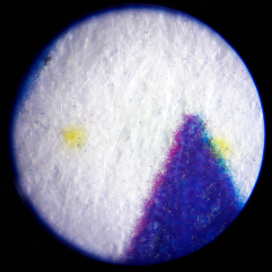
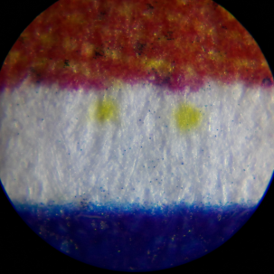
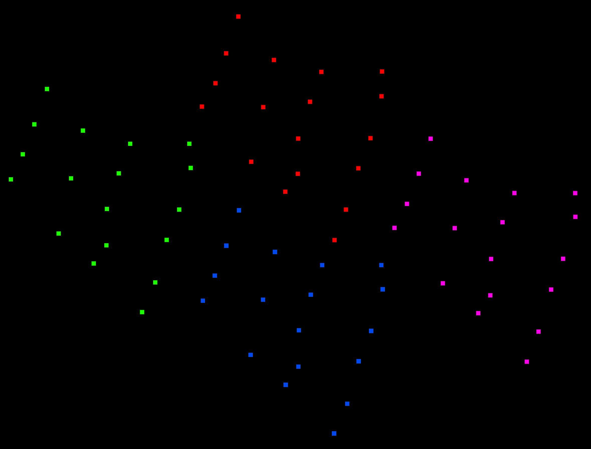
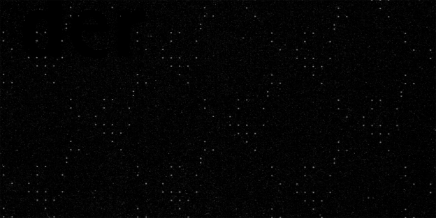
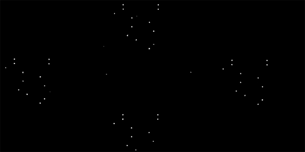

<style>
q { font-family: monospace; }
.footnotes p { margin-bottom: 0; }
</style>

# Revealing Traces in printouts and scans

_September 2022_

In our [store](https://proxysto.re/index.html) in Leipzig (Germany), we offer to use a multi-function printer (printer, copier and scanner) as described in our [concept](https://dys2p.com/konzept.html). To ensure that this can be done in the most privacy-friendly way possible, we have addressed privacy issues and are taking a number of measures. Unlike many other copyshops, we have not installed any cameras, either in front of or inside our store.

On other factors we have no or only limited influence. For example, every print, copy and scan leaves traces or information behind that can have an adverse effect on the user. For example, if confidential or private documents are involved, which could thus unintentionally fall into the hands of third parties, or if the traces and information are suitable for identifying the person.

## Table of contents

<nav>
  <ul>
    <li>
      <a href="#datenspeicherung-und-verarbeitung">Data storage and processing</a>
      <ul>
        <li>
          <a href="#externe-datentraeger">External media</a>
          <ul>
		    <li>
			  <a href="#malware">Malware</a>
		    </li>
		    <li>
			  <a href="#identifikation">Identification</a>
		    </li>
          </ul>
        </li>
        <li>
          <a href="#interner-datenspeicher">Internal memory and storage</a>
          <ul>
            <li>
              <a href="#festplatte">Hard disk</a>
            </li>
            <li>
              <a href="#arbeisspeicher">Main memory (RAM)</a>
            </li>
          </ul>
        </li>
      </ul>
    </li>
    <li>
      <a href="#fehldrucke-und-vergessene-dokumente">Misprints and forgotten documents</a>
    </li>
    <li>
      <a href="#verraeterische-spuren-auf-ausdrucken-und-in-gescannten-dokumenten">Revealing traces on printouts and in scanned documents</a>
      <ul>
        <li>
          <a href="#machine-identification-codes">Machine Identification Codes</a>
        </li>
        <li>
          <a href="#counterfeit-deterrence-systems">Counterfeit Deterrence Systems</a>
          <ul>
            <li>
              <a href="#eurion-konstellation">EURion constellation</a>
            </li>
            <li>
              <a href="#digimarc">Digital watermarks from Digimarc</a>
            </li>
          </ul>
        </li>
        <li>
          <a href="#patente">Patents</a>
        </li>
      </ul>
    </li>
    <li>
      <a href="#mics-eigene-untersuchungen">MICs: Own investigations</a>
      <ul>
        <li>
          <a href="#untersuchung-mit-dem-mikroskop">Analysis with a microscope</a>
        </li>
        <li>
          <a href="#untersuchung-mit-schwarzlicht">Analysis with black light</a>
        </li>
        <li>
          <a href="#untersuchung-am-computer">Analysis on the computer</a>
          <ul>
            <li>
              <a href="#gimp">Edit with GIMP</a>
            </li>
          </ul>
        </li>
        <li>
          <a href="#mics-in-freier-wildbahn">MICs in the wild</a>
        </li>
        <li>
          <a href="#deda-toolkit">Deda Toolkit</a>
          <ul>
            <li>
              <a href="#deda_gui">deda_gui</a>
            </li>
            <li>
              <a href="#deda_extract_yd">deda_extract_yd</a>
            </li>
          </ul>
        </li>
      </ul>
    </li>
    <li>
      <a href="#metadaten-in-gescannten-dateien">Metadata in scanned files</a>
      <ul>
        <li>
          <a href="#fallstricke-der-dateisysteme">Pitfalls of the file systems</a>
        </li>
      </ul>
    </li>
    <li>
      <a href="#unerklaerliche-blaue-punkte-auf-dem-papier">Inexplicable blue dots on the paper</a>
    </li>
    <li>
      <a href="#farben-typografie-und-weitere-faktoren">Colors, typography and other factors</a>
    </li>
    <li>
      <a href="#fazit">Summary</a>
    </li>
    <li>
      <a href="#danksagung-und-partizipation">Acknowledgement and participation</a>
    </li>
    <li>
      <a href="#weiterfuehrende-literatur">Further literature</a>
    </li>
    <li>
      <a href="#presse">Press</a>
    </li>
    <li>
      <a href="#guides">Guides</a>
    </li>
    <li>
      <a href="#fussnoten">Footnotes</a>
    </li>
  </ul>
</nav>

<h2 id="datenspeicherung-und-verarbeitung">Data storage and processing</h2>

<h3 id="externe-datentraeger">External media</h3>

Unless you only want to make a copy of a document you have brought with you, you will most likely use a rewritable storage medium (USB stick, SD card, ...) to save scanned documents on it or to print stored documents. In some self-service copy stores, storage media brought along must be connected to a computer in order to be able to print out saved documents.

<h4 id="malware">Malware</h4>

These computers and devices may be infected with malware. It is possible, for example, for the malware to embed itself in the rewritable external storage medium and to spread during further use, causing a wide range of damage. It is also conceivable that the malware reads out and forwards stored files. Last but not least, traces of the files can remain on the device and fall into unauthorized hands later.

[Golem.de and Kaspersky tested this in 2015](https://web.archive.org/web/20150515004008/https://www.golem.de/news/golem-de-test-mit-kaspersky-so-sicher-sind-fototerminals-und-copyshops-1505-113981.html) with 70 USB sticks at photo terminals and copyshops in several cities. In this sample, one USB stick was infected with the malware [Sality](https://en.wikipedia.org/wiki/Sality).

To reduce the above risks, people can print and save scanned documents from our Tails terminal. (This is a computer without a hard disk that boots the operating system [Tails](https://tails.boum.org/index.en.html) from a DVD. It allows you to access the Internet anonymously and to edit documents without leaving any traces on the computer. A cabin protects you from snooping eyes). It is also possible to bring files to be printed on CD/DVD and to burn scanned documents on CD/DVD.

In this context, using write-once CDs and DVDs is safer than flash storage media such as USB sticks and SD cards, even if the latter offer some kind of write protection: "In the case of storage media with built-in hardware write protection, it is always uncertain to what extent a proprietary firmware guarantees the blocking of write commands and other commands (e.g. firmware update) and only allows the commands required to read the data."<sup><a href="#fn1" id="fnref1">1</a></sup> If you want to read more about [write protection](https://vkldata.com/Write-Blocker-Adapter), or want to [retrofit write protection](https://vkldata.com/Schreibschutzschalter-am-USB-Stick-nachruesten) yourself, we recommend the website [vkldata.com](https://vkldata.com) (in German language only).

Hardware write blockers (e.g. for forensic purposes [DE](https://web.archive.org/web/20210512013406/https://it-forensik.fiw.hs-wismar.de/index.php/Write_Blocker)[EN](https://en.wikipedia.org/wiki/Forensic_disk_controller)) currently seem too expensive and impractical for this use. An [open source DIY solution](https://www.instructables.com/Cheap-and-Effective-USB-Write-Blocker/), as first published at [Black Hat Europe 2012](https://docs.huihoo.com/blackhat/europe-2012/bh-eu-12-Polstra-Preventing_Oh_Shit-WP.pdf), unfortunately has a very low read speed.

<h4 id="identifikation">Identification</h4>

External storage media such as USB sticks or cell phones are detected by the device's operating system. The resulting log files (logs) can reveal a variety of information about external storage media used on the device when analyzed, e.g., after being seized or infected. They can include hardware serial numbers, product names and product IDs, manufacturer IDs, times of mounting and ejecting, UUID/GUID of file systems, and more, from the last weeks, months or years. <sup><a href="#fn2" id="fnref2">2</a></sup> <sup><a href="#fn3" id="fnref3">3</a></sup> <sup><a href="#fn4" id="fnref4">4</a></sup> If more than one device or person is involved, connections between several devices and persons could also be made. For sensitive work, it is therefore recommended to use an operating system such as Tails, which "forgets" all log files when it is shut down and [additionally overwrites](https://tails.boum.org/contribute/design/memory_erasure/) the main memory (RAM). For particularly sensitive work, the external storage media should also be deleted and physically destroyed afterwards.

Unfortunately, we could not determine what information about external storage media is being logged by our multi-function printer.

<h3 id="interner-datenspeicher">Internal memory and storage</h3>

Multi-function printers use their internal main memory (RAM) and hard disk(s) in order to work as intended. The main memory is primarily used to process print jobs. The hard disk stores firmware and settings, as well as data for printing, copying and scanning.

Our multi-function printer is a Canon imageRUNNER ADVANCE c5235i. Canon writes about its data processing:

> Your imageRUNNER ADVANCE machine separates data into management information and actual data before storing the data.
> Management information is automatically erased when the copy, send/receive, or print operation is completed. However, actual data is stored and remains in the hard disk.
> If HDD Data Erase function is set to 'On', actual data (image, management, and spool data for the copying, mail box, printing, and sending/receiving functions) is erased at the same time as management information.

<h4 id="festplatte">Hard disk</h4>

Our multi-function printer has a 160 GB hard disk. Depending on the device, data stored on hard disks can be partially or completely recovered with or without special software if it was not destroyed properly. Especially if used devices and hard disks are resold, such failures repeatedly lead to reports such as:

- [cbsnews: Digital Photocopiers Loaded With Secrets (2010)](https://web.archive.org/web/20210702104607/https://www.cbsnews.com/news/digital-photocopiers-loaded-with-secrets/)
- [DHZ: Gefährlicher Datenspeicher: Sicherheitslücke am Kopierer (2015)](https://web.archive.org/web/20210712195315/https://www.deutsche-handwerks-zeitung.de/buerodrucker-richtig-entsorgen-148837/)
- [heise/c't: Wirklich alles gelöscht? (2016)](https://web.archive.org/web/20210630084612/https://www.heise.de/select/ct/2016/13/1466680725734830)
- [DiePresse: Das unschlagbare Langzeitgedächtnis von Druckern (2019)](https://web.archive.org/web/20210218171718/https://www.diepresse.com/5663245/das-unschlagbare-langzeitgedachtnis-von-druckern)
- [DasErste: Datenleck: Ungelöschte Festplatten auf ebay Kleinanzeigen (2021)](https://web.archive.org/web/20211022043523/https://www.daserste.de/information/wirtschaft-boerse/plusminus/sendung/daten-festplatten-ebay-kleinanzeigen-100.html)

Canon [writes about it](https://web.archive.org/web/20221108092044/https://oip.manual.canon/USRMA-0067-zz-CS-enUS/contents/CS5255_security1243_specifyingmanagementsettingsfortheharddisk.html):

> The management information is automatically erased when the job is complete, but the actual data is stored in the hard disk.

We have configured our multi-function printer so that during a job the processed and stored data is overwritten according to the DoD standard. (["The data is overwritten three times. The first time with a fixed value, the second time with a complement of the fixed value, and the third time with random data."](https://web.archive.org/web/20221108092034/https://oip.manual.canon/USRMA-0067-zz-CS-enUS/contents/CS5255_security1244_completelyerasingunnecessarydatafromthehardd.html)). This includes:

> - Image temporarily data created when scanning
> - Remaining data after the files in the Mail Box/Advanced Space are deleted
> - Remaining data after the files in the Fax/I-Fax Inbox (Confidential Fax Inbox/Memory RX Inbox) are deleted
> - Sent and received fax/I-fax data
> - [Spooled data](https://en.wikipedia.org/wiki/Spooling)
> - Data temporarily stored as print data

In addition, we reset the device to factory settings approximately every 30 days and overwrite all data again with the device's internal function according to DoD standards. We wanted to test the effectiveness of this method with a forensic investigation, but failed [like others before](https://web.archive.org/web/20220808210713/https://www.copytechnet.com/forums/archive/index.php/t-157793.html) when trying to read out the hard drive due to the ATA password. We hope to make up for this at a later date, and welcome [advice](https://proxysto.re/kontakt.html).

It's a good thing to overwrite storage devices that are no longer needed, such as hard disks, USB sticks and SD cards, with random data. Physically destroying them afterwards is an even better one. In order to provide other people and also ourselves with an easy-access way to decommission storage devices safely, we want to acquire a storage device shredder and make it available for free in our store and [are currently collecting funds for this](https://dys2p.com/de/support.html).

<h4 id="arbeisspeicher">Main memory (RAM)</h4>

The multi-function printer in our store has 2.5 GB of main memory. As written in the previous section, we have configured the device to delete and overwrite information that is no longer needed, already during processing. Those who do not trust the setting can turn off the device after use to let the memory "forget".

<h2 id="fehldrucke-und-vergessene-dokumente">Misprints and forgotten documents</h2>

Misprints can be shredded directly into millimeter-small shreds in our store using the adjacent document shredder, a Dahle 706air with security levels P-7/F-3/T-6. If that is not sufficient, the remains can be taken away.

If people have forgotten printed, copied or scanned documents, we will look at them and retain presumably important originals for a limited time. Obvious copies and printouts will be shred at the end of the day.

<h2 id="verraeterische-spuren-auf-ausdrucken-und-in-gescannten-dokumenten">Revealing traces on printouts and in scanned documents</h2>

There are many ways to extract information from printouts that can lead to identifying the manufacturer, the device, and the person responsible for that printout or copy. In the following, we will discuss most of the possibilities that we are aware of.

<h3 id="machine-identification-codes">Machine Identification Codes</h3>

Although being known [since 2004](https://web.archive.org/web/20210502113634/https://www.pcworld.idg.com.au/article/8305/dutch_track_counterfeits_via_printer_serial_numbers/), this is something that few people have in mind when they print something. A Machine Identification Code (MIC) is also called _yellow dots_, _tracking dots_, _secret dots_, color printer marking, _color tracking dots_, or _printer steganography_, and refers to a process that adds tiny yellow dots to printouts, invisible to the naked eye. These yellow dots make a pattern (of which there are several forms) <sup><a href="#fn5" id="fnref5">5</a></sup>, in which information such as the serial number of the device and a timestamp (print date and time) is encoded. This pattern is repeated over the entire page. The firmware of the devices is responsible for the implementation. In 2004, Canon Deutschland GmbH received the BigBrotherAward in the category "Technology" for this.<sup><a href="#fn6" id="fnref6">6</a></sup>

The encoded information is sometimes used to identify persons which are responsible for printouts. Among others, this has led to the identification of an NSA whistleblower ([DE](https://web.archive.org/web/20220930221428/https://www.heise.de/newsticker/meldung/Vom-Drucker-verraten-NSA-Dokument-enttarnt-Whistleblowerin-3734692.html)[EN](https://web.archive.org/web/20220314225850/https://blog.erratasec.com/2017/06/how-intercept-outed-reality-winner.html)) and of [employee(s) of the Berlin State Security](https://web.archive.org/web/20201124104210/https://de.indymedia.org/node/29284) who sent threatening letters containing internal police information [to 42 people](https://web.archive.org/web/20210917182258/https://de.indymedia.org/node/16467).

The [Electronic Frontier Foundation (EFF)](https://www.eff.org/), which has extensively studied [printers and their tracking methods](https://www.eff.org/de/issues/printers), made [the following assessment](https://www.eff.org/pages/list-printers-which-do-or-do-not-display-tracking-dots) in 2017:

> Reminder: It appears likely that all recent commercial color laser printers print some kind of forensic tracking codes, not necessarily using yellow dots. This is true whether or not thoses codes are visible to the eye and whether or not the printer models are listed here. This is also includes the printers that are listed here as not producing yellow dots.

The purpose of these procedures is obvious – to identify devices and people – but what is the justification for all this? Let's take a look at the world of banknotes.

<h3 id="counterfeit-deterrence-systems">Counterfeit Deterrence Systems</h3>

The Central Bank Counterfeit Deterrence Group (CBCDG), a working group of now 32 central banks, [wrote on its homepage already in March 2004](https://web.archive.org/web/20201020093710/https://rulesforuse.org/en/press-releases/central-banks-and-technology-industry-join-combat-banknote-counterfeiting):

> The Central Bank Counterfeit Deterrence Group (CBCDG) has now developed the Counterfeit Deterrence System, consisting of anti-counterfeiting technologies which prevent personal computers and digital imaging tools from capturing or reproducing the image of a protected banknote.
>
> Several leading personal computer hardware and software manufacturers have voluntarily adopted the system in recognition of the harm that counterfeit currency can cause their customers and the general public. The technology does not have the capacity to track the use of a personal computer or digital imaging tool and consumers will not notice any difference in the performance or effectiveness of products equipped with this technology.

The [Independent Center for Data Protection Schleswig-Holstein (ULD)](https://www.datenschutzzentrum.de/) asked the manufacturer Canon in 2019 ([Caution: Yellow Dots! Hidden information in color copies](https://www.datenschutzzentrum.de/uploads/it/2019_ULD_Report-Yellow-Dots.pdf)) and summarizes the response [freely translated]:

> [Canon] refers to the global cooperation to combat counterfeiting between law enforcement agencies and the printing industry, which was established at the instigation of Europol and Interpol (cf. [8]), as well as the voluntary commitment of the printer industry to implement the counterfeit prevention system. The manufacturer could not provide more detailed information due to a confidentiality agreement.

<h4 id="eurion-konstellation">EURion constellation</h4>

In experiments, Markus Kuhn discovered the [EURion constellation](https://en.wikipedia.org/wiki/EURion_constellation) on euro banknotes and [published it in 2002](https://www.cl.cam.ac.uk/%7Emgk25/eurion.pdf). The pattern is also found on [other countries' banknotes](https://people.duke.edu/~ng46/collections/steg-eurion-constellation.htm). It is designed to work in conjunction with supporting software and firmware from hardware and software vendors to prevent the scanning, editing, and printing of banknotes. Further research by Steven J. Murdoch and Ben Laurie shows that the EURion constellation is not the only feature by which banknotes are recognized.<sup><a href="#fn7" id="fnref7">7</a></sup> <sup><a href="#fn8" id="fnref8">8</a></sup> <sup><a href="#fn9" id="fnref9">9</a></sup>


Both our own investigations and those of the Independent Center for Data Protection Schleswig-Holstein confirm this. If a part of the EURion constellation, which is located between the digits on new euro bills, is identified by the device, it either omits areas when printing or changes the overall image, for example by blackening or streaking. We tried this with the front of euro banknotes from 5 to 50 euros and found that when part of the EURion constellation is covered, the identification fails and no other areas are changed.

<h4 id="digimarc">Digital watermarks from Digimarc</h4>

In addition to the EURion constellation, a 2005 article in [Datenschleuder Nr. 86](https://dasalte.ccc.de/colorcopy/) mentions _Digimarc_'s digital watermark, which was brought up shortly before at 21C3 by Steven J. Murdoch and Ben Laurie in their presentation [The Convergence of Anti-Counterfeiting and Computer Security](https://murdoch.is/talks/ccc04_counterfeiting.pdf). Patent [WO1999053428A1](https://web.archive.org/web/20221012145732/https://patents.google.com/patent/WO1999053428A1/) from Digimarc Corporation describes its principles.

If you want to know more about euro banknotes in general, you can find it at [Wikipedia](https://en.wikipedia.org/wiki/Euro_banknotes).

<h3 id="patente">Patents</h3>

The fundamentals of these already known processes are patent applications such as [US Patent 5515451](https://patents.justia.com/patent/5515451), which was applied for by Xerox on October 7, 1993 and granted in 1996, and [US Patent 5845008](https://patents.justia.com/patent/5845008), which was applied for by Omron Corporation on January 20, 1995 and granted in 1998. Since these applications were filed long before its implementation and subsequent "discoveries in the wild," it may be worthwhile to research other patent applications filed by manufacturers to gain clarification on additional, possibly previously undiscovered, privacy-hostile methods.

* [Brother Industries, Ltd.](https://patents.justia.com/assignee/brother-industries-ltd)
* [Brother Industries, Limited](https://patents.justia.com/assignee/brother-industries-limited)
* [Brother International Corporation ](https://patents.justia.com/assignee/brother-international-corporation)
* [Brother Kogyo Kabushiki Kaisha](https://patents.justia.com/assignee/brother-kogyo-kabushiki-kaisha)
* [Canon](https://patents.justia.com/company/canon)
* [Canon Kabushiki Kaisha](https://patents.justia.com/assignee/canon-kabushiki-kaisha)
* [Canon Production Printing Holding B.V.](https://patents.justia.com/assignee/canon-production-printing-holding-b-v)
* [Fuji Pigment Co., Ltd.](https://patents.justia.com/assignee/fuji-pigment-co-ltd)
* [Fuji Xerox Co ltd.](https://patents.justia.com/assignee/fuji-xerox-co-ltd)
* [Hewlett-Packard](https://patents.justia.com/company/hewlett-packard)
* [Hewlett-Packard Development Company, L.P.](https://patents.justia.com/search?q=Hewlett-Packard+Development+Company%2C+L.P.)
* [HP INDIGO B.V.](https://patents.justia.com/assignee/hp-indigo-b-v)
* [Hewlett-Packard Indigo B.V.](https://patents.justia.com/assignee/hewlett-packard-indigo-b-v)
* [Hewlett-Packard Industrial Printing Ltd.](https://patents.justia.com/assignee/hewlett-packard-industrial-printing-ltd)
* [Konica Minolta, Inc.](https://patents.justia.com/assignee/konica-minolta-inc)
* [Kyocera Document Solutions Inc.](https://patents.justia.com/assignee/kyocera-document-solutions-inc)
* [Lexmark International, Inc.](https://patents.justia.com/assignee/lexmark-international-inc)
* [Oki Electric Industry Co., Ltd.](https://patents.justia.com/assignee/oki-electric-industry-co-ltd)
* [Ricoh Company ltd.](https://patents.justia.com/assignee/ricoh-company-ltd)
* [Samsung](https://patents.justia.com/company/samsung)
* [Seiko Epson Corp.](https://patents.justia.com/assignee/seiko-epson-corp)
* [Seiko Epson Corporation](https://patents.justia.com/assignee/seiko-epson-corporation)
* [Xerox Corporation](https://patents.justia.com/assignee/xerox-corporation)

<h2 id="mics-eigene-untersuchungen">MICs: Own investigations</h2>

Back to the Machine Identification Code. There are various methods for checking whether a color laser printer leaves Machine Identification Codes on printouts. We have based our investigations on the procedure of the Independent Center for Data Protection Schleswig-Holstein (ULD) in the second version of their paper [Vorsicht: Yellow Dots!](https://www.datenschutzzentrum.de/uploads/it/2019_ULD_Report-Yellow-Dots.pdf).

One of the factors that could lead incorrect analysis results is a low fill level of the yellow toner cartridge. It should be noted here that, on some printers, even printing in black and white is no longer possible if one color cartridge is empty. If the printout is scanned in, a too low scan resolution can also affect the result.

For all the following investigations, unless otherwise stated, we have used printouts of our Canon imageRUNNER ADVANCE c5235i in DIN A4 with the color profiles <q>color</q> and <q>black</q>. For a meaningful comparison, we analyzed a sheet of paper in the same way before and after printing. Beforehand, we marked one side of the sheet to ensure that we were looking at the same side before and after printing.

<h3 id="untersuchung-mit-dem-mikroskop">Analysis with a microscope</h3>

We first took unprinted sheets of paper, marked a spot and analyzed it with a pocket microscope (magnification 60 to 120) before and after printing. This allowed us to confirm the results of the ULD in our case. On printouts printed with the profile <q>color</q>, we detected several tiny yellow dots. These were not present on printouts made with the color profile <q>black</q>.

 

<h3 id="untersuchung-mit-schwarzlicht">Analysis with black light</h3>

In contrast to the result of the ULD, we could not make any yellow dots visible to the naked eye under black light. For better illustration, the following is a photo of the magnified image of the ULD analysis illuminated with black light.

](../assets/images/print-scan-traces/uv-uld.jpg)

<h3 id="untersuchung-am-computer">Analysis on the computer</h3>

In order to analyze the printouts on the computer, it is recommended to work with scanned documents. It should be noted that this is best done in a high resolution (e.g. 1200x1200 dpi) and in a lossless format.

We scanned a previously unprinted, white DIN A4 sheet before and after printing with a _Canon CanoScan LiDE 210_ with 300, 600, 1200 and 2400 dpi and saved it as a PNG file. We used [GNOME simple-scan](https://gitlab.gnome.org/GNOME/simple-scan) for scanning.

<h4 id="gimp">Edit with GIMP</h4>

We performed these steps with [GIMP (GNU Image Manipulation Program)](https://www.gimp.org):

1. select scanned file and open it in GIMP
2. Windows > Dockable Dialogs > Channels: deselect the colors red and green
3. Colors > Invert
4. Colors > Saturation: increase (multiple possible)
5. If necessary, further adjustments, e.g. with the color curves
6. Colors > Components > Mono Mixer: Highlight blue channel, e.g. with the values 0, 0, 1


A simplified workflow, which was not used here, can look as follows:

1. Colors > Saturation: execute two times with the value 10
2. Colors > Components > Mono Mixer: Highlight blue channel, e.g. with the values 0, 0, 1
3. Colors > Invert

The higher the resolution (300, 600, 1200, 2400 dpi), the better the pattern can be recognized and analyzed:


We scanned printouts made from a computer and an USB stick, as well as copies, at a resolution of 600x600 dpi, and processed them in GIMP to analyze them for Machine Identification Codes. In the <q>Single color</q> and <q>Two color</q> printing modes, we have analyzed only some of the available colors.

<table class="table">
  <thead>
    <tr>
      <th>Category</th>
      <th>Mode</th>
      <th>Mode setting</th>
      <th>MIC</th>
    </tr>
  </thead>
  <tbody>
    <tr>
      <td>Print from PC</td>
      <td>Black and white</td>
      <td>-</td>
      <td>no MIC detected</td>
    </tr>
    <tr>
      <td>Print from PC</td>
      <td>Color</td>
      <td>-</td>
      <td><strong>MIC detected</strong></td>
    </tr>
    <tr>
      <td>Print from USB</td>
      <td>Auto (color/black)</td>
      <td>-</td>
      <td><strong>MIC detected</strong></td>
    </tr>
    <tr>
      <td>Print from USB</td>
      <td>Black</td>
      <td>-</td>
      <td>no MIC detected</td>
    </tr>
    <tr>
      <td>Copy</td>
      <td>Auto (color/black)</td>
      <td>-</td>
      <td><strong>MIC detected</strong></td>
    </tr>
    <tr>
      <td>Copy</td>
      <td>Single color</td>
      <td>Yellow</td>
      <td><strong>MIC detected</strong></td>
    </tr>
    <tr>
      <td>Copy</td>
      <td>Single color</td>
      <td>Green</td>
      <td><strong>MIC detected</strong></td>
    </tr>
    <tr>
      <td>Copy</td>
      <td>Single color</td>
      <td>Red</td>
      <td><strong>MIC detected</strong></td>
    </tr>
    <tr>
      <td>Copy</td>
      <td>Black</td>
      <td>-</td>
      <td>no MIC detected</td>
    </tr>
    <tr>
      <td>Copy</td>
      <td>Full color</td>
      <td>-</td>
      <td><strong>MIC detected</strong></td>
    </tr>
    <tr>
      <td>Copy</td>
      <td>Two color</td>
      <td>Black & red</td>
      <td><strong>MIC detected</strong></td>
    </tr>
  </tbody>
</table>

Printouts and copies that are made without colors, but only with black, are thus not given a visible Machine Identification Code in our tests on our device.

All detected patterns are so-called <dfn>skewed small patterns</dfn>, described by Peter Buck in his paper "[Reverse Engineering the Machine Identification Code](https://www.researchgate.net/publication/325976319_Reverse_Engineering_the_Machine_Identification_Code)" and also studied at [Duke University](https://people.duke.edu/~ng46/collections/steg-color-copier-dot-code.htm).

We can confirm the results of that work: We find a pattern of 18 dots, which we estimate to be arranged in a 16x32 grid, probably representing the serial number of our device (JWF11162) and repeating across the page. The pattern does not change with time, date, or the content of the printed document. It has the shape of a parallelogram tilted by about 30 degrees. However, the orientation, start and end could be different from what is shown here. The following image shows four repetitions of the pattern, which we have colored differently.



<h3 id="mics-in-freier-wildbahn">MICs in the wild</h3>

To determine how common MICs are "in the wild," we analyzed 100 documents from 100 different companies, associations, and government agencies that we had received independently of this research. The oldest document is from 2013, and most are from 2020-2022. We randomly selected the documents and analyzed mostly the first sheet of each using scanning and processing with GIMP, as described above, and with a microscope at 120x magnification.

<table class="table">
  <thead>
    <tr>
      <th>number</th>
      <th>Printing in color / black and white</th>
      <th>MIC</th>
      <th>Pattern</th>
      <th></th>
    </tr>
  </thead>
  <tbody>
    <tr>
      <td>001</td>
      <td>bw</td>
      <td>no MIC detected</td>
      <td></td>
      <td></td>
    </tr>
    <tr>
      <td>002</td>
      <td>color</td>
      <td><strong>MIC detected</strong></td>
      <td></td>
      <td></td>
    </tr>
    <tr>
      <td>003</td>
      <td>bw</td>
      <td>no MIC detected</td>
      <td></td>
      <td></td>
    </tr>
    <tr>
      <td>004</td>
      <td>bw</td>
      <td>no MIC detected</td>
      <td></td>
      <td></td>
    </tr>
    <tr>
      <td>005</td>
      <td>bw</td>
      <td>no MIC detected</td>
      <td></td>
      <td></td>
    </tr>
    <tr>
      <td>006</td>
      <td>bw</td>
      <td>no MIC detected</td>
      <td></td>
      <td></td>
    </tr>
    <tr>
      <td>007</td>
      <td>bw</td>
      <td>no MIC detected</td>
      <td></td>
      <td></td>
    </tr>
    <tr>
      <td>008</td>
      <td>color</td>
      <td><strong>MIC detected</strong></td>
      <td></td>
      <td></td>
    </tr>
    <tr>
      <td>009</td>
      <td>bw</td>
      <td>no MIC detected</td>
      <td></td>
      <td></td>
    </tr>
    <tr>
      <td>010</td>
      <td>bw</td>
      <td>no MIC detected</td>
      <td></td>
      <td></td>
    </tr>
    <tr>
      <td>011</td>
      <td>bw</td>
      <td>no MIC detected</td>
      <td></td>
      <td></td>
    </tr>
    <tr>
      <td>012</td>
      <td>bw</td>
      <td>no MIC detected</td>
      <td></td>
      <td></td>
    </tr>
    <tr>
      <td>013</td>
      <td>bw</td>
      <td>no MIC detected</td>
      <td></td>
      <td></td>
    </tr>
    <tr>
      <td>014</td>
      <td>bw</td>
      <td>no MIC detected</td>
      <td></td>
      <td></td>
    </tr>
    <tr>
      <td>015</td>
      <td>bw</td>
      <td>no MIC detected</td>
      <td></td>
      <td></td>
    </tr>
    <tr>
      <td>016</td>
      <td>bw</td>
      <td>no MIC detected</td>
      <td></td>
      <td></td>
    </tr>
    <tr>
      <td>017</td>
      <td>bw</td>
      <td>no MIC detected</td>
      <td></td>
      <td></td>
    </tr>
    <tr>
      <td>018</td>
      <td>bw</td>
      <td>no MIC detected</td>
      <td></td>
      <td></td>
    </tr>
    <tr>
      <td>019</td>
      <td>bw</td>
      <td>no MIC detected</td>
      <td></td>
      <td></td>
    </tr>
    <tr>
      <td>020</td>
      <td>color</td>
      <td>uncertain (CMYK dots)</td>
      <td></td>
      <td></td>
    </tr>
    <tr>
      <td>021</td>
      <td>color</td>
      <td><strong>MIC detected</strong></td>
      <td></td>
      <td></td>
    </tr>
    <tr>
      <td>022</td>
      <td>bw</td>
      <td>no MIC detected</td>
      <td></td>
      <td></td>
    </tr>
    <tr>
      <td>023</td>
      <td>bw</td>
      <td>no MIC detected</td>
      <td></td>
      <td></td>
    </tr>
    <tr>
      <td>024</td>
      <td>bw</td>
      <td>no MIC detected</td>
      <td></td>
      <td></td>
    </tr>
    <tr>
      <td>025</td>
      <td>bw</td>
      <td>no MIC detected</td>
      <td></td>
      <td></td>
    </tr>
    <tr>
      <td>026</td>
      <td>bw</td>
      <td>no MIC detected</td>
      <td></td>
      <td></td>
    </tr>
    <tr>
      <td>027</td>
      <td>bw</td>
      <td>uncertain (CMYK dots)</td>
      <td></td>
      <td></td>
    </tr>
    <tr>
      <td>028</td>
      <td>bw</td>
      <td>no MIC detected</td>
      <td></td>
      <td></td>
    </tr>
    <tr>
      <td>029</td>
      <td>bw</td>
      <td>no MIC detected</td>
      <td></td>
      <td></td>
    </tr>
    <tr>
      <td>030</td>
      <td>bw</td>
      <td>no MIC detected</td>
      <td></td>
      <td></td>
    </tr>
    <tr>
      <td>031</td>
      <td>bw</td>
      <td>no MIC detected</td>
      <td></td>
      <td></td>
    </tr>
    <tr>
      <td>032</td>
      <td>bw</td>
      <td>no MIC detected</td>
      <td></td>
      <td></td>
    </tr>
    <tr>
      <td>033</td>
      <td>color</td>
      <td><strong>MIC detected</strong></td>
      <td></td>
      <td></td>
    </tr>
    <tr>
      <td>034</td>
      <td>bw</td>
      <td>no MIC detected</td>
      <td></td>
      <td></td>
    </tr>
    <tr>
      <td>035</td>
      <td>bw</td>
      <td>uncertain (CMYK dots)</td>
      <td></td>
      <td></td>
    </tr>
    <tr>
      <td>036</td>
      <td>bw</td>
      <td>no MIC detected</td>
      <td></td>
      <td></td>
    </tr>
    <tr>
      <td>037</td>
      <td>color</td>
      <td><strong>MIC detected</strong></td>
      <td></td>
      <td></td>
    </tr>
    <tr>
      <td>038</td>
      <td>bw</td>
      <td>no MIC detected</td>
      <td></td>
      <td></td>
    </tr>
    <tr>
      <td>039</td>
      <td>color</td>
      <td><strong>MIC detected</strong></td>
      <td></td>
      <td></td>
    </tr>
    <tr>
      <td>040</td>
      <td>bw</td>
      <td>no MIC detected</td>
      <td></td>
      <td></td>
    </tr>
    <tr>
      <td>041</td>
      <td>bw</td>
      <td>no MIC detected</td>
      <td></td>
      <td></td>
    </tr>
    <tr>
      <td>042</td>
      <td>bw</td>
      <td><strong>MIC detected</strong></td>
      <td></td>
      <td></td>
    </tr>
    <tr>
      <td>043</td>
      <td>color</td>
      <td><strong>MIC detected</strong></td>
      <td></td>
      <td></td>
    </tr>
    <tr>
      <td>044</td>
      <td>color</td>
      <td><strong>MIC detected</strong></td>
      <td></td>
      <td></td>
    </tr>
    <tr>
      <td>045</td>
      <td>bw</td>
      <td>no MIC detected</td>
      <td></td>
      <td></td>
    </tr>
    <tr>
      <td>046</td>
      <td>bw</td>
      <td>no MIC detected</td>
      <td></td>
      <td></td>
    </tr>
    <tr>
      <td>047</td>
      <td>bw</td>
      <td>no MIC detected</td>
      <td></td>
      <td></td>
    </tr>
    <tr>
      <td>048</td>
      <td>bw</td>
      <td>no MIC detected</td>
      <td></td>
      <td></td>
    </tr>
    <tr>
      <td>049</td>
      <td>bw</td>
      <td>no MIC detected</td>
      <td></td>
      <td></td>
    </tr>
    <tr>
      <td>050</td>
      <td>bw</td>
      <td>no MIC detected</td>
      <td></td>
      <td></td>
    </tr>
    <tr>
      <td>051</td>
      <td>bw</td>
      <td>no MIC detected</td>
      <td></td>
      <td></td>
    </tr>
    <tr>
      <td>052</td>
      <td>bw</td>
      <td>no MIC detected</td>
      <td></td>
      <td></td>
    </tr>
    <tr>
      <td>053</td>
      <td>bw</td>
      <td>no MIC detected</td>
      <td></td>
      <td></td>
    </tr>
    <tr>
      <td>054</td>
      <td>bw</td>
      <td>no MIC detected</td>
      <td></td>
      <td></td>
    </tr>
    <tr>
      <td>055</td>
      <td>bw</td>
      <td>no MIC detected</td>
      <td></td>
      <td></td>
    </tr>
    <tr>
      <td>056</td>
      <td>bw</td>
      <td>no MIC detected</td>
      <td></td>
      <td></td>
    </tr>
    <tr>
      <td>057</td>
      <td>bw</td>
      <td>no MIC detected</td>
      <td></td>
      <td></td>
    </tr>
    <tr>
      <td>058</td>
      <td>bw</td>
      <td>no MIC detected</td>
      <td></td>
      <td></td>
    </tr>
    <tr>
      <td>059</td>
      <td>color</td>
      <td><strong>MIC detected</strong></td>
      <td></td>
      <td></td>
    </tr>
    <tr>
      <td>060</td>
      <td>bw</td>
      <td>no MIC detected</td>
      <td></td>
      <td></td>
    </tr>
    <tr>
      <td>061</td>
      <td>bw</td>
      <td>no MIC detected</td>
      <td></td>
      <td></td>
    </tr>
    <tr>
      <td>062</td>
      <td>bw</td>
      <td>no MIC detected</td>
      <td></td>
      <td></td>
    </tr>
    <tr>
      <td>063</td>
      <td>bw</td>
      <td>no MIC detected</td>
      <td></td>
      <td></td>
    </tr>
    <tr>
      <td>064</td>
      <td>bw</td>
      <td>no MIC detected</td>
      <td></td>
      <td></td>
    </tr>
    <tr>
      <td>065</td>
      <td>bw</td>
      <td>no MIC detected</td>
      <td></td>
      <td></td>
    </tr>
    <tr>
      <td>066</td>
      <td>bw</td>
      <td>no MIC detected</td>
      <td></td>
      <td></td>
    </tr>
    <tr>
      <td>067</td>
      <td>bw</td>
      <td>no MIC detected</td>
      <td></td>
      <td></td>
    </tr>
    <tr>
      <td>068</td>
      <td>bw</td>
      <td>no MIC detected</td>
      <td></td>
      <td></td>
    </tr>
    <tr>
      <td>069</td>
      <td>bw</td>
      <td>no MIC detected</td>
      <td></td>
      <td></td>
    </tr>
    <tr>
      <td>070</td>
      <td>bw</td>
      <td>no MIC detected</td>
      <td></td>
      <td></td>
    </tr>
    <tr>
      <td>071</td>
      <td>bw</td>
      <td>no MIC detected</td>
      <td></td>
      <td></td>
    </tr>
    <tr>
      <td>072</td>
      <td>bw</td>
      <td>no MIC detected</td>
      <td></td>
      <td></td>
    </tr>
    <tr>
      <td>073</td>
      <td>bw</td>
      <td><strong>MIC detected</strong></td>
      <td></td>
      <td></td>
    </tr>
    <tr>
      <td>074</td>
      <td>bw</td>
      <td>no MIC detected</td>
      <td></td>
      <td></td>
    </tr>
    <tr>
      <td>075</td>
      <td>bw</td>
      <td>no MIC detected</td>
      <td></td>
      <td></td>
    </tr>
    <tr>
      <td>076</td>
      <td>color</td>
      <td><strong>MIC detected</strong></td>
      <td></td>
      <td></td>
    </tr>
    <tr>
      <td>077</td>
      <td>bw</td>
      <td>no MIC detected</td>
      <td></td>
      <td></td>
    </tr>
    <tr>
      <td>078</td>
      <td>bw</td>
      <td>uncertain (CMYK dots)</td>
      <td></td>
      <td></td>
    </tr>
    <tr>
      <td>079</td>
      <td>bw</td>
      <td>no MIC detected</td>
      <td></td>
      <td></td>
    </tr>
    <tr>
      <td>080</td>
      <td>bw</td>
      <td>no MIC detected</td>
      <td></td>
      <td></td>
    </tr>
    <tr>
      <td>081</td>
      <td>bw</td>
      <td>no MIC detected</td>
      <td></td>
      <td></td>
    </tr>
    <tr>
      <td>082</td>
      <td>bw</td>
      <td>no MIC detected</td>
      <td></td>
      <td></td>
    </tr>
    <tr>
      <td>083</td>
      <td>bw</td>
      <td>no MIC detected</td>
      <td></td>
      <td></td>
    </tr>
    <tr>
      <td>084</td>
      <td>bw</td>
      <td>no MIC detected</td>
      <td></td>
      <td></td>
    </tr>
    <tr>
      <td>085</td>
      <td>bw/color</td>
      <td>no MIC detected</td>
      <td></td>
      <td></td>
    </tr>
    <tr>
      <td>086</td>
      <td>color</td>
      <td><strong>MIC detected</strong></td>
      <td></td>
      <td></td>
    </tr>
    <tr>
      <td>087</td>
      <td>bw</td>
      <td>no MIC detected</td>
      <td></td>
      <td></td>
    </tr>
    <tr>
      <td>088</td>
      <td>bw</td>
      <td>no MIC detected</td>
      <td></td>
      <td></td>
    </tr>
    <tr>
      <td>089</td>
      <td>bw</td>
      <td>no MIC detected</td>
      <td></td>
      <td></td>
    </tr>
    <tr>
      <td>090</td>
      <td>color</td>
      <td><strong>MIC detected</strong></td>
      <td></td>
      <td></td>
    </tr>
    <tr>
      <td>091</td>
      <td>bw</td>
      <td>no MIC detected</td>
      <td></td>
      <td></td>
    </tr>
    <tr>
      <td>092</td>
      <td>color</td>
      <td><strong>MIC detected</strong></td>
      <td></td>
      <td></td>
    </tr>
    <tr>
      <td>093</td>
      <td>bw</td>
      <td>no MIC detected</td>
      <td></td>
      <td></td>
    </tr>
    <tr>
      <td>094</td>
      <td>bw</td>
      <td>no MIC detected</td>
      <td></td>
      <td></td>
    </tr>
    <tr>
      <td>095</td>
      <td>bw</td>
      <td>no MIC detected</td>
      <td></td>
      <td></td>
    </tr>
    <tr>
      <td>096</td>
      <td>color</td>
      <td><strong>MIC detected</strong></td>
      <td></td>
      <td></td>
    </tr>
    <tr>
      <td>097</td>
      <td>bw</td>
      <td>no MIC detected</td>
      <td></td>
      <td></td>
    </tr>
    <tr>
      <td>098</td>
      <td>bw</td>
      <td>no MIC detected</td>
      <td></td>
      <td></td>
    </tr>
    <tr>
      <td>099</td>
      <td>bw</td>
      <td>no MIC detected</td>
      <td></td>
      <td></td>
    </tr>
    <tr>
      <td>100</td>
      <td>bw</td>
      <td>no MIC detected</td>
      <td></td>
      <td></td>
    </tr>
  </tbody>
</table>

The printouts and copies were from laser and inkjet printers unknown to us and were in black and white and in color. The sample included white paper, non-bleached recycled paper, and pre-printed notepaper. In the latter case, we did not investigate further whether the Machine Identification Code was applied when the form was created or when the content was printed, so the result here is also only <q>MIC detected</q> or <q>no MIC detected</q>.

With four documents, we were able to detect yellow dots on the paper with the microscope, but since there were colored dots in CMYK colors on the entire page in each document, we could not clearly identify a pattern and rated it as <q>uncertain (CMYK dots)</q>.

In total, a Machine Identification Code was detected in 16 out of 100 documents, including 14 out of 16 color documents.

<h3 id="deda-toolkit">Deda Toolkit</h3>

An interesting approach is taken by the [Deda Toolkit](https://github.com/dfd-tud/deda), which was developed at the [TU Dresden](https://tu-dresden.de/tu-dresden/newsportal/news/geheime-daten-auf-dem-druckpapier-diplominformatiker-der-tu-dresden-entwickeln-verfahren-gegen-druckerueberwachung). It is intended to help detect tracking dots and offers the possibility of anonymization by removing detected patterns or [adding new ones](https://news.ycombinator.com/item?id=14501894#14502387). Among others, [Netzpolitik.org](https://netzpolitik.org/2018/gute-nachricht-fuer-whistleblower-dresdner-forscher-tricksen-druckerueberwachung-aus/) and [Deutschlandfunk](https://www.deutschlandfunk.de/farblaserdrucker-tracking-dots-unlesbar-machen-100.html) reported on the method.

We have tested the Deda Toolkit on a Debian-based system.

```
sudo apt update
sudo apt install python3-pip
pip3 install --user deda
```

<h4 id="deda_gui">deda_gui</h4>

`python3 /home/user/.local/bin/deda_gui`

The `deda_gui` did not recognize the pattern that became visible with editing in GIMP during our tests. We tested several scans saved as PNG files at 300, 600 and 1200 dpi and got only the message <q>No tracking dot pattern detected. For best results try a 300 dpi scan and a lossless file format.</q>

<h4 id="deda_extract_yd">deda_extract_yd</h4>

`python3 /home/user/.local/bin/deda_extract_yd filepath --debug`

In our tests in the command line with the same input files, `deda_extract_yd` detected a tracking pattern (<q>Detected tracking dot pattern (-1, -1, 0.283334, 0.006667)</q>) for a file with 300 dpi resolution, but not for higher resolutions. Instead we received the error message <q>AttributeError: 'YellowDotsXposer' object has no attribute 'dots'</q>.

Therefore, to search for MICs, the manual method with GIMP seems more reliable to us at the moment. Also the anonymization method of deda seems to work only for some patterns. In test with our Canon device, there was no change to the original file despite the successful message <q>Document anonymized and saved</q> in the `deda_gui` and the creation of a file `anon.png`. The MIC was still recognizable. As Stephan Escher told us, there was not enough material for the analysis of the samples used by Canon so far. In addition, patterns from Canon devices are more difficult to detect than those from other manufacturers.

<h2 id="metadaten-in-gescannten-dateien">Metadata in scanned files</h2>

Digital files such as documents and graphics contain [metadata](https://www.whonix.org/wiki/Metadata). These can unintentionally reveal information and thus allow to draw conclusions about the source. The [Extensible Metadata Platform (XMP)](https://github.com/adobe/xmp-docs) is a standard developed by Adobe for embedding metadata in files. However, metadata can also be stored as a separate file in the same directory.

If no custom filename is entered when saving a scanned document, our Canon imageRUNNER ADVANCE c5235i generates the file name from the system time UTC+0 at the time of scan start, [using the XMP standard](https://github.com/adobe/xmp-docs/blob/master/XMPNamespaces/XMPDataTypes/CoreProperties.md). Thus, the file name `20041224084919.pdf` means that the file, according to the time set on the device, was created on 2004-12-24 at 08:49:19 UTC+0. For scans in JPEG format, the file names are additionally numbered like `_001`, a number which increases by one with each page. Other devices may use a different scheme for naming. This may allow to draw conclusions about the manufacturer or model.

In the following metadata, you can see that in our test, the name was assigned with UTC+0 despite the UTC+1 time zone being set. We use [ExifTool](https://exiftool.org/) to read out the Exif data:

`exiftool -g /home/user/20041224084919.pdf`

```
---- ExifTool ----
ExifTool Version Number         : 12.44
---- File ----
File Name                       : 20041224084919.pdf
Directory                       : /mnt/usb/...
File Size                       : 44 kB
File Modification Date/Time     : 2004:12:24 09:49:26+01:00
File Access Date/Time           : 2022:08:08 11:29:37+02:00
File Inode Change Date/Time     : 2004:12:24 09:49:24+01:00
File Permissions                : -rwxr-xr-x
File Type                       : PDF
File Type Extension             : pdf
MIME Type                       : application/pdf
---- PDF ----
PDF Version                     : 1.4
Linearized                      : No
Creator                         : Canon iR-ADV C5235  PDF
Create Date                     : 2004:12:24 08:49:24Z
Page Count                      : 1
---- XMP ----
XMP Toolkit                     : Adobe XMP Core
Creator Tool                    : Canon iR-ADV C5235  PDF
Producer                        : Adobe PSL 1.2e for Canon
Format                          : application/pdf
Document ID                     : uuid:14d8cb41-0000-8887-1780-13af00000000
```

With `-g`, ExifTool groups the read out information.

* `ExifTool Version Number`: used version of ExifTool
* `File Name`: file name
* `Directory`: file path
* `File Size`: file size
* `File Modification Date/Time`: Time of the last modification of the file (in our example, the saving after the completion of the scan).
* `File Access Date/Time`: Time of the last access to the file
* `File Inode Change Date/Time`
* `File Permissions`: file permissions
* `File Type`: file type
* `File Type Extension`: file name extension
* `MIME Type`: Specification of the media type and its subtype
* `PDF Version`: used PDF version 1.4
* `Linearized`
* `Creator`: Name of the creator (can also be a device name or software used)
* `Create Date`: System time of the device (UTC+0, "Zulu")
* `Page Count`: Number of pages
* `XMP Toolkit`: XMP Toolkit used
* `Creator Tool`: Name of the creator (can also be a device name or software used)
* `Producer`: Adobe PDF Scan Library version
* `Format`: Specification of the media type and its subtype
* `Document ID`: Universally Unique Identifier

These metadata can be individually manipulated or partially removed using programs such as [Metadata Anonymisation Toolkit v2 (mat2)](https://0xacab.org/jvoisin/mat2). For example, `mat2 /home/user/20041224084919.pdf` creates the file `20041224084919.cleaned.pdf`, which contains only the following metadata:

```
---- ExifTool ----
ExifTool Version Number         : 12.44
Warning                         : Invalid xref table
---- File ----
File Name                       : 20041224084919.cleaned.pdf
Directory                       : /mnt/usb/...
File Size                       : 97 kB
File Modification Date/Time     : 2022:08:05 10:19:10+02:00
File Access Date/Time           : 2022:08:05 10:19:36+02:00
File Inode Change Date/Time     : 2022:08:05 10:19:10+02:00
File Permissions                : -rwxr-xr-x
File Type                       : PDF
File Type Extension             : pdf
MIME Type                       : application/pdf
---- PDF ----
PDF Version                     : 1.5
Linearized                      : No
```

If you are using the [Tails](https://tails.boum.org/index.en.html) operating system, `mat2` is already installed and you can right-click to select the <q>Remove metadata</q> option to strip a file in a supported file format of most of its metadata. If you are using a different Linux-based operating system and want to install `mat2`, you can find [instructions here](https://0xacab.org/jvoisin/mat2/-/blob/master/INSTALL.md).

If a PDF file is converted to a [Trusted PDF](https://github.com/QubesOS/qubes-app-linux-pdf-converter) in [Qubes OS](https://www.qubes-os.org/), a lot of metadata is also removed, but e.g. not the `Create Date`, which is reset. If you want to manipulate the date and time information in the file system metadata and in the PDF metadata, you can change the system time for this and set it to the future or past. This may require being offline temporarily or preventing online time synchronization.

<h3 id="fallstricke-der-dateisysteme">Pitfalls of the file systems</h3>

Some file systems store multiple timestamps, which are sometimes overlooked and cannot always be removed completely. For example, the ext4 file system stores a <q>Creation Date</q> for each file. Furthermore, the accuracy of the timestamp can also reveal information about the origin or transport method of a file. The Whonix project writes on the subject of [File System Data Leakage](https://www.whonix.org/wiki/Metadata#File_System_Data_Leakage) in footnote 3:

> USB flash drives are fairly unique in that they usually use FAT32, and FAT32 is unique in that its datetime fields have a resolution of 2 seconds. So it's really easy to tell if files were on a USB flash drive (all the datetime values will be even numbers) unless the datetime metadata is scrubbed.

<h2 id="unerklaerliche-blaue-punkte-auf-dem-papier">Inexplicable blue dots on the paper</h2>

During our analysis with the microscope, we noticed that small blue, sometimes violet appearing dots could be seen on the majority of the analyzed papers (DIN A4 and A3) and also on new unprinted sheets (recycled paper as well as bleached white) just taken out of the original packaging. Unfortunately, we have not managed to make these dots visible by means of scans and image processing. The quantity and arrangement of the dots appear to be non-repetitive and sometimes very different to us in these random sightings, so we are unsure whether they are, for example, a code added to the paper by paper manufacturers, or random artifacts created during the manufacturing process.


For the sake of completeness, it should be mentioned at this point that paper sheets can also be analyzed forensically, but we will not go into this further here.

<h2 id="farben-typografie-und-weitere-faktoren">Colors, typography and other factors</h2>

Forensic analyses of printed products use other indicators to identify or narrow down the range of devices. Among other things, this involves looking at the print image, which often differs between different printer models. Individual printers and scanners can also be identified via individual signs of wear and resulting small unique inaccuracies.

The printing colors themselves can also be analyzed. This starts using a range of non-destructive methods and, if necessary, is followed up with a small piece of paper that is cut out and analyzed. The results can be checked against databases. For example, the FBI maintains the [International Ink Library](https://en.wikipedia.org/wiki/International_Ink_Library), which is said to contain more than 15,000 data records. Similar databases are also conceivable at the federal and EU levels. For example, there is already a database for automotive paints, the <q>European Collection of Automotive Paints</q> (EUCAP), which is also fed with information from Japan, Canada and the USA.

Since we cannot influence these factors, we do not go into more detail here and refer to the further literature mentioned below.

<h2 id="fazit">Summary</h2>

If the color laser printer in our store (Canon imageRUNNER ADVANCE c5235i) is used to produce printouts in color (profile <q>color</q>), **at least** the already named Machine Identification Code is applied to the entire surface of the printed pages, thus enabling a connection to our device.

Since this is not generally known and the manufacturers do not inform about it, it is up to us to inform users of our device about revealing traces and to name possible countermeasures. The [Independent State Center for Data Protection Schleswig-Holstein also sums up](https://www.datenschutzzentrum.de/uploads/it/2019_ULD_Report-Yellow-Dots.pdf) [freely translated]:

> The use of the yellow dots found on the color copies of the multi-function printer is neither mentioned on the manufacturer's website, nor in the system specification, nor in the operating instructions of the device. [...] Thus, a color copy can no longer be used for (supposedly) confidential communication, because additional data is stored on the color copy on an additional layer (not visible to the naked eye) that does not comply with the transparency requirements.

Open hardware and free firmware (or appropriate reverse engineering) could solve this problem, which probably affects all modern printers and copiers. We wish much success to all who are working on this.

By the way, revealing traces on your printouts are not the only danger that can arise from your copier. For example, in April 2022, a listening device was discovered in an anarchist library in Paris [hidden in a photocopier](https://earsandeyes.noblogs.org/post/2022/04/02/an-audio-surveillance-device-found-in-the-libertad-anarchist-library-in-paris-france/).

<h2 id="danksagung-und-partizipation">Acknowledgement and participation</h2>

We would like to take this opportunity to thank all those who developed the principles and procedures that we were able to use for this text.

If you have any further ideas, hints or suggestions for improvement, please [feel free to write us](https://proxysto.re/kontakt.html) or collaborate with us on [github](https://github.com/dys2p/website-dys2p/blob/master/2021-12-tamper-evident-protection) on this project.

If you want to support our work, [you can tip us](https://dys2p.com/support.html). You can also support our plan to set up a publicly accessible shredder for storage media that can be used free of charge. To order professional print products in a data-saving way, you can use our **[print service](https://druck.proxysto.re/)** (European Union only).

<h2 id="weiterfuehrende-literatur">Further literature</h2>

* [Chiang et al.: Printer and Scanner Forensics (2008)](https://engineering.purdue.edu/~prints/public/papers/sp_article_09_chiang.pdf)
* Jiang-Chun Li, Fang Fang, Xing-Zhou Han, Biao Li, Wei Han, Qian Zhou: Stability and Specificity of Counterfeit Protection System Code (2019)
* [Joost van Beusekom, Faisal Shafait, Thomas M. Breuel: Automatic Authentication of Color Laser Print-Outs Using Machine Identification Codes](https://citeseerx.ist.psu.edu/viewdoc/download?doi=10.1.1.433.5855&rep=rep1&type=pdf)
* [Marco Schreyer, Christian Schulze, Armin Stahl, Wolfgang Effelsberg: Intelligent Printing Technique Recognition and Photocopy Detection for Forensic Document Examination](https://www.dfki.de/fileadmin/user_upload/import/4605_printing_recognition.pdf)
* [Mikkilineni et al.: Printer Forensics using SVM Techniques](https://engineering.purdue.edu/~prints/public/papers/nip05-mikkilineni.pdf)
* [M. Uma Devi, C. Raghavendra Rao, Arun Agarwal: A Survey of Image Processing Techniques for Identification of Printing Technology in Document Forensic Perspective (2010)](https://citeseerx.ist.psu.edu/viewdoc/download?doi=10.1.1.206.5534&rep=rep1&type=pdf)
* [Ryan Gibson: Steganography: Hiding Data In Plain Sight](https://www.cs.unc.edu/~lin/COMP089H/LEC/steganography.pdf)
* Timo Richter, Stephan Escher, Dagmar Schönfeld, Thorsten Strufe: Forensic Analysis and Anonymisation of Printed Documents (2018)
* [Trevor M. Bobka: Analysis of a Photocopier Hard Drive for Forensically Relevant Artifacts](https://www.marshall.edu/forensics/files/Bobka-Research-Paper-160803.pdf)
* [TU Dresden: Yellow dots identify printers: Computer scientists of TU Dresden develop a tool for printer anonymisation (2018)](https://tu-dresden.de/ing/informatik/sya/ps/die-professur/news/geheime-daten-auf-dem-druckpapier-diplominformatiker-der-tu-dresden-entwickeln-verfahren-gegen-druckerueberwachung)

<h2 id="presse">Press</h2>

* [heise.de: Anonymes Drucken und Kopieren nahzu unmöglich (2017)](https://web.archive.org/web/20220323005634/https://www.heise.de/ct/artikel/Anonymes-Drucken-und-Kopieren-nahzu-unmoeglich-3735925.html)
* [heise.de: Bürgerrechtler wollen Spionage per Farblaser-Ausdruck dokumentieren (2005)](https://web.archive.org/web/20220930221428/https://www.heise.de/newsticker/meldung/Buergerrechtler-wollen-Spionage-per-Farblaser-Ausdruck-dokumentieren-118895.html)
* [SRF: Der Spion im Farbdrucker (2019)](https://web.archive.org/web/20220127120940/https://www.srf.ch/news/schweiz/anonym-ausdrucken-kaum-moeglich-der-spion-im-farbdrucker)

<h2 id="guides">Guides</h2>

* [Anonymous Planet: Printing Watermarking](https://anonymousplanet.org/guide.html#printing-watermarking)
* [Whonix: Printing and Scanning](https://www.whonix.org/wiki/Printing_and_Scanning)

<h2 id="references">References</h2>

* [Cipherbrain - Neues zu den gelben Punkten auf Laser-Ausdrucken](https://scienceblogs.de/klausis-krypto-kolumne/2022/10/16/neues-zu-den-gelben-punkten-auf-laser-ausdrucken/)
* [kryptografie.de - Yellow Dots Code (Machine Identification Code für Farblaserdrucker)](https://kryptografie.de/kryptografie/chiffre/yellow-dots-code.htm)

<h2 id="fussnoten">Footnotes</h2>

<div class="footnotes">
	<p><sup><a href="#fnref1" id="fn1">1</a></sup> <a href="https://vkldata.com/Open-Source-Projekte">https://vkldata.com/Open-Source-Projekte</a></p>
	<p><sup><a href="#fnref2" id="fn2">2</a></sup> <a href="https://github.com/snovvcrash/usbrip">https://github.com/snovvcrash/usbrip</a></p>
	<p><sup><a href="#fnref3" id="fn3">3</a></sup> <a href="https://web.archive.org/web/20220121231136/https://www.forensafe.com/blogs/usbforensics.html">https://forensafe.com/blogs/usbforensics.html</a></p>
	<p><sup><a href="#fnref4" id="fn4">4</a></sup> <a href="https://linuxhint.com/usb_forensics/">https://linuxhint.com/usb_forensics/</a></p>
	<p><sup><a href="#fnref5" id="fn5">5</a></sup> <a href="https://www.researchgate.net/publication/325976319_Reverse_Engineering_the_Machine_Identification_Code">https://www.researchgate.net/publication/325976319_Reverse_Engineering_the_Machine_Identification_Code</a></p>
	<p><sup><a href="#fnref6" id="fn6">6</a></sup> <a href="https://bigbrotherawards.de/2004/technik-canon">https://bigbrotherawards.de/2004/technik-canon</a></p>
	<p><sup><a href="#fnref7" id="fn7">7</a></sup> <a href="https://murdoch.is/projects/currency/">https://murdoch.is/projects/currency/</a></p>
	<p><sup><a href="#fnref8" id="fn8">8</a></sup> <a href="https://murdoch.is/talks/ccc04_counterfeiting.pdf">https://murdoch.is/talks/ccc04_counterfeiting.pdf</a></p>
	<p><sup><a href="#fnref9" id="fn9">9</a></sup> <a href="https://people.duke.edu/~ng46/collections/steg-currency-detection.htm">https://people.duke.edu/~ng46/collections/steg-currency-detection.htm</a></p>
</div>
