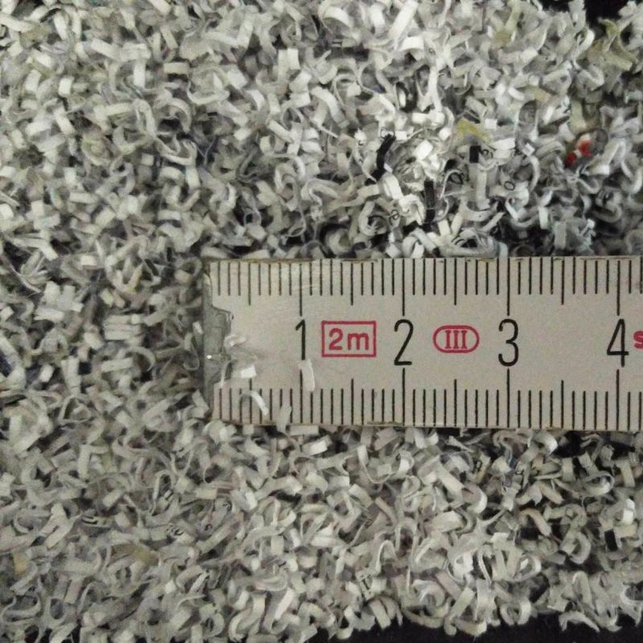

# Unterstütze uns

## Schreddern für alle!

_Leipzig, den 6. April 2021_

Wir möchten in unserem [Ladenlokal](https://proxysto.re) einen Shredder für Papier und einen Shredder für Datenträger aufstellen. Beide werden während der Öffnungszeiten kostenfrei oder zum Selbstkostenpreis (für Wartungsarbeiten und die Entsorgung der Abfälle) nutzbar sein. Wie in unserem [Konzept](konzept.html) beschrieben, schwebt uns ein Aktenvernichter der höchsten Sicherheitsstufe (P-7/F-3) und ein Festplattenvernichter "HSM Powerline HDS 150" vor.

Da beide Geräte nicht billig sind, brauchen wir eure Unterstützung. Wenn ihr euch an der Finanzierung beteiligen möchtet, könnt ihr dies mit Bargeld bei uns vor Ort, per Banküberweisung (Kontodaten [auf Anfrage](https://proxysto.re/kontakt.html)) oder in den Kryptowährungen Monero und Bitcoin tun. Falls ihr zufällig einen vergleichbaren Shredder zu verschenken habt, wären wir natürlich auch dafür dankbar.

**Aktenvernichter – 1.000 von 1.000 Euro**

	

**Festplattenshredder – 15 von 12.500 Euro**

	

	
	
	<form method="POST" action="https://pay.proxysto.re/api/v1/invoices" class="btcpay-form btcpay-form--block">
	  <input type="hidden" name="storeId" value="53wEhRv1kSEYRWR5q82UrF56eWSSDRH7bL4iq1RYqoJt" />
	  <input type="hidden" name="orderId" value="Shredder" />
	  <input type="hidden" name="checkoutDesc" value="Shredder – Thank you very much!" />
	  <input type="hidden" name="browserRedirect" value="https://dys2p.com/support.html" />
	  

		

		  <button class="plus-minus" type="button" onclick="handlePlusMinus(event);return false" data-type="-" data-step="1" data-min="5" data-max="9999">-</button>
		  <input class="btcpay-input-price" type="number" name="price" min="5" max="9999" step="1" value="10" data-price="10" style="width:3em;" oninput="handlePriceInput(event);return false" />
		  <button class="plus-minus" type="button" onclick="handlePlusMinus(event);return false" data-type="+" data-step="1" data-min="5" data-max="9999">+</button>
		

		<select name="currency">
		  <option value="USD">USD</option>
		  <option value="GBP">GBP</option>
		  <option value="EUR" selected>EUR</option>
		  <option value="BTC">BTC</option>
		</select>
	  

	  <input type="image" class="submit" name="submit" src="https://pay.proxysto.re/img/paybutton/pay.svg" style="width:209px" alt="Pay with BTCPay Server, a Self-Hosted Bitcoin Payment Processor">
	</form>

Das Spendenziel für den Aktenvernichter wurde am 5. Mai 2021 durch eine Einzelspende erreicht. Wir möchten uns an dieser Stelle noch einmal herzlich dafür bedanken! Am 14. Mai 2021 hat uns der damit erworbene Aktenvernichter (Dahle 41334 CleanTEC) mit den Sicherheitsstufen P-7/F-3/T-6 erreicht. Er steht ab sofort während unserer Öffnungszeiten (im Einklang mit den jeweiligen Corona-Bestimmungen) zur freien Nutzung in unserem [Laden](https://proxysto.re) zur Verfügung.

	

		
	

	

		
	

Zukünftige Gelder fließen in den Topf für den Festplattenvernichter. Für den Fall, dass wir das Finanzierungsziel nicht erreichen, bitten wir euch um eine Angabe einer Möglichkeit zur Rückzahlung. Das können Kontodaten, eine Monero- oder Bitcoin-Adresse oder eine Kontaktmöglichkeit zu euch sein, wobei eine Rückzahlung auf dem selben Weg wie die ursprüngliche Zahlung erfolgen muss. (Da wir eingehende Kryptowährungen direkt verkaufen, ist in dem Fall der Kurswert auf kraken.com zu den jeweiligen Zeitpunkten maßgeblich.) Falls ihr keine Rückzahlungsmöglichkeit angebt, werden wir überschüssige Gelder zu gleichen Teilen an [Archive.org](https://archive.org/donate), die [Electronic Frontier Foundation](https://supporters.eff.org/donate/pu20--WB), [Qubes OS](https://www.qubes-os.org/donate/), [SciHub](https://de.wikipedia.org/wiki/Sci-Hub) und [Tails](https://tails.boum.org/donate/index.de.html) spenden.

Eine Spendenquittung o. ä. können wir leider nicht ausstellen, aber euch winkt ewige Dankbarkeit und natürlich seid ihr jederzeit zum Schreddern willkommen!

Falls unser Projekt irgendwann eingestellt wird, werden wir die Geräte an die nächstgelegene Datenschutzinitiative (etwa eine Ortsgruppe des CCC oder einen Verein), die Interesse hat und den Weiterbetrieb sicherstellen kann, verschenken.

## Digitale Kaffeekasse

Falls euch unsere Projekte und Ideen gefallen, freuen wir uns über eine kleine Zuwendung in unsere Kaffeekasse. Damit unterstützt ihr unsere [gegenwärtigen und zukünftigen Aktivitäten](https://dys2p.com).

	<!-- don't repeat style and script -->
	<form method="POST" action="https://pay.proxysto.re/api/v1/invoices" class="btcpay-form btcpay-form--block">
	  <input type="hidden" name="storeId" value="53wEhRv1kSEYRWR5q82UrF56eWSSDRH7bL4iq1RYqoJt" />
	  <input type="hidden" name="orderId" value="Contribution" />
	  <input type="hidden" name="checkoutDesc" value="Contribution – Thank you very much!" />
	  <input type="hidden" name="browserRedirect" value="https://dys2p.com/support.html" />
	  

		

		  <button class="plus-minus" type="button" onclick="handlePlusMinus(event);return false" data-type="-" data-step="1" data-min="5" data-max="9999">-</button>
		  <input class="btcpay-input-price" type="number" name="price" min="5" max="9999" step="1" value="10" data-price="10" style="width:3em;" oninput="handlePriceInput(event);return false" />
		  <button class="plus-minus" type="button" onclick="handlePlusMinus(event);return false" data-type="+" data-step="1" data-min="5" data-max="9999">+</button>
		

		<select name="currency">
		  <option value="USD">USD</option>
		  <option value="GBP">GBP</option>
		  <option value="EUR" selected>EUR</option>
		  <option value="BTC">BTC</option>
		</select>
	  

	  <input type="image" class="submit" name="submit" src="https://pay.proxysto.re/img/paybutton/pay.svg" style="width:209px" alt="Pay with BTCPay Server, a Self-Hosted Bitcoin Payment Processor">
	</form>

