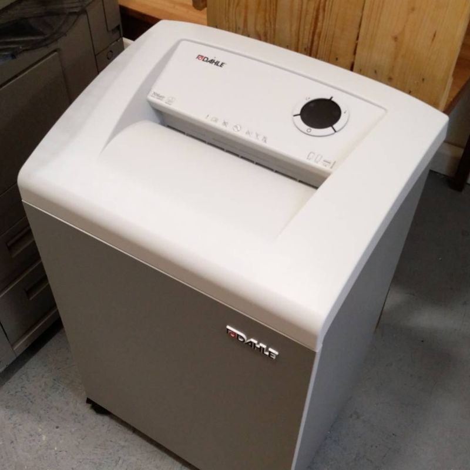
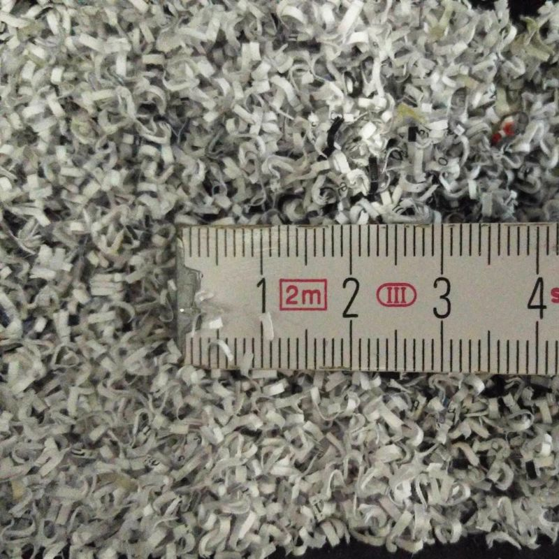

# Support us

## Shredding for everyone!

_Leipzig, April 6, 2021_

We would like to set up a shredder for paper and a shredder for data media in our [store location](https://proxysto.re). Both will be usable during opening hours free of charge or at cost price (for maintenance and waste disposal). As described in our [concept](konzept.html), we have a document shredder of the highest security level (P-7/F-3) and the hard disk shredder "HSM Powerline HDS 150" in mind.

Since both devices are not cheap, we need your support. If you would like to contribute to the funding, you can do so with cash at our site, by bank transfer (account details available [on request](https://proxysto.re/kontakt.html)) or in the cryptocurrencies Monero and Bitcoin. If you happen to have a comparable shredder to give away, we would of course be grateful for that as well.

**Document shredder – 1.000 of 1.000 Euro**

	

**Storage device shredder – 15 of 12.500 Euro**

	

	
	
	<form method="POST" action="https://pay.proxysto.re/api/v1/invoices" class="btcpay-form btcpay-form--block">
	  <input type="hidden" name="storeId" value="53wEhRv1kSEYRWR5q82UrF56eWSSDRH7bL4iq1RYqoJt" />
	  <input type="hidden" name="orderId" value="Shredder" />
	  <input type="hidden" name="checkoutDesc" value="Shredder – Thank you very much!" />
	  <input type="hidden" name="browserRedirect" value="https://dys2p.com/support.html" />
	  

		

		  <button class="plus-minus" type="button" onclick="handlePlusMinus(event);return false" data-type="-" data-step="1" data-min="5" data-max="9999">-</button>
		  <input class="btcpay-input-price" type="number" name="price" min="5" max="9999" step="1" value="10" data-price="10" style="width:3em;" oninput="handlePriceInput(event);return false" />
		  <button class="plus-minus" type="button" onclick="handlePlusMinus(event);return false" data-type="+" data-step="1" data-min="5" data-max="9999">+</button>
		

		<select name="currency">
		  <option value="USD">USD</option>
		  <option value="GBP">GBP</option>
		  <option value="EUR" selected>EUR</option>
		  <option value="BTC">BTC</option>
		</select>
	  

	  <input type="image" class="submit" name="submit" src="https://pay.proxysto.re/img/paybutton/pay.svg" style="width:209px" alt="Pay with BTCPay Server, a Self-Hosted Bitcoin Payment Processor">
	</form>

The donation goal for the document shredder was reached on May 5, 2021 through a single donation. We would like to take this opportunity to thank you once again! On May 14, 2021, we received the document shredder (Dahle 41334 CleanTEC) with security levels P-7/F-3/T-6. It is now available for free use in our [store](https://proxysto.re) during our opening hours (in accordance with the Corona regulations).

	

		
	

	

		
	

Future funds are going into the pot for the storage device shredder. We ask you to provide a way to return the money in the event that we don't reach one of the funding goals. This can be account details, a Monero or Bitcoin address, or a way to contact you. Returns must be made the same way as the original payment. (Since we sell incoming cryptocurrencies directly, the exchange value on kraken.com at the respective times is relevant in that case). If you do not specify a return method, we will donate excess funds in equal parts to [Archive.org](https://archive.org/donate), the [Electronic Frontier Foundation](https://supporters.eff.org/donate/pu20--WB), [Qubes OS](https://www.qubes-os.org/donate/), [SciHub](https://de.wikipedia.org/wiki/Sci-Hub), and [Tails](https://tails.boum.org/donate/index.de.html).

Unfortunately, we can't issue a donation receipt or similar, but eternal gratitude beckons you and of course you are welcome to shred anytime!

If our project is discontinued at some point, we will give the devices to the nearest privacy initiative (such as a local chapter of the CCC, or an association) that is interested and can ensure their continued operation.

## Digital tip

If you like our projects and ideas, we would appreciate a small tip. This way you support our [current and future activities](https://dys2p.com).

	<!-- don't repeat style and script -->
	<form method="POST" action="https://pay.proxysto.re/api/v1/invoices" class="btcpay-form btcpay-form--block">
	  <input type="hidden" name="storeId" value="53wEhRv1kSEYRWR5q82UrF56eWSSDRH7bL4iq1RYqoJt" />
	  <input type="hidden" name="orderId" value="Contribution" />
	  <input type="hidden" name="checkoutDesc" value="Contribution – Thank you very much!" />
	  <input type="hidden" name="browserRedirect" value="https://dys2p.com/support.html" />
	  

		

		  <button class="plus-minus" type="button" onclick="handlePlusMinus(event);return false" data-type="-" data-step="1" data-min="5" data-max="9999">-</button>
		  <input class="btcpay-input-price" type="number" name="price" min="5" max="9999" step="1" value="10" data-price="10" style="width:3em;" oninput="handlePriceInput(event);return false" />
		  <button class="plus-minus" type="button" onclick="handlePlusMinus(event);return false" data-type="+" data-step="1" data-min="5" data-max="9999">+</button>
		

		<select name="currency">
		  <option value="USD">USD</option>
		  <option value="GBP">GBP</option>
		  <option value="EUR" selected>EUR</option>
		  <option value="BTC">BTC</option>
		</select>
	  

	  <input type="image" class="submit" name="submit" src="https://pay.proxysto.re/img/paybutton/pay.svg" style="width:209px" alt="Pay with BTCPay Server, a Self-Hosted Bitcoin Payment Processor">
	</form>

