# Tamper-evident Protection

The history of mankind is also a history of secrets, attacks and defense of the confidential. Steganography, cryptography and technical tools support us in protecting the private. The antagonists of confidentiality operate - depending on the actor - outside or inside legal frameworks, often adapting them with bogus arguments. For example, banning procedures to protect the confidential is always a step in the wrong direction (from our point of view) and does not weaken the need for individual protection, but sanctions it. Therefore, in this cat-and-mouse game, the practical use of what is possible is more important than the legal framework.

If we have objects or devices out of our sight, in case of doubt we cannot exclude that there were unwanted/unauthorized accesses to them and possibly the confidentiality and integrity no longer exists. We would like to give a brief summary of a few known countermeasures and introduce a new method below.

If there was an unauthorized access (attempt), it is in the interest of the affected parties (owner/proprietor/transmitter/recipient) to know about it in order not to believe in false security and to initiate possible follow-up measures.

For thousands of years, seals have been used in various forms with the aim of certifying the confidentiality and integrity of letters, for example. Attacks on these protective measures are similarly old. This continues to this day, but these attacks are now taking place on a very different level. Above all, digital communication and the widespread presence of technical devices, the accumulation and automated analysis of data have changed a lot since then. The tools of this communication intervene very deeply in our lives, so their confidentiality and integrity should also be a very high priority. In the following, we would like to name a few examples of these attacks.

## Inward and outward attacks

### Tampering in transit (supply-chain interdiction).

[While the U.S. government has claimed for years that companies from China are building surveillance technologies into devices exported to the U.S. (such as networking equipment)](https://www.techradar.com/news/networking/routers-storage/photos-reveal-nsa-tampered-with-cisco-router-prior-to-export-1249191), it was revealed in 2014 in the book ["Global Surveillance" by Glenn Greenwald](https://www.droemer-knaur.de/buch/glenn-greenwald-die-globale-ueberwachung-9783426786918) that the NSA's "TAO" (Tailored Access Operations) unit has been intercepting and tampering with technical devices in transit since at least 2010. [The Intercept published a good article](https://theintercept.com/2019/01/24/computer-supply-chain-attacks/) on supply chain attacks in 2019, and Microsoft has its own series of articles: [Part 1](http://microsoft.com/security/blog/2019/10/16/guarding-against-supply-chain-attacks-part-1-big-picture/), [Part 2](https://web.archive.org/web/20210226030901/https://www.microsoft.com/security/blog/2020/02/03/guarding-against-supply-chain-attacks-part-2-hardware-risks/), and [Part 3](https://web.archive.org/web/20210303150737/https://www.microsoft.com/security/blog/2020/03/11/guarding-against-supply-chain-attacks-part-3-how-software-becomes-compromised/).

> According to these, it is common practice to, among other things, prepare servers, routers and other network technology 
> with eavesdropping technology before exporting them to third countries. Afterwards, the equipment is repackaged and shipped as planned.

[translated freely from netzpolitik.org](https://netzpolitik.org/2014/nsa-hat-eine-spezialeinheit-um-paeckchen-zu-oeffnen-und-wanzen-zu-implantieren/)

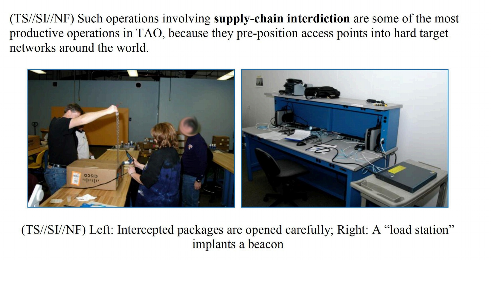

It is likely that such attacks are taking place in other states as well - whether against individuals or on a larger scale.

### Evil-Maid Attacks

If hardware access exists, an [Evil-Maid attack](https://www.whonix.org/wiki/AEM) can be carried out in the true sense [within a few minutes](https://www.youtube.com/watch?v=loBX_vEXxVA). Whoever has access to the hardware can not only manipulate firmware and possibly software, but also replace or manipulate hardware and copying the data storage.

The linked article also presents measures that should at least allow such manipulation to be detected. After all, not all accesses are as obvious as they are here:

> I just write quicker sometimes with pen and paper. I put it in the safe in my hotel room, and that night I had gone out by myself. I came home and the door to my hotel room was open, the safe was open, there was still the cash I had taken out from the Cueva sitting on a table, so no one had stolen anything. When I first saw the door open I thought oh, maybe they’re doing late turndown service or something, but the door to the safe was open with my laptop in it and my laptop was in a different position. I don’t know what happened, you know? Someone clearly opened the safe, they moved it around, they didn’t take any money, but they also left my door open. So, I never knew whether they actually did something or put something on the laptop or looked at the laptop and saw that there was nothing there, or whether they just left it open to scare me or send a message.

[Nicole Perlroth (cyber-security and digital espionage reporter at The New York Times) at 16:45 in EP 98: Zero Day Brokers from darknet diaries.](https://darknetdiaries.com/episode/98/)

## Methods and attacks

There are special screws, seals, "tamper-proof" labels and tape, "tamper-proof" bags, and [much more](https://www.hhi.fraunhofer.de/abteilungen/fs/projekte/archiv/optical-tamper-protection-otp-fuer-prs-security-module.html) to detect unauthorized access to items/products and contents of shipments. We assume that most of these can be tampered and are not a problem for talented and resourceful attackers. If you like to get an insight, you can have a look at presentations like this one from [DEFCON 19: Introduction to Tamper Evident Devices](https://www.youtube.com/watch?v=W07ZpEv9Sog). You can also learn more about this in the work of Sergei Skorobogatov (Physical Attacks and Tamper Resistance. Introduction to Hardware Security and Trust, 143-173. doi:10.1007/978-1-4419-8080-9_7) and [Elena Dubrova](https://people.kth.se/~msmith/is2500_pdf/Anti-Tamper%20Techniques_elena.pdf). There are also contests that focus on evading as many of these protections as possible, so Mos & Boo give us insights from the [OzSecCon 2018 Tamper Evident Challenge](https://mosandboo.com/ozseccon-2018-tamper-evident-challenge-walkthrough/). For now, we'll just go into more detail below on one method for sealing screws and unused ports.

### Glitter nail polish

A realtively widespread method to seal screws on devices, for example, so that unauthorized access can be detected with a higher probability, is the use of nail polish with different colored/large elements. To our knowledge, this technique was first presented at [30C3](https://media.ccc.de/v/30C3_-_5600_-_en_-_saal_1_-_201312301245_-_thwarting_evil_maid_attacks_-_eric_michaud_-_ryan_lackey) by [Eric Michaud](https://twitter.com/ericmichaud) and [Ryan Lackey](https://twitter.com/octal) and is recommended and used by several companies, individuals and for example, [journalists evaluating the Panama Papers](https://www.mz.de/deutschland-und-welt/politik/panama-papers-journalisten-sicherten-laptops-mit-glitzernagellack-1138070).

We have done a few experiments ourselves to test the effectiveness of this process.

#### Glitter nail polish with stickers

In the method described by [Mullvad VPN](https://mullvad.net/en/help/how-tamper-protect-laptop/), a sticker, the edge of which is sealed with glitter nail polish, protects the screws (or unused ports) so that, on the one hand, access attempts can be detected and on the other hand, access to them can be regained as easily as possible if necessary. With this method, however, it is relatively easy without much practice to, for example, drive a needle or scalpel under the sticker and push it partially upwards to get at the screws. Any broken areas of the nail polish could be resealed with clear varnish, although we mostly didn't need to do this during our tests. We have used two different stickers in our testing so far, with Mullvad's holding up best.

We have two pictures below of one of our first trials, in which all but 3-4 glitter elements at the edge (top left) of the sticker are still in the same place. In further attempts this could be reduced, so that we classify this method as unsuitable.

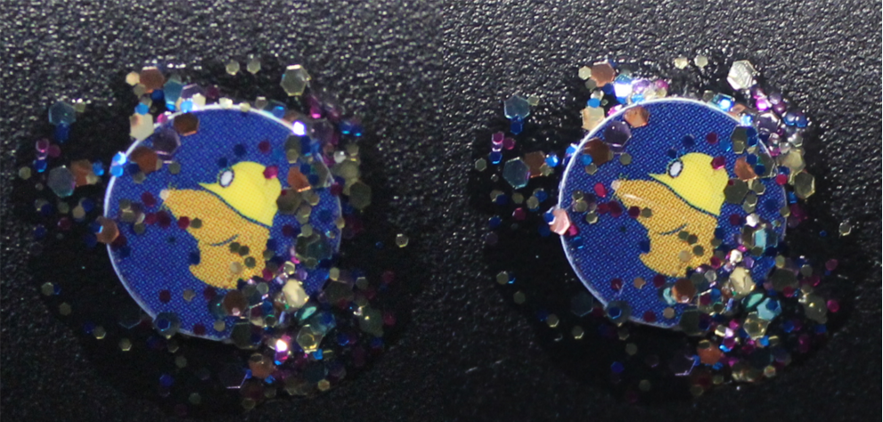

In the left photo you can see a screw sealed with Mullvad VPN nail polish. In the right photo you can see this sealing after it has been opened once as described above. In the upper left part of the right photo you can see that the arrangement of the elements on the edge of the sticker is not quite the same. The two larger elements (left edge in the middle and at the bottom) were also broken, but afterwards they were brought back to their position. In further tests, we achieved similar results. The decisive factor in this process is the amount of elements on and around the edge of the sticker. We suspect that with stickers used for seals, those that break when peeled off are better in combination with nail polish.

#### Glitter nail polish directly

This method is used by [Nitrokey](https://docs.nitrokey.com/de/nitropad/qubes/sealed-hardware.html) and [Purism](https://puri.sm/posts/anti-interdiction-update-six-month-retrospective/), for example is safer in our view compared to the previous method. Here, the screws are sealed directly with glitter nail polish. Here, the shafts of the screws are particularly relevant. If this shaft/channel is too deep, it is difficult to take a usable photo of the sealing under normal conditions. If the shaft/channel is shallow or the channel as a whole is filled with nail polish, there is a risk that if a lot of polish is used, the top layer will be cut off and reapplied after manipulation with clear polish. However, if too few elements are used, they could be manually re-arranged to the original location after manipulation if necessary. Unfortunately, how [HoodiePony](https://twitter.com/hoodiePony) proceeded to successfully break and reattach 3 out of 4 seals at the OzSecCon 2018 Tamper Evident Challenge is currently unknown to us.

Assessment based on our self-experiments: It is sometimes very difficult or impossible to detect tampering with these two methods. In further tests, we have tried the combination of nail polish with various adhesives (Uhu Alleskleber, superglue from herlitz, Doratex Double Power and Yachtcare Super Epoxy). Our favorite here is sealing the shaft with epoxy and GLitzer nail polish in it or over it. We have not investigated attacks with agents specifically for epoxy. However, this method also makes it a bit more difficult to loosen all the screws again if necessary.

## random mosaic $ rm -r ice

We thought about finding a method that would produce a pattern that is difficult to reproduce using widely available and as inexpensive means as possible. This pattern should be as easy to check manually or by technical means as possible. We came up with two main options for this: one for short-term storage and another for longer-term storage and/or shipping.

This could be used, for example, to protect documents, data carriers, communications technology, hardware wallets and other sensitive objects in such a way that unauthorized access can be detected with greater probability.

### Searching for suitable objects/substances

In order to find suitable items/substances, we have formulated the following requirements, tried several substances and mixtures, and made the following assessment:

The mixture we are looking for should:

- Not too small, so that the pattern/individual elements can be seen as well as possible.
- Not too large so that it is as difficult as possible to reproduce the pattern.
- Consist of elements of different colors and/or sizes, which can result in a pattern that is as contrasting as possible.
- The elements should be round and dry and not prone to lumping or jamming or sticking.
- In the event of damage (e.g. a tear) to our protective measures, the protected contents should not be additionally damaged. Therefore, only solids should be used and the contents should be protected separately, if necessary, to prevent/impede penetration of the elements (e.g. in case of a crack) into the object/object.
- Do not use sharp-edged or pointed parts that could damage our protective measures if necessary.
- Do not be too heavy, e.g. to save shipping costs.

To test the mixing behavior especially the first 3 points were relevant for us, through a pre-selection only items/substances were chosen that met the last 3 points of our requirements.

Our favorites so far are: red lentils & beluga lentils, yellow and green peas and white beans, and colored rice.

#### Means for our mosaic

red lentils & beluga lentils:

* The lentils are a good size (neither too small, nor too large), have good mixing characteristics, and form a high contrast pattern.

yellow peas & white beans:

* Both yellow peas and white beans have good size (neither too small, nor too large), good mixing behavior, and form a contrasting pattern.

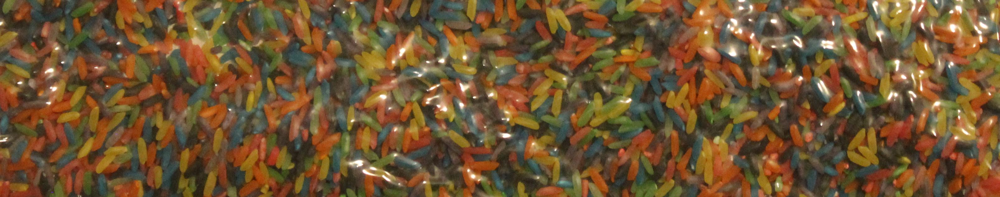

dyed rice:

* The rice is a little smaller than the two previously mentioned substances, but has the advantage that you can make up your own desired colors as needed with food coloring (more on this below).

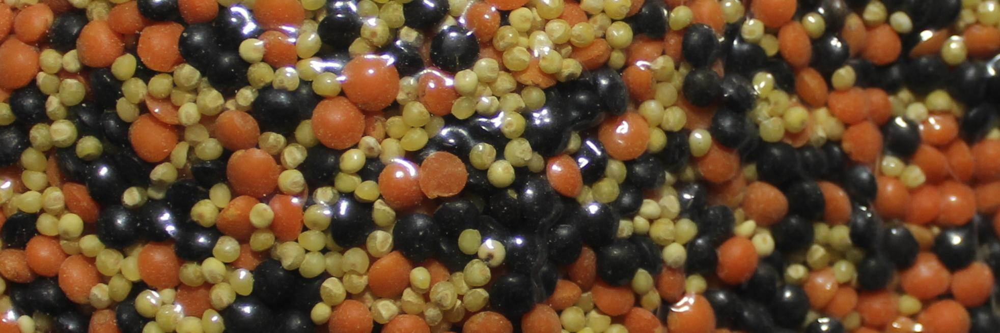

golden millet:

* We tested millet only in combination with other substances due to its small size.

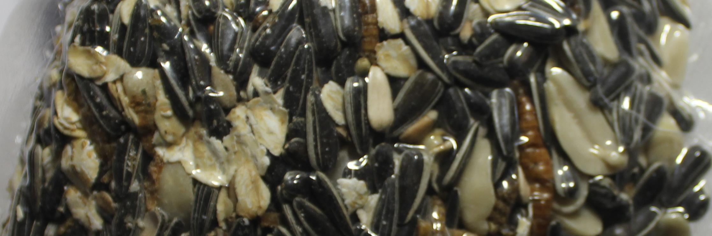

birdseed:

* Birdseed has the advantage that it looks relatively normal in smaller bags, for example, and may still be able to hide its secret from attackers as a result. However, depending on the contents of the mixture, it may be easy to stick.

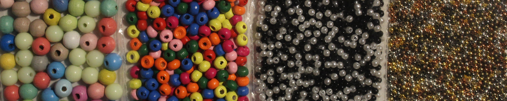

Balls of different colors, sizes and materials:

* The balls probably have the best resistance compared to the other items, but unfortunately they are also relatively costly and harder to get than most other remedies.

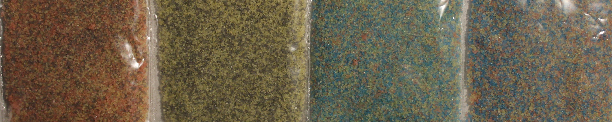

colored salt:

* We colored the salt with food coloring (more on this below). Sugar and salt behave similarly, with occasional slight lumpiness in the sugar. Because of the size, it is also sometimes difficult to compare the pattern.

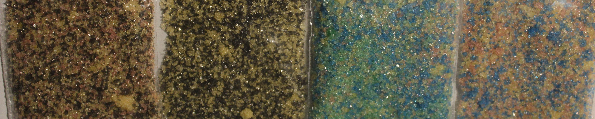

colored sugar:

* We colored the sugar with food coloring (more on this below). Sugar and salt behave similarly, with the sugar occasionally forming slight lumps. Because of the size, it is also sometimes difficult to compare the pattern.

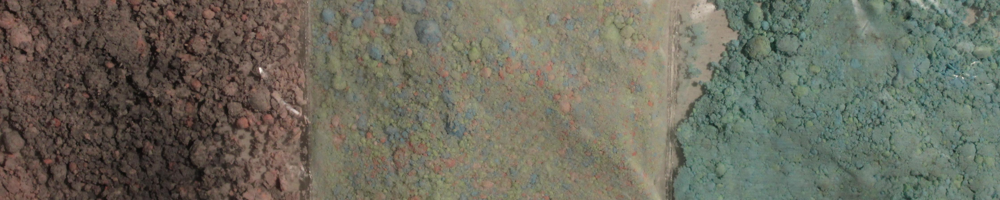

Dyed cornstarch (DIY Holi powder):

* We dyed the cornstarch with food coloring (more on this below). The cornstarch makes a powder mixture in which the individual colors are sometimes difficult to discern.

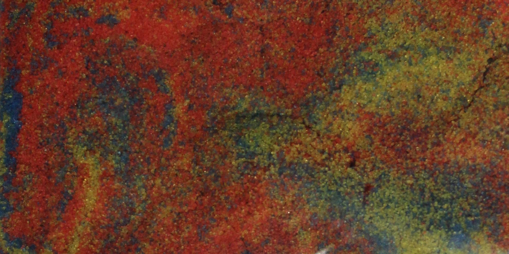

kinetic sand:

* The kinetic sand seems unsuitable to us, since this is also realtiv cost-intensive, in a single color is unsuitable and if several colors are used, after several times mixing everything looks apparently the same. Furthermore, we assume that with such a consistency there will be several attacks, where we can no longer determine whether there was an access attempt or not.

#### Coloring

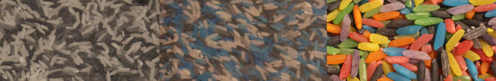

We have colored the rice and the other substances with food coloring and tested 2 different food colors. We find the food coloring from V2 Foods better than the one from Limino because of the color intensity. The procedure was always similar:

1) per 125 g substance about 15 drops of food coloring
2) add 0.5 teaspoon of water (not for salt and sugar)
3) Mix well in a closed bag or box.
4) If the desired color intensity is not yet achieved, add a few more drops of food coloring. But not too much, otherwise the substance may stick/clump too much.
5) Let the colored substance air dry a little spread out in a plate, on baking paper or in a box.

Following another instruction, we first used vinegar essence instead of water. However, the rice dyed with it was very smelly, so we decided to use only water afterwards. The result was similar with both agents. The vessel used for dyeing should be cleaned well afterwards so that the color intensity is not distorted by color residues if the vessel is used again for dyeing.

We can not yet evaluate how the durability is over a longer period. It may be that the color intensity decreases due to UV radiation and other influences. We have not yet made any tests with other colors.

In addition to the normal food coloring, several elements could also be colored with fluorescent black light colors, so in addition to the normal and obvious image, another pattern would be possible, which is only visible with black light. We have not tested this yet.

### Short-term storage

Following the genesis, we start with the first option, short-term storage. When we have to leave a place and leave items or equipment behind, we can wrap them in one or more foils/bags and store them preferably in a box that is transparent from all sides. Then we fill the box a little bit with our colorful mixture, at least so far that there is a sufficiently thick layer over our devices. We can draw a grid on the box beforehand to limit a comparison to individual areas (unknown to the attacker) in this grid or make an overall comparison. The box should be stored in such a way that e.g. vibrations or other factors do not change the initial pattern as far as possible. For example, the box can be positioned on a towel or piece of clothing on an object in such a way that this attenuates minor vibrations of the environment, but the box cannot slide off this. To take good pictures of the initial pattern, the box should be photographed from all visible sides. This photograph can be stored on a device that is as secure as possible, sent to a person we trust via an encrypted and verified path, or sent to another device of our own. To subsequently verify that the initial pattern still has the current pattern, a new photograph can be taken and/or the found condition can be compared to the photograph of the initial pattern.

If there has been a change in several elements within the pattern, unauthorized access or compromise should be assumed. Whereby this assessment should be made depending on the factors and the need for protection. Maybe just your pet or a family member was a bit curious about the colorful mixture.

At this point, we recommend combining it with [Haven](https://guardianproject.github.io/haven/). If the device fails or there are problems with the sensors or transmission, there is still at least one more layer of our protection.

### Longer-term storage or shipping

For shipping in particular, it seems to us to be a very well-suited method to be able to detect unauthorized access to their contents worthy of protection by the affected parties. Almost every shipping method with third parties involves multiple people and locations unknown to us.

Since the items would not hold their position in transit as suggested above, another method is needed. The device/item is wrapped with plastic wrap, a bag, or otherwise. This is to prevent damage to the device/item that could be caused, for example, by elements rubbing off or penetrating (e.g., into ports on the cell phone/laptop). This protective layer should take up as little additional space as possible. The item or device packed in this way is now placed in an empty or partially filled bag. This bag is filled with additional elements so that the object or device is sufficiently provided with elements from all sides and the object itself can no longer be seen from the outside.

This bag filled with colored elements is then vacuumed. This keeps them in their respective positions. As soon as the bag is damaged and pressure equalization takes place, but at the latest when the enclosed object is accessed, the elements change their position.

#### Vacuuming with the vacuum cleaner.

Since many people have vacuum cleaners (there are even public ones at some gas stations), this process is our first priority. There are special, reusable bags for vacuum cleaners to be able to store e.g. clothes or blankets in a space-saving way and to protect them from damage (e.g. by moths). The air inside the bag can be removed through a valve and with a vacuum cleaner. The resulting negative pressure significantly reduces the volume of blankets in these bags, for example. Unfortunately, we could only find larger bags that are well suited for laptops, for example, but less so for small items.

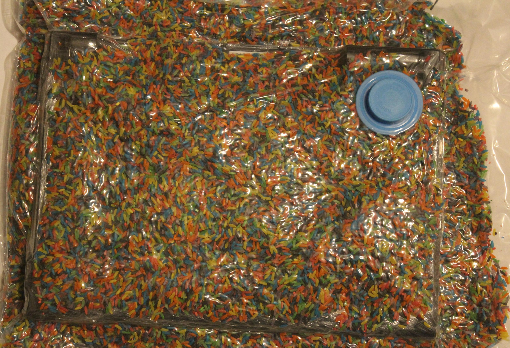

#### Vacuuming with a vacuum sealer

There are many different vacuuming devices, they differ in quality and size. Vacuumers are used, for example, to keep food fresh longer. The appropriate bags for this are available in all desired sizes, although these can not be reused so easily or only with loss of material.

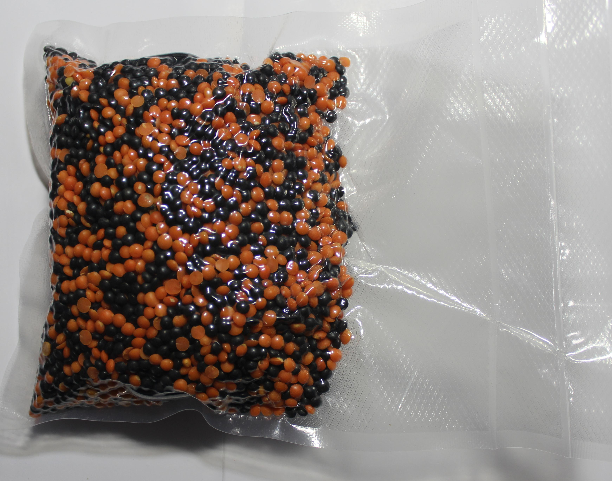
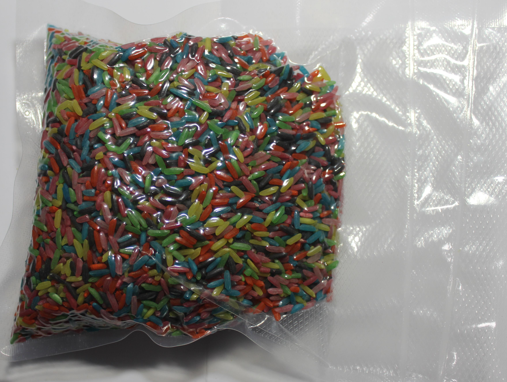

In both procedures, it is also possible to cascade the bags with the elements. To do this, the process is performed once as described above: Vacuum the object/device in the bag with the elements. The result of the first operation, after saving the images, is again put into a bag with more elements and vacuumed.

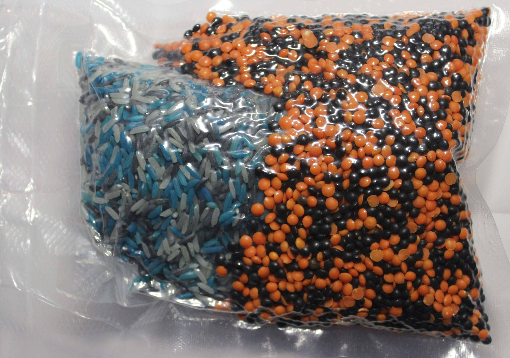

Some companies deliberately omit certain tamper-evident procedures. [For example, Ledger](https://support.ledger.com/hc/en-us/articles/4404389367057-Is-my-Ledger-device-genuine-?#h_d3e66427-a745-46c6-b1bf-3b7f52ba8ed4), the company that makes the eponymous hardware wallet for cryptocurrencies, refers to the forgeability of seals and limits itself to [hardware-side protection measures](https://support.ledger.com/hc/en-us/articles/4404382029329-Check-hardware-integrity):

> **Anti-tamper seals**.
> Ledger deliberately chooses not to use anti-tamper seals on its packaging. These seals are easy to counterfeit and can,
> therefore, be misleading. Rather, genuine Ledger devices contain a secure chip that prevents physical tampering: this
> provides stronger security than any sticker possibly could.

After a breach containing customer data in 2020, several Ledger customers received [fake alleged replacement devices](https://www.nasdaq.com/articles/inside-the-scam%3A-victims-of-ledger-hack-are-receiving-fake-hardware-wallets-2021-06-17) in the mail in spring 2021.

Other companies are looking for ways to improve. For example, we found the work of [shiftcrypto](https://shiftpages.github.io/tamper-evident-packaging/#how-it-works) after our tests during research for this text and were pleased to see that they follow(ed) similar approaches to some extent. You can read more about their experiences during the test phase [here](https://medium.com/shiftcrypto/bitboxtep-alpha-program-what-we-have-learned-cd2e1a1bbd6c).

## Acknowledgement and participation

We would like to take this opportunity to thank everyone who supported us in this project. This thanks goes especially to those who provided us with vacuum equipment, Mullvad VPN for the glitter nail polish, as well as Nitrokey and Purism for the exchange to seal with nail polish.

If you have further ideas, hints or suggestions for improvement [feel free to write us](https://proxysto.re/kontakt.html) or work with us on [github](https://github.com/dys2p/website-dys2p/tree/master/rm) on this project.
